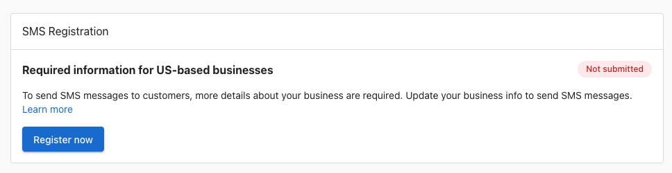

To prevent spam and other widespread SMS abuse, phone carriers in the United States require businesses to register their phone numbers before sending SMS messages to customers (A2P 10DLC).

If your business is based in the United States and you want to use Conversations SMS messaging in Conversations AI Pro, you are required to register your business.

## How to register

To register your US-based business, go to **Business App > Administration > Conversations Settings** to see the registration card. Click "Register now" to view the form.

Fill out the form completely, and then click `Submit information`. You can also save your progress if you are unsure of some fields and return to complete the registration later.

## Understanding brand and campaign

The registration form collects two types of information: **Brand** details and **Campaign** details.

**Brand** represents your business identity. This includes your legal business name, EIN/Tax ID, address, industry, and an authorized representative. Brand information is verified against government databases, so it must exactly match the information the IRS has on file for your business. Your Brand only needs to be registered once. It applies across all messaging you send.

**Campaign** describes *how* your business uses SMS messaging. This includes what types of messages you send (transactional, marketing, or both), how you collect customer consent, and links to your privacy policy and terms and conditions. Campaign details tell phone carriers what customers can expect when they receive messages from your business.

## Privacy policy

Your registration requires a link to a privacy policy that is publicly accessible on your website. The privacy policy must clearly describe how your business handles customer data in the context of SMS messaging.

**What your privacy policy should include:**
- That your business collects phone numbers for the purpose of sending SMS messages
- What types of messages customers may receive (e.g., appointment reminders, promotional offers)
- How customer data is stored and protected
- How customers can request their data be deleted
- That phone numbers and messaging data are not sold to third parties

**What your privacy policy should NOT include:**
- References to SMS messaging from a different business or brand
- Language that grants blanket permission to share customer phone numbers with unrelated third parties
- Outdated or placeholder text that does not reflect your actual data practices

The URL you provide must link directly to the privacy policy, not to a homepage or a general legal page. Carriers review this link during registration, and a missing or inaccessible policy can cause your registration to be rejected.

## Terms and conditions

Your registration also requires a link to terms and conditions that are publicly accessible on your website. These terms must cover your business's SMS messaging practices.

**What your terms and conditions should include:**
- A description of the SMS messaging program (what messages customers will receive)
- Message frequency disclosure (e.g., "Message frequency varies")
- "Message and data rates may apply" notice
- Instructions for opting out (e.g., "Reply STOP to unsubscribe")
- Instructions for getting help (e.g., "Reply HELP for assistance")
- Your business contact information

**What your terms and conditions should NOT include:**
- Language that prevents customers from opting out of messages
- Terms that contradict standard carrier opt-out mechanisms (STOP/HELP keywords)
- Outdated terms referencing a messaging program your business no longer operates

Like the privacy policy, the URL must link directly to the terms and conditions page. A generic or broken link can result in registration rejection.

## Customer consent and opt-in

Phone carriers require proof that your business collects consent from customers before sending them SMS messages. The registration form asks how your business collects this consent.

### Types of SMS messaging

Your business can register to send **transactional** messages, **marketing** messages, or **both**.

- **Transactional messages** include appointment reminders, order confirmations, and customer support communications.
- **Marketing messages** include promotions, sales announcements, and special offers.

### Consent on your webform

If your business collects customer information through a webform on your website, the form must include **separate consent checkboxes** for transactional and marketing messaging:

- **Transactional consent**: Confirms the customer agrees to receive service-related messages such as appointment reminders and support updates.
- **Marketing consent**: Confirms the customer agrees to receive promotional messages such as sales and special offers. **If your business sends marketing messages, the marketing consent checkbox must not be required to complete the form.** Customers must be able to submit the form without opting into marketing messages.

Both consent checkboxes should clearly state that message and data rates may apply, message frequency varies, and that the customer can reply STOP to unsubscribe at any time.

### Other consent methods

In addition to webforms, the registration form allows you to describe other ways your business collects consent:

- **Verbal consent**: If your business collects consent over the phone or in person, you can provide the script used during that conversation.
- **Website chat widget**: If your business uses a chat widget on your website, customers may provide consent to receive SMS messages through the chat interaction.

## FAQs

<strong>How long does registration take?</strong>

Once the form has been submitted, registration through third-party verification can take anywhere from one week, up to one month. Telecom carriers in the United States use a third-party service to verify business registration data with government databases.

<strong>How can I ensure my application is approved?</strong>

The most common reason for an application being rejected is because the information entered in the form does not match the information the IRS has for your business, associated with the EIN / Tax ID. Make sure the business information you submit matches exactly the same information associated with the EIN.

<strong>Why was my registration rejected?</strong>

Registration rejections fall into a few common categories. Here are the most frequent reasons and what to do about each one.

**Your business type is not eligible**

Certain industries are blocked from SMS registration by US phone carriers, regardless of whether the business is legal in your state. If your business sells or promotes any of the following, it is not eligible to register:

- Cannabis, CBD, hemp, or kratom products
- Tobacco, e-cigarettes, or vaping products
- Firearms or ammunition
- Alcohol (direct consumer marketing)
- Payday loans, high-interest lending, or debt settlement services
- Gambling (unless specifically licensed and pre-approved by carriers)
- Multi-level marketing (MLM) programs

If your business falls into one of these categories, SMS registration is not available.

**Your business information doesn't match IRS records**

The registration system verifies your legal business name, EIN, and address against government databases. If anything doesn't match exactly, including punctuation, abbreviations, or your registered address, the registration will be rejected. Use your IRS CP 575 confirmation letter to verify the exact name and address on file before submitting.

**Your website's privacy policy has a problem**

Your privacy policy must be live, publicly accessible, and clearly state that you do not sell or share customer phone numbers with third parties. Common issues that cause rejection:

- No privacy policy exists on your website
- The privacy policy link is broken or the page is not accessible
- The privacy policy includes language that allows sharing or selling contact information with third parties or other companies
- The privacy policy does not mention SMS messaging or how you use phone numbers

**Your website is missing SMS opt-in consent**

If customers can enter their phone number anywhere on your website, that form must include a checkbox where the customer actively agrees to receive text messages from your business. A phone number field without explicit SMS consent language is a common rejection reason.

**Your terms and conditions are missing required messaging language**

Your terms and conditions must include all of the following:

- How often customers will receive messages (e.g., "Message frequency varies")
- "Message and data rates may apply"
- How customers can opt out (e.g., "Reply STOP to unsubscribe")
- How customers can get help (e.g., "Reply HELP for assistance")

**Your campaign description or sample messages were rejected**

If your brand registration was approved but your campaign was rejected, the most common causes are:

- The use case description is too vague: "communicate with customers" is not sufficient. Carriers need specifics like "send appointment reminders to customers who opted in through our online booking form."
- Sample messages don't include your business name
- Sample messages don't include opt-out instructions (e.g., "Reply STOP to unsubscribe")
- Sample messages include a public URL shortener like bit.ly or tinyurl.com. These are blocked by carriers.

If your registration is rejected, correct the issue and resubmit once the form shows a failed status.

<strong>How do I find my business registration number a.k.a. EIN / Tax ID?</strong>

An EIN is a nine-digit number the IRS uses to identify a business for tax purposes, much like a Social Security number identifies an individual. In the US, the Internal Revenue Service (IRS) issues a CP 575 EIN Confirmation Letter to confirm the unique Employer Identification Number (EIN) issued to a new business. The EIN provided in a CP 575 letter is required to file your company's taxes, open a business bank account, and apply for a business credit card, loan, or payroll processing. If you do not know your EIN, you can apply for an EIN by submitting IRS Form SS-4 online.

<strong>Can sole-proprietor businesses without an EIN register for SMS?</strong>

Not at this time.

<strong>I registered for SMS through another product. Do I need to register again?</strong>

No. Your business only needs to register once. The phone number and registration are shared across all products that use SMS messaging, so a registration completed through any product applies everywhere.

<strong>My business is located outside of the United States. Do I need to register?</strong>

Registration is strictly for businesses that wish to send messages to US numbers through US telecom carriers. Some businesses may be located outside of the United States but wish to send SMS messages to US numbers. This is not supported.

<strong>I don't see the registration option in Conversations?</strong>

Registration is only available for US-based businesses, with Conversations AI Pro product active. Ensure your account has an address located in the United States.

<strong>There was a mistake on the registration form I submitted - can I cancel it?</strong>

No, the form cannot be edited or canceled once submitted. If information was missing or incorrect, the registration will eventually move to a 'failed' status. Once registration fails, the form can be resubmitted.

