This document provides a comprehensive overview of **WhatsApp Coexistence**, a feature that allows your business to use the traditional WhatsApp Business App alongside professional automation tools.

## What is WhatsApp Coexistence?

WhatsApp Coexistence is a Meta-supported feature that allows you to link your existing WhatsApp Business number to a professional CRM or automation platform without losing access to the app on your phone. You can use the WhatsApp Business App on a single phone for personal 1:1 chats while also utilizing the WhatsApp Business Platform (API) for automation.

## Why use it?

Coexistence gives you the "best of both worlds" by bridging the gap between personal touch and professional scale.

* **Zero Disruption:** You don't have to change your number or delete your app. Everything stays exactly where it is.
* **Keep Your History:** You can import up to **6 months** of existing chat history and all your contacts directly into the CRM.
* **Dual-Platform Flexibility:** 
  * **On your phone:** Keep using the app for quick 1:1 replies, voice notes, and posting to **WhatsApp Status**.
  * **In the platform:** Access advanced features that the platform offers and allow your entire team to manage WhatsApp conversations collaboratively.
* **Real-Time Sync:** Messages, history and contacts stay synced. If you reply from your phone, the message appears in the platform. If a team member or AI bot replies from the platform, it shows up on your phone.

## How to Set It Up (Step-by-Step)

Setting up Coexistence takes a few minutes via a QR code scan.

### 1. Prerequisites

* An active **WhatsApp Business App** account on your phone.
* Access to your **Meta Business Account** (Facebook login).
* Ensure your WhatsApp app is updated to the latest version.

### 2. The Connection Process

1. **Navigate to Settings:** In your Business App dashboard, go to `Administration` > `Conversations Settings` > `WhatsApp` > `Sign in with Facebook`

   

     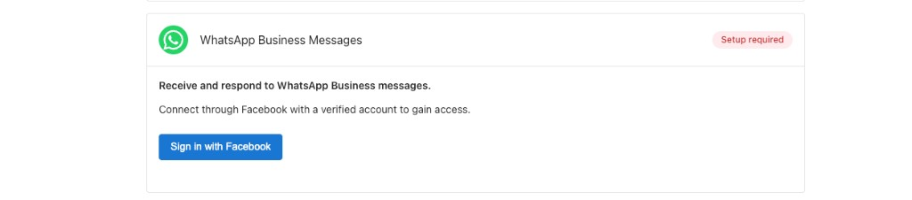
   

2. **Log in flow:** A popup will appear. Log in to your Facebook account to authorize the connection.

   

     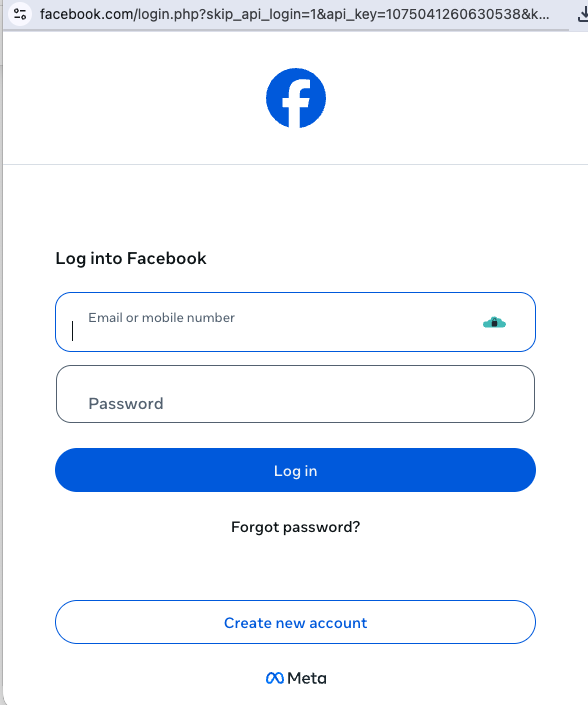
   

   * **Authorize Access:** Review the permissions and click `Continue` to allow Business App to connect to your WhatsApp Business account.

   

     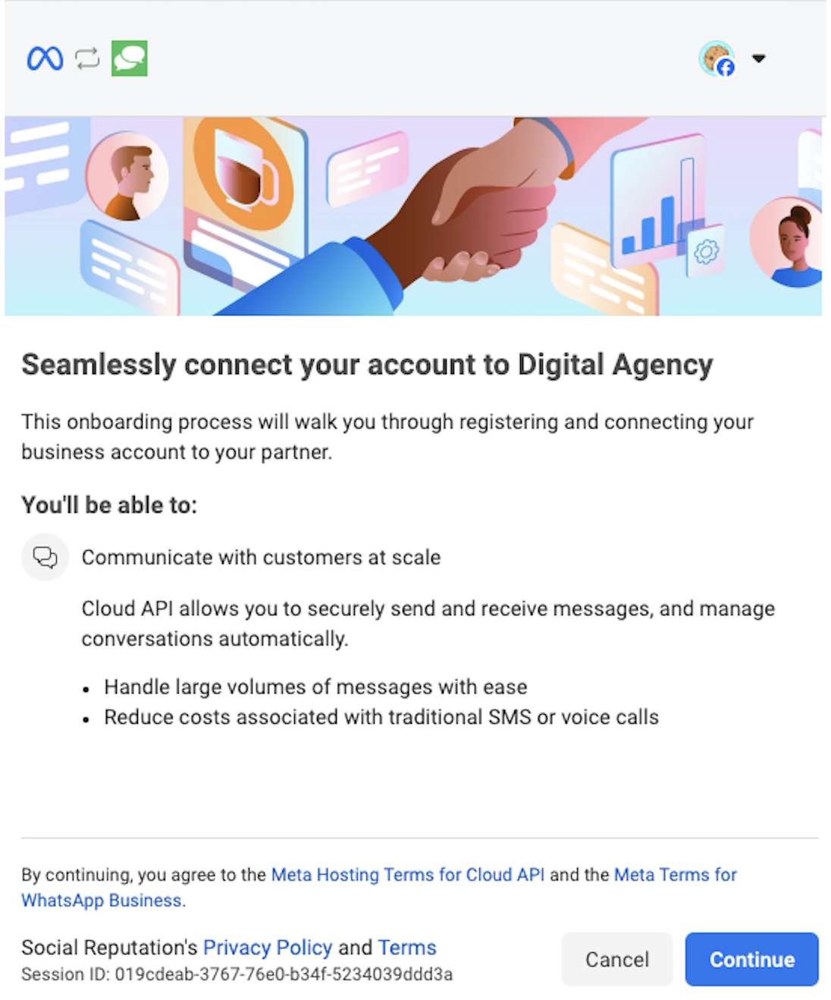
   

   * **Select Business Assets and Connection Type:** Choose your **Business Portfolio** from the dropdown menu, then under **WhatsApp Business account**, select **"Connect a WhatsApp Business App"** to link your existing account.

   

     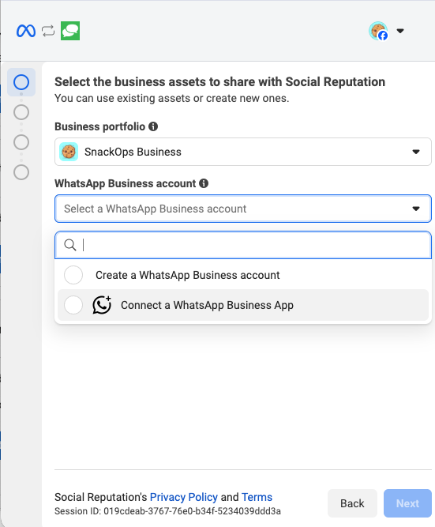
   

   * **Enter Phone Number:** Select your country code and enter the phone number associated with your WhatsApp Business App.

   

     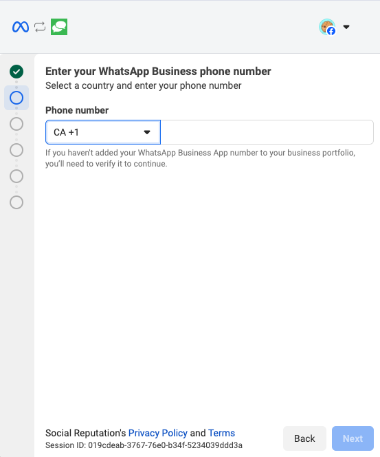
   

   * **Select Your Registered Business:** From the dropdown, choose your existing WhatsApp Business account that shows as `Registered`. Review the sharing access details and click `Next` to continue.

   

     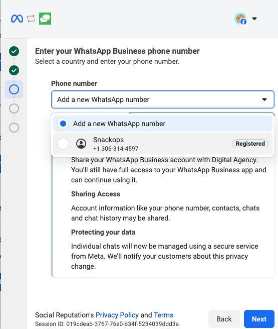
   

   * **Scan the QR Code:**
     * A QR code will appear on the platform.
      
       

         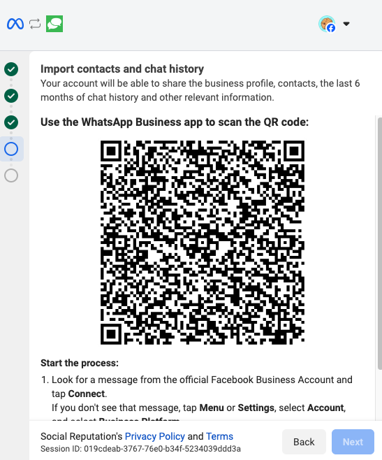
       

     * On your phone, open the WhatsApp Business App.
     * Check for a notification from **Facebook Business**. Tap the **Connect** button to begin the connection process.

       

         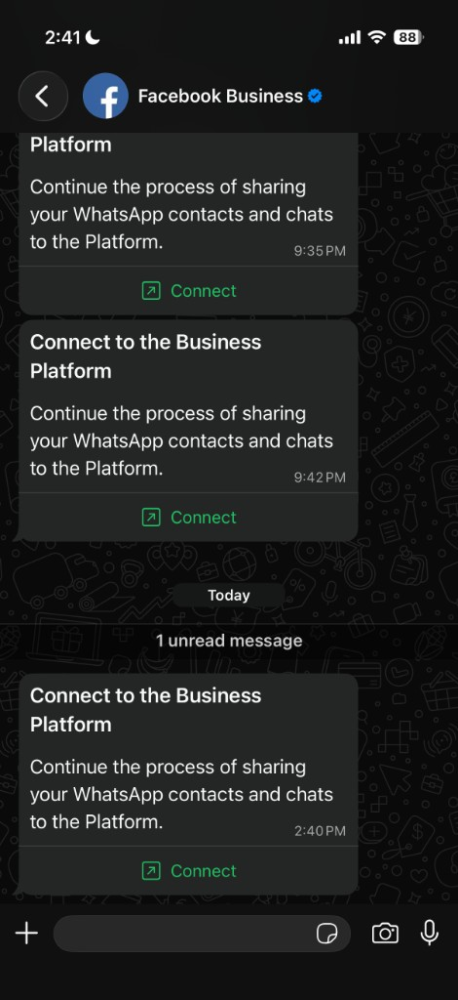
       

     * Click **Connect to the Business Platform** to continue the connection flow.

       

         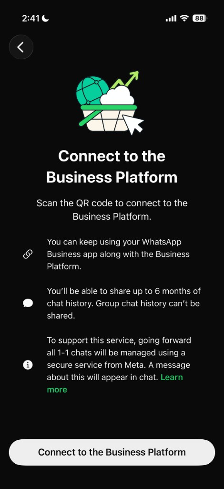
       

     * Choose your chat history preference: **Share all chats** (imports up to 6 months of history) or **Don't share chats**.

       

         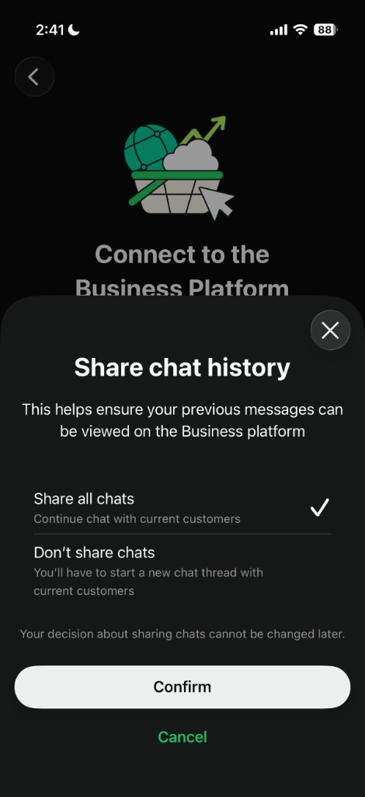
       

     * Scan the QR code to link your app to the platform. This can take up to 45 seconds.
     * Complete any remaining on-screen steps. If prompted, you can optionally add a payment method or finish the connection process. 

### 3. Verification

Once connected (this can take a few seconds for the connection to complete), you will see a `Connected` status in Business App. Your phone will continue to function normally, but you will now see all that conversation history (if available) appearing in the `Conversations` tab in Business App.

## How to Disconnect

If you no longer want to use WhatsApp with the platform, you can remove the connection. Disconnection is a two-part process: you disconnect in the WhatsApp Business app on your phone first, then remove the connection in Business App.

1. **Open the WhatsApp connection card:** In Business App, go to `Administration` > `Conversations Settings`. Locate the `WhatsApp Business Messages` card. When connected, it shows a `Connected` status and your linked phone number. Click `Disconnect` on the card

   

     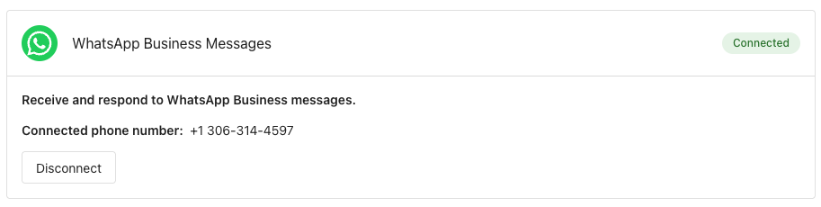
   

2. **Disconnect on your phone:** A modal appears with instructions. On your phone, open the **WhatsApp Business** app, then go to `Settings` > `Account` > `Business Platform`. Tap your business app name, then `Disconnect`, and confirm.

   

     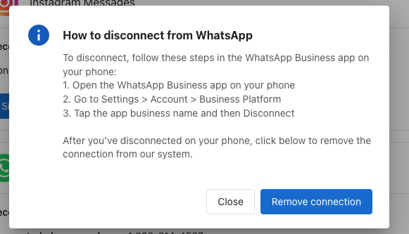
   

3. **Remove the connection in Business App:** After you have disconnected in the WhatsApp Business app on your phone, click `Remove connection` in the modal to remove the connection from the platform.

