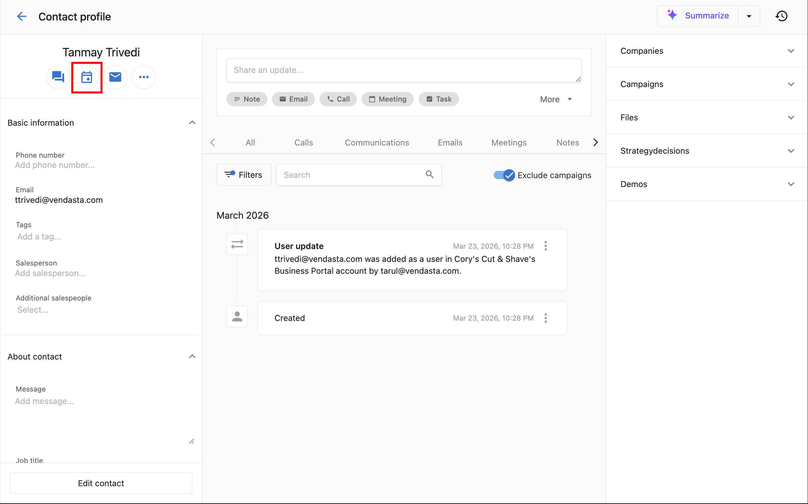

# Send a meeting request from CRM Contacts

Instead of copying a booking link and emailing it manually, you can send a meeting request directly from a contact's profile in the CRM. The contact receives an email with your booking link and picks a date and time that works for them.

:::tip Booking vs. requesting
This feature **sends the contact an email** so they can choose their own time slot. If you want to **book the meeting yourself** on a contact's behalf, use the **Book a meeting** button on the **My Meetings** page instead. See [My Meetings](./index.md).
:::

## How to send a meeting request

1. Navigate to `CRM` > `Contacts`.
2. Open the contact's profile.
3. Click the **calendar icon** near the top of the contact profile (or the **Book a meeting** button).

   

4. In the dialog, select the **event type** you want to use. The event type determines the booking link sent and the email subject and description.

5. Click **Send**.

The contact receives an email with your booking link. They click the link, choose an available date and time, and confirm. The meeting is then added to your calendar automatically.

## Customizing the invitation email

The subject and description of the meeting request email come from the **Customize invitation email** settings on each event type. To personalize it:

1. Go to `CRM` > `My Meetings`.
2. Click **Manage booking links**.
3. Open the kebab menu (⋮) next to the event type and click **Settings**.
4. Expand the **Customize invitation email** section.
5. Update the **Subject** and **Description** fields.
6. Click **Update event type** to save.

The next meeting request sent using that event type will use your updated subject and body.
