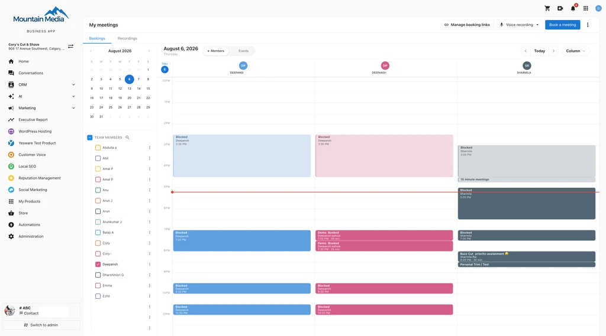
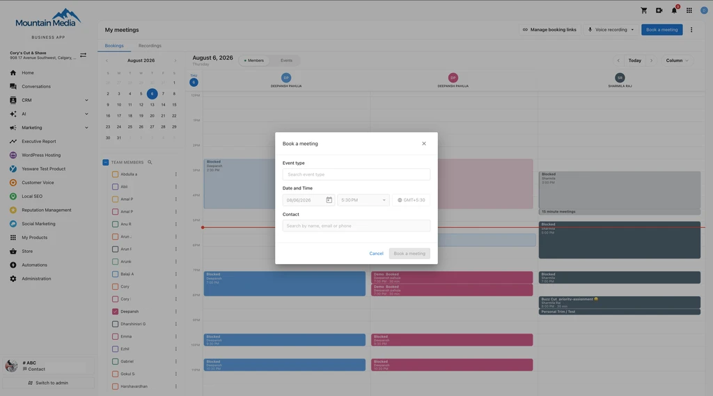
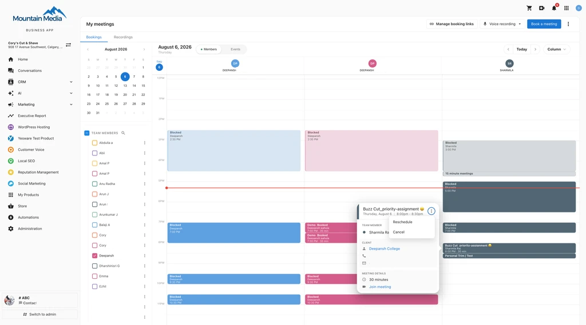
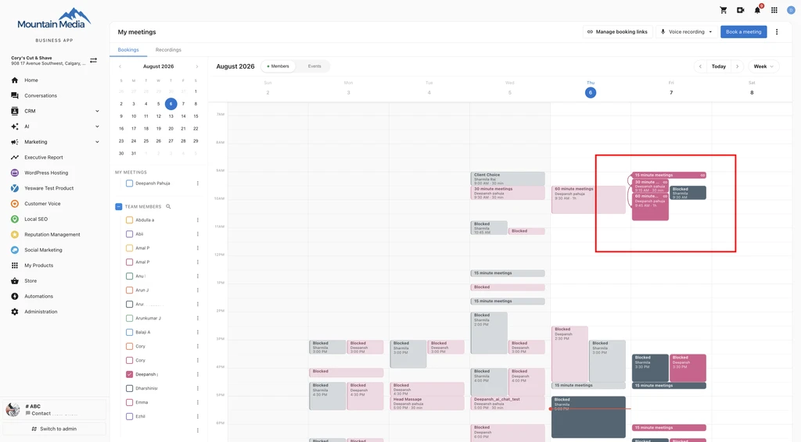
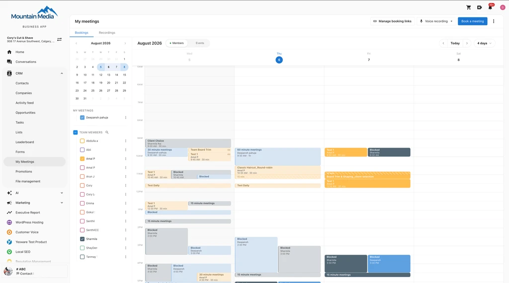

# Calendar Views

The My Meetings calendar gives you a live, interactive view of your business's schedule. Filter by team member or event type, switch between six calendar views, and book, reschedule, or cancel meetings directly from the calendar without leaving the page.

## Accessing the calendar

1. Go to `CRM` > `My Meetings`.
2. The calendar opens in **Column View** by default.
3. Use the view switcher in the top toolbar to switch between views.
4. Navigate dates with the arrow controls, or click any date on the mini calendar in the sidebar to jump directly.

## Choosing a view

Pick the view that fits how you work:

- **Column View (Teams)** — See your entire team side by side. Each column is a staff member; each row is a time slot. This is the fastest way to spot a gap across your whole team and find the right person for a new booking.
- **Day View** — A single-day breakdown by hour. Use this when you need to focus on what's happening today without any noise from the rest of the week.
- **Week View** — A seven-day grid for short-term planning. See how your team is spread across the week while keeping the detail of individual time slots.
- **Month View** — A full-month overview with event density that adapts to available space. Good for spotting coverage patterns and planning ahead.
- **List View** — A clean, chronological list of events grouped by day — ideal for a quick read of what's on the books without the visual weight of a grid.
- **Year View** — Also available from the view switcher for a longer-range look at your schedule.

## Column View: your whole team at a glance

Column View arranges your staff as side-by-side columns on a shared time axis. You can see at a glance who is booked, who has availability, and where the gaps are. Drag column headers to rearrange the order to match how you think about your team.

## Filter what you see

Use the left sidebar to control what appears on the calendar:

- Check or uncheck individual team members to show or hide their bookings.
- Right-click any team member's name and choose **Display only this** to isolate their schedule.
- Click the **Events** tab at the top of the sidebar to filter by service type instead of team member.
- Use the search bar inside the Team Events section to find specific bookings by name.

Your sidebar selections are remembered between sessions, so the calendar opens exactly as you left it.

## Book a meeting from the calendar

Click any empty time slot to open the booking dialog with the time and date pre-filled. Select the event, date, time, and contact to book with — you are booking as the host. Drag across multiple slots before releasing to set a longer duration.

You can select up to **5 event types** in a single booking — the same limit as services and groups.

## View, edit, reschedule, or cancel a meeting

Click any event card to open a detail panel showing the client's name and contact information, service type, time and duration, assigned hosts, booking questions and answers, guest emails, meeting link, and room or location.

From the same panel you can:

- **Reschedule** — Click **Reschedule**, then pick a new time from the available slots. Conflicts are checked automatically.
- **Cancel** — Cancel the booking directly from the detail panel.
- **Edit client details** — Update the client's information without leaving the panel.

## Color-coded team and services

Each team member and service type has its own color so you can read a packed calendar at a glance. Choose from 27 options per member — 9 base colors across regular, light, and bold intensities.

## Multi-service bookings

When a client books multiple services in a single session, the calendar shows them as linked. Click any one of the events and the detail panel lists the complete appointment — every service, its time, duration, and assigned provider.

:::note
Dragging one event in a multi-service booking moves all linked services by the same time offset — their relative spacing is always preserved.
:::

## Blocked time from connected calendars

When a team member connects their Google or Outlook calendar, their external busy time appears on the My Meetings calendar as a non-bookable **Blocked** slot, so you won't accidentally book over a lunch break, focus block, or out-of-office. Each card shows "Blocked," the team member's name, and the time and duration, in their assigned color at low opacity. The actual event title is never shown, keeping personal calendar details private.

Blocked slots appear in Column, Day, and Week views and respect your sidebar filters. Both **busy** and **out-of-office** statuses are treated as blocked.

## Good to know

- **Inactive team members stay visible.** Deactivated staff appear in a separate group in the sidebar so you can still review historical bookings. New bookings cannot be assigned to inactive members, and the calendar flags any existing bookings that need to be reassigned.
- **Conflict detection includes buffer time.** Each service type can be configured with setup or teardown buffer minutes. The calendar accounts for these when evaluating whether a drop destination is available.
- **Cross-column reassignment requires confirmation.** In Column View, dropping an event onto a different staff member's column opens a confirmation dialog before the provider change is saved.

## Frequently Asked Questions

Which calendar view opens by default?

Column View opens by default. You can switch to Day, Week, Month, List, or Year view using the view switcher in the top toolbar.

How many event types can I select in a single booking?

You can select up to 5 event types in a single booking — the same limit that applies to services and groups.

How do I see only one team member's schedule?

Right-click that team member's name in the sidebar and choose **Display only this** to isolate their schedule.

Will the calendar remember my sidebar filters the next time I open it?

Yes. Your sidebar selections are remembered between sessions, so the calendar opens exactly as you left it.

What happens if I drag one event in a multi-service booking?

All linked services in that booking move by the same time offset — their relative spacing is always preserved.

What are the blocked slots on my calendar?

Blocked slots represent busy time from a team member's connected Google or Outlook calendar. Both busy and out-of-office statuses appear as blocked, non-bookable time. The actual event title is never shown, so personal calendar details stay private.

Blocked slots appear in Column, Day, and Week views and respect your sidebar filters.

Can I still see bookings for a deactivated team member?

Yes. Deactivated staff appear in a separate group in the sidebar so you can review historical bookings. New bookings can't be assigned to inactive members, and the calendar flags any existing bookings that need to be reassigned.

Does the calendar account for setup or teardown time between bookings?

Yes. If a service type is configured with setup or teardown buffer minutes, the calendar accounts for that buffer time when checking whether a drop destination is available.

## Related articles

- [My Meetings](./index.md)
- [Team Booking Links](./team-booking-links.md)
