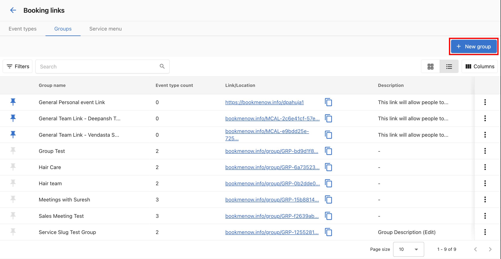
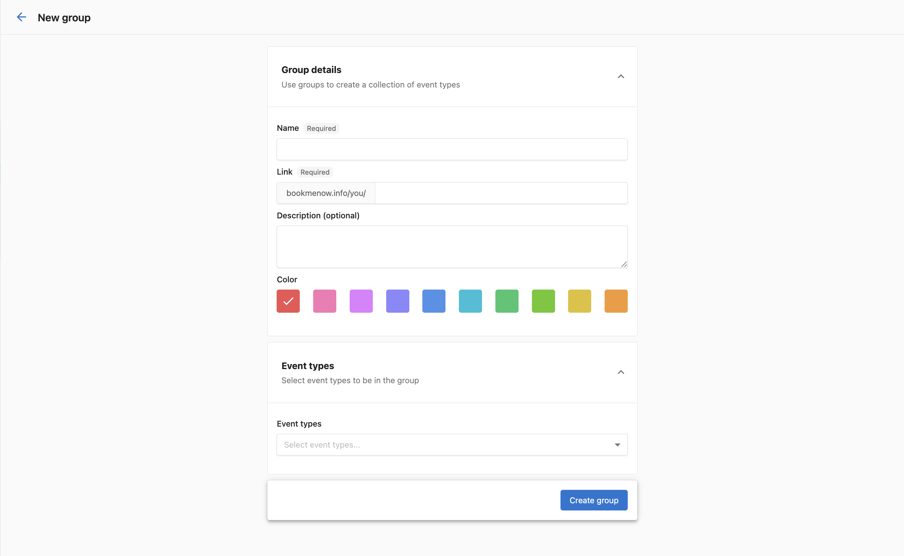
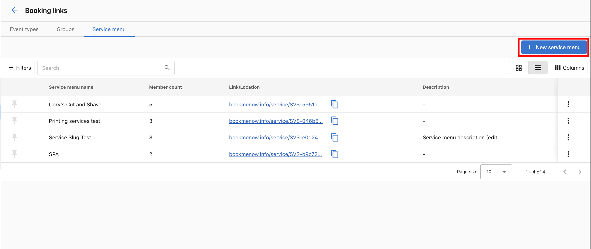
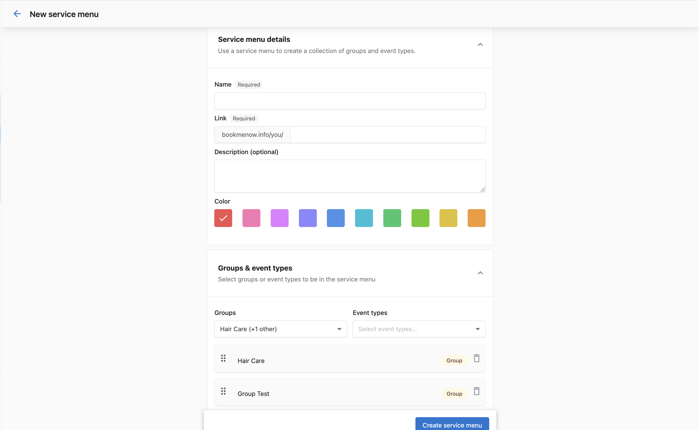

# Groups and Service Menus

Groups and Service Menus let you organize event types into curated collections, so you can share a single link with customers or publish a full service catalogue on your website.

- **Groups** — Bundle multiple event types under one link. The customer chooses which meeting type they want, then picks a time.
- **Service Menus** — A structured, multi-level catalogue of Groups and/or Event Types. Ideal for service businesses that want to publish a "Book an Appointment" page on their website.

:::note
Groups and Service Menus are shared across your organization. Any team member can create, edit, or delete them.
:::

---

## Setting up Groups

### Create a Group

1. Navigate to `My Meetings` > **Manage booking links** > **Groups** tab.

   

2. Click **+ New group**.

   

3. Fill in the group details:
   - **Name** — A descriptive name customers will see (e.g., "Hair Care").
   - **Link** — A URL slug is generated automatically. You can customize it.
   - **Description** (optional) — Briefly describe the group.
   - **Color** — Pick a color to identify the group.
   - **Event types** — Add the event types you want in the group. You can mix personal and team event types.

4. Click **Create group**.

### Share a Group link

Copy the link from the Groups list and share it via email, chat, or add it to a website button like "Book a Service."

When a customer clicks the group link, they see all event types in the group and choose the one that fits before picking a date and time.

### Edit or delete a Group

From the Groups list, click the kebab menu (⋮) next to a group:
- **Settings** — Edit name, description, color, and event types.
- **View event link** — Preview the booking page.
- **Delete** — Remove the group (does not affect underlying event types or existing bookings).

:::note
The **General Personal Event Link** and **General Team Event Link** groups are created automatically and cannot be deleted.
:::

---

## Setting up Service Menus

### Create a Service Menu

1. Navigate to `My Meetings` > **Manage booking links** > **Service menu** tab.

   

2. Click **+ New service menu**.

   

3. Fill in the service menu details:
   - **Name** — A descriptive name (e.g., "Cory's Cut and Shave").
   - **Link** — A URL slug is generated automatically.
   - **Description** (optional).
   - **Color** — Pick a color.
   - **Groups & event types** — Add one or more Groups and/or individual Event Types.

4. Click **Create service menu**.

### Share or embed a Service Menu

After creating the service menu, copy its link from the Service menu list to:
- Publish as a "Book an Appointment" button on your website.
- Share directly with customers via email or chat.

You can also use the **Add to my website** embed code (available on individual event types and service menus) to embed the booking form inline on your website.

### Customer booking flow

When a customer clicks your Service Menu link:

1. They see all Groups and direct Event Types in the menu.
2. If they choose a Group, they then see the event types within it and select one.
3. They pick an available date and time and confirm.

---

## Best practices

**For service businesses (salons, clinics, trades):**
- Use In-Person (Host Location) event types — do not offer Video or Client Location for physical services.
- Use Round Robin if any available staff member can serve a customer; use Client Selection if customers prefer a specific person.
- Keep Groups to **3–5 event types** to avoid overwhelming customers.

**For sales teams:**
- Group related meeting types together — e.g., Discovery Call, Product Demo, Pricing Review in one "Sales Meetings" group.
- Share the group link in outbound emails so prospects self-select the right meeting.

**General:**
- Name Groups and Event Types clearly so customers immediately understand their options.
- Your branding (logo, colors) applies automatically across Group and Service Menu booking pages.
- Existing event types can be added to Groups and Service Menus immediately — no need to recreate them.
- Use Service Menus for a structured hierarchy (e.g., service categories → specific services).
