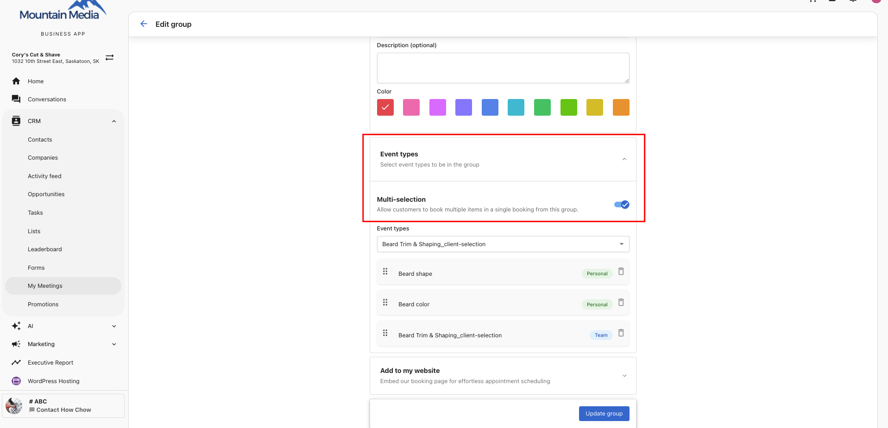
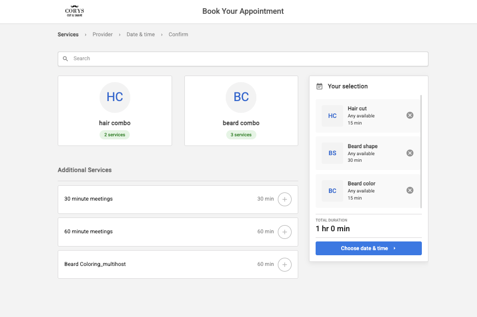
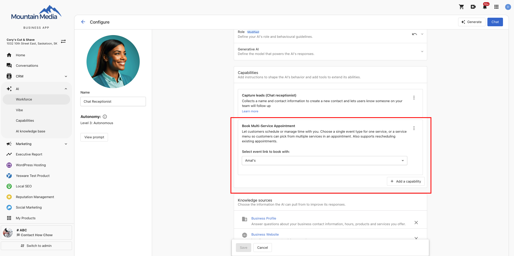
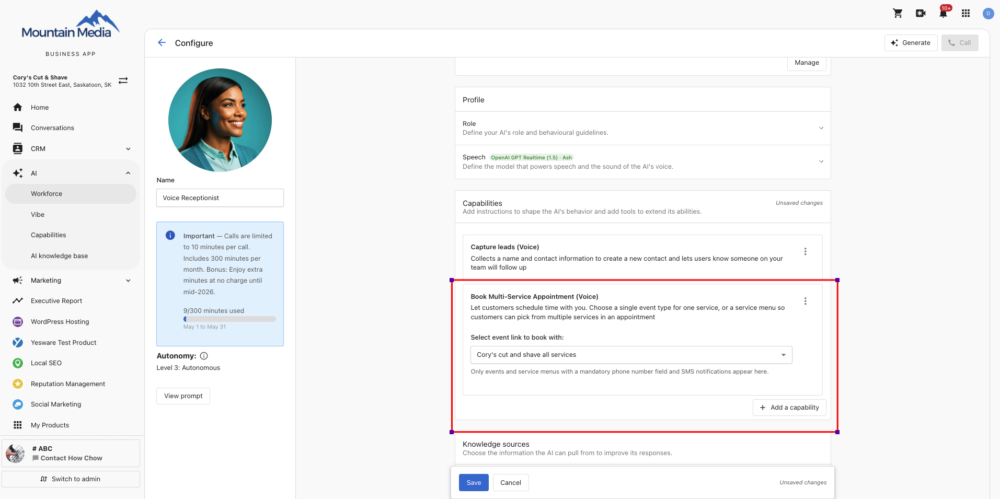

# Groups and Service Menus

Groups and Service Menus let you organize event types into curated collections, so you can share a single link with customers or publish a full service catalogue on your website.

- **Groups** — Bundle multiple event types under one link. The customer chooses which meeting type they want, then picks a time.
- **Service Menus** — A structured, multi-level catalogue of Groups and/or Event Types. Ideal for service businesses that want to publish a "Book an Appointment" page on their website.

With **Multi-Service Booking** enabled, customers can select multiple services in a single session and walk away with one confirmed appointment block.

:::note
Groups and Service Menus are shared across your organization. Any team member can create, edit, or delete them.
:::

---

## Setting up Groups

### Create a Group

1. Navigate to `My Meetings` > **Manage booking links** > **Groups** tab.

   

2. Click **+ New group**.

   

3. Fill in the group details:
   - **Name** — A descriptive name customers will see (e.g., "Hair Care").
   - **Link** — A URL slug is generated automatically. You can customize it.
   - **Description** (optional) — Briefly describe the group.
   - **Color** — Pick a color to identify the group.
   - **Event types** — Add the event types you want in the group. You can mix personal and team event types.
   - **Multi-selection** — Toggle **on** to let customers pick more than one service from this group (e.g., add-ons and upgrades). Leave **off** if they should pick only one (e.g., a primary service category where options are mutually exclusive).
   - **Redirect to a custom URL** — Turn on to send customers to a custom HTTPS URL after they book through this group, instead of the default confirmation page, with an optional delay in seconds. This setting applies to every booking made through the group — individual event type redirect settings inside it are not used. See [Redirect to a custom URL](#redirect-to-a-custom-url) below.

   

4. Click **Create group**.

### Share a Group link

Copy the link from the Groups list and share it via email, chat, or add it to a website button like "Book a Service."

When a customer clicks the group link, they see all event types in the group and choose the one that fits before picking a date and time.

### Edit or delete a Group

From the Groups list, click the kebab menu (⋮) next to a group:
- **Settings** — Edit name, description, color, event types, and multi-selection setting.
- **View event link** — Preview the booking page.
- **Delete** — Remove the group (does not affect underlying event types or existing bookings).

:::note
The **General Personal Event Link** and **General Team Event Link** groups are created automatically and cannot be deleted.
:::

---

## Setting up Service Menus

### Create a Service Menu

1. Navigate to `My Meetings` > **Manage booking links** > **Service menu** tab.

   

2. Click **+ New service menu**.

   

3. Fill in the service menu details:
   - **Name** — A descriptive name (e.g., "Cory's Cut and Shave").
   - **Link** — A URL slug is generated automatically.
   - **Description** (optional).
   - **Color** — Pick a color.
   - **Groups & event types** — Add one or more Groups and/or individual Event Types.
   - **Multi-selection** — Turn **on** to allow customers to select services across groups in a single booking session. Defaults to **on** for new menus, **off** for existing menus.
   - **Redirect to a custom URL** — Turn on to send customers to a custom HTTPS URL after they book through this service menu, instead of the default confirmation page, with an optional delay in seconds. This setting applies to every booking made through the service menu — individual group and event type redirect settings are not used. See [Redirect to a custom URL](#redirect-to-a-custom-url) below.

   :::note
   If you add a Group with multi-selection enabled to a Service Menu that has it turned off, the app shows a warning. Enable multi-selection on the Service Menu to resolve it, or keep it off if you want the overall session to remain single-service.
   :::

4. Click **Create service menu**.

### Share or embed a Service Menu

After creating the service menu, copy its link from the Service menu list to:
- Publish as a "Book an Appointment" button on your website.
- Share directly with customers via email or chat.

You can also use the **Add to my website** embed code (available on individual event types and service menus) to embed the booking form inline on your website.

### Customer booking flow

When a customer clicks your Service Menu link:

1. They see all Groups and direct Event Types in the menu.
2. If they choose a Group, they then see the event types within it and select one (or multiple, if multi-selection is enabled on that group).
3. They pick an available date and time and confirm.

---

## Redirect to a custom URL

Event types, Groups, and Service Menus can each redirect customers to a custom URL after they book, instead of showing the default confirmation page. The setting is independent at each level — there's no global toggle, and enabling a redirect on a Group or Service Menu doesn't enable it on the event types inside it, or the other way around.

### Which setting applies

- **Booking an event type directly** — Uses that event type's own redirect setting. If it's off, the customer sees the default confirmation page.
- **Booking through a Group** — Uses only the group's redirect setting, regardless of what the event types inside it have configured. If the group's redirect is off, the customer sees the default confirmation page.
- **Booking through a Service Menu** — Uses only the service menu's redirect setting, regardless of what the groups or event types inside it have configured. If it's off, the customer sees the default confirmation page.

### Conflict warning

If a Group's or Service Menu's redirect toggle is off while one or more of the event types inside it have their own redirect URL set, a warning banner appears on the Redirect to a custom URL card:

> Action Required: Some events have redirect URLs set. Add a group-level URL here, otherwise all bookings will fall back to the default confirmation page.

(Service menus show the same message, referencing events and groups.)

To clear the banner, either turn on the toggle and enter a Group- or Service Menu-level URL, or leave it off and accept that all bookings through that Group or Service Menu land on the default confirmation page. The banner clears automatically once you save with the toggle on and a valid URL entered.

### What to know

- The customer's booking confirmation email always sends, regardless of the redirect configuration.
- For Group and Service Menu bookings, the redirect fires once, after every service in the booking is confirmed.
- For team and round-robin event types, the redirect URL comes from the event type setting — it doesn't change based on which host is assigned.
- Redirect doesn't apply to meetings you book yourself from a CRM contact — those bookings don't show a public confirmation page.
- If a customer books through an embedded widget on your website, the redirect breaks out of the widget to the full browser window.
- Redirect only applies to bookings submitted through the guest-facing booking form. It doesn't apply to bookings made through an AI Chat or AI Voice Receptionist.

---

## Multi-Service Booking

Multi-Service Booking lets customers select multiple services in a single session and walk away with one confirmed appointment block — without going through the booking flow separately for each service.

### How it works for your customers

When a customer opens your booking link with multi-selection enabled:

1. They see your services organized by the groups you configured and can select multiple services.
2. They pick a provider (or let the system assign one). The provider selection screen appears only when the event type is set to **Client Selection** assignment — all other assignment types skip directly to date and time.
3. They pick a date and time — the calendar shows only slots where the full sequence of selected services fits back-to-back.
4. On confirmation, they receive a **single notification** with the complete itinerary: every service, every time, and every provider.

The booking appears in your **My Meetings** bookings view as individual appointment blocks assigned to the right team member for each service.

### Smart availability

The booking engine finds back-to-back time that works for every selected service and the right provider for each. If two services require the same staff member, the system finds a contiguous window. If services can be split across providers, it finds a sequence where both are available.

**Anchor service rule:** Services are scheduled in the order the customer selected. The start time of each subsequent service locks automatically to the end of the previous one.

### What to know

- **Customers can choose their provider** — pick a specific staff member per service, stick with the same provider across all services, or select **"Any"** to get the best available. "Any" prioritises staff who can cover all selected services, minimising session gaps.
- **Reschedule and cancel apply to the full session.** Customers reschedule or cancel the entire booking, not individual services within it.
- **Notification channel follows event type settings.** If all services use SMS, the customer gets one SMS. If a mix exists, both channels send a single consolidated message each.
- **Existing single-service menus are unaffected.** The multi-selection toggle defaults to **off** for all existing menus. Nothing changes for your current customers unless you opt in.
- **Intake form deduplication.** If two services both ask for "Phone Number," the customer is asked only once.
- **Single CRM activity log.** The entire multi-service session is recorded as one event in the CRM activity feed.

---

## Book Multi-Service Appointments with AI

Your AI Chat and AI Voice Receptionists can handle multi-service bookings end-to-end — detecting multiple services in a single request, finding a contiguous time block, and confirming the full session automatically.

Both AI agents must be configured separately. Enabling the capability for Chat does not enable it for Voice.

### AI Chat Receptionist

When a customer types "I need a haircut and a beard trim" in chat, the AI detects both services, presents your Service Menu, finds a time slot where all selected services fit back-to-back, and confirms the whole session in one conversation.

**To set up:**

1. Create a Service Menu with multi-selection enabled (see above).
2. Go to **AI → Workforce → Chat Receptionist → Configure → Add a Capability → Book Multi-Service Appointment**.
3. Select the Service Menu and save.

Your AI Chat Receptionist presents that menu to customers and handles the full multi-service booking flow automatically.

:::note
Your Chat Receptionist configuration may show two capabilities: **Book Appointments** and **Book Multi-Service Appointment**. Use **Book Multi-Service Appointment** — it handles both single-service and multi-service bookings and is a complete replacement. If Book Appointments is visible in your configuration, switch to Book Multi-Service Appointment to access multi-service support and future improvements.
:::

### AI Voice Receptionist

When a caller says "I need a haircut and a beard trim," the AI Voice Receptionist detects both services, navigates service categories conversationally to keep calls short, finds a contiguous time block, and confirms the full session over the phone.

**Voice booking requirements:** Voice bookings are phone-number-based. Only event types configured with **SMS as the notification type** and **Phone Number as a required intake field** are compatible with the AI Voice Receptionist. Event types that require an email address are incompatible and do not appear when configuring this capability. Update those event type settings before connecting a Service Menu to your Voice Receptionist.

**To set up:**

1. Ensure every event type in your Service Menu has:
   - **Notification type:** SMS
   - **Required intake field:** Phone Number
2. Go to **AI → Workforce → Voice Receptionist → Configure → Add a Capability → Book Multi-Service Appointment**.
3. Select the Service Menu and save. Only Service Menus whose event types are fully configured for SMS and phone number appear as options.

Booking confirmations and reminders are sent via SMS to the phone number provided during the booking.

:::note
AI Chat and AI Voice Receptionists are independent agents. A Service Menu that works for Chat may not be immediately compatible with Voice if any of its event types use email notifications. Review and update those event types before connecting the menu to your Voice Receptionist.
:::

---

## Best practices

**For service businesses (salons, clinics, trades):**
- Use In-Person (Host Location) event types — do not offer Video or Client Location for physical services.
- Use Round Robin if any available staff member can serve a customer; use Client Selection if customers prefer a specific person.
- Keep Groups to **3–5 event types** to avoid overwhelming customers.
- Enable multi-selection on Service Menus to let customers book multiple services (e.g., haircut + beard trim) in a single visit.

**For sales teams:**
- Group related meeting types together — e.g., Discovery Call, Product Demo, Pricing Review in one "Sales Meetings" group.
- Share the group link in outbound emails so prospects self-select the right meeting.

**General:**
- Name Groups and Event Types clearly so customers immediately understand their options.
- Your branding (logo, colors) applies automatically across Group and Service Menu booking pages.
- Existing event types can be added to Groups and Service Menus immediately — no need to recreate them.
- Use Service Menus for a structured hierarchy (e.g., service categories → specific services).
- For AI bookings, connect the same Service Menu to both Chat and Voice Receptionists if both channels are active — but configure each agent separately.
