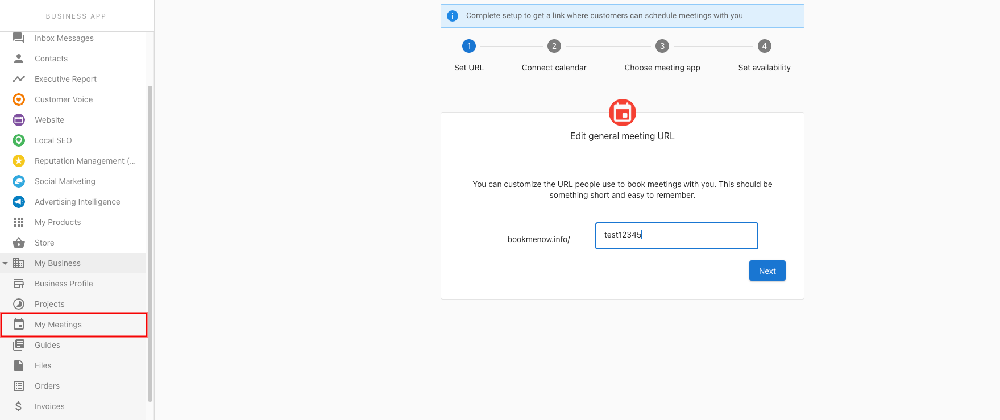
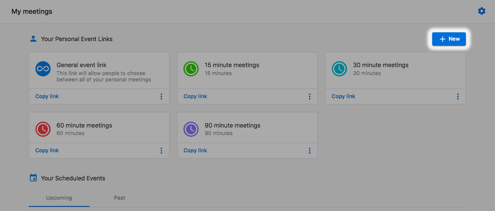
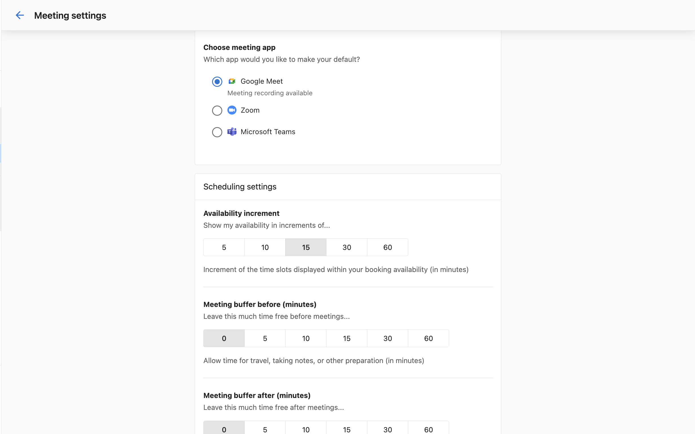
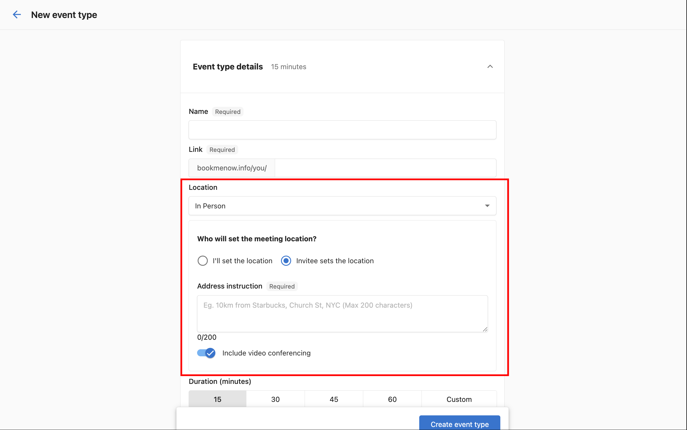
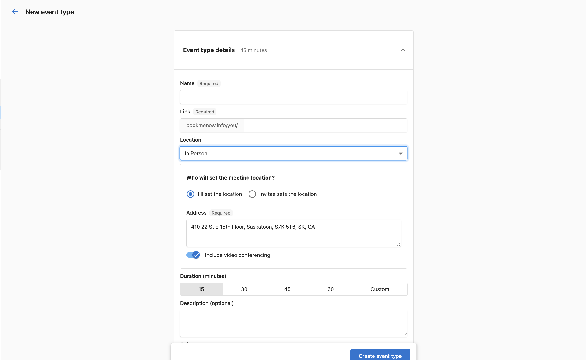
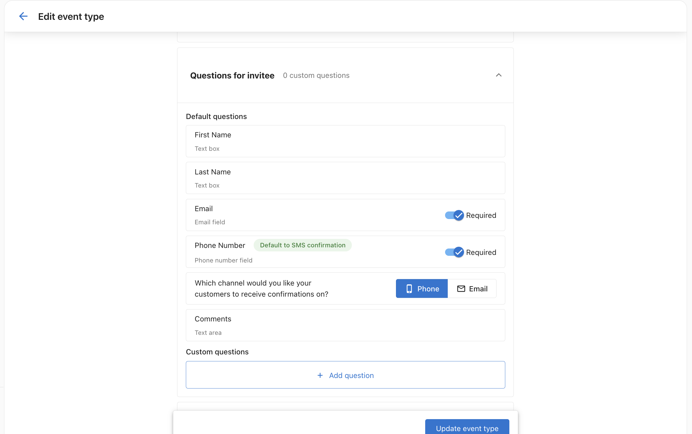
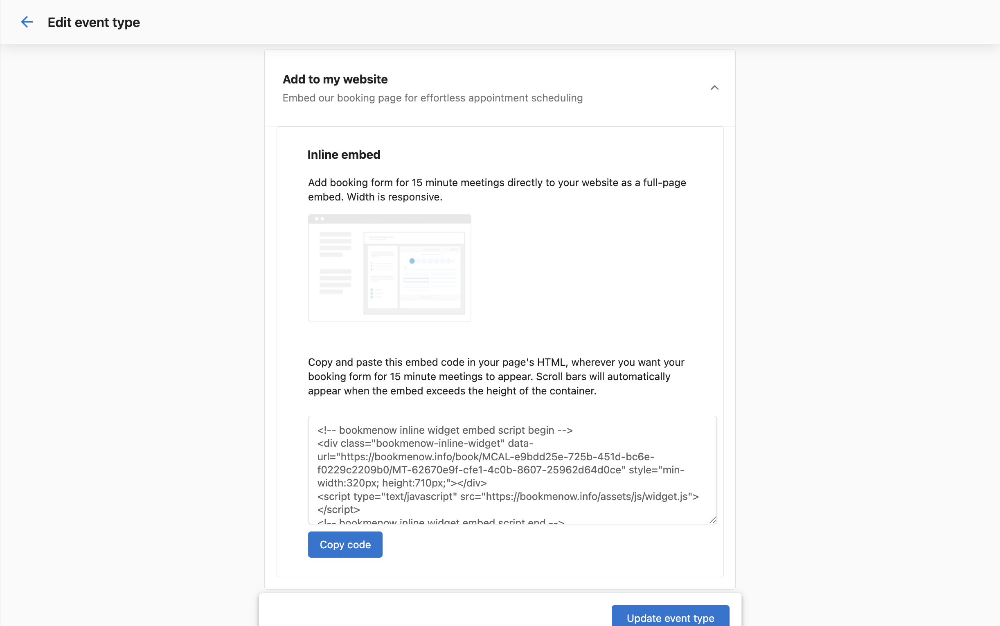
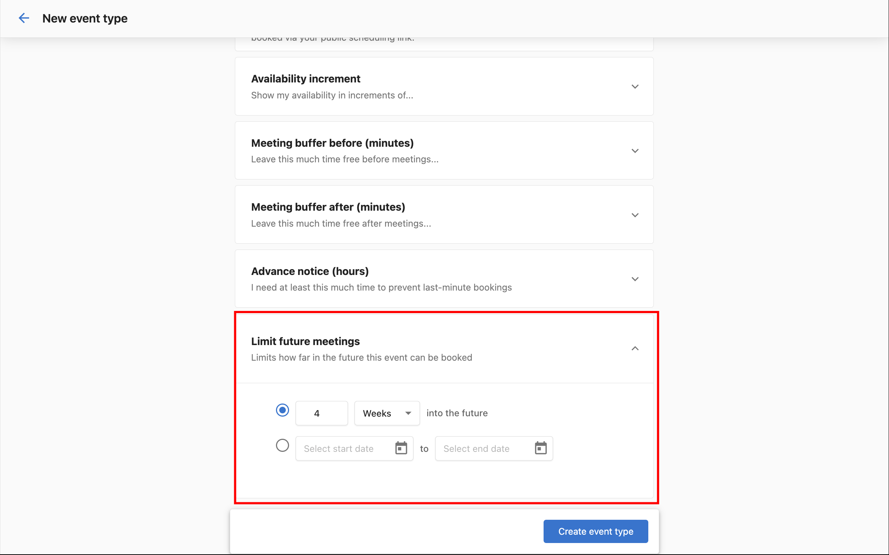
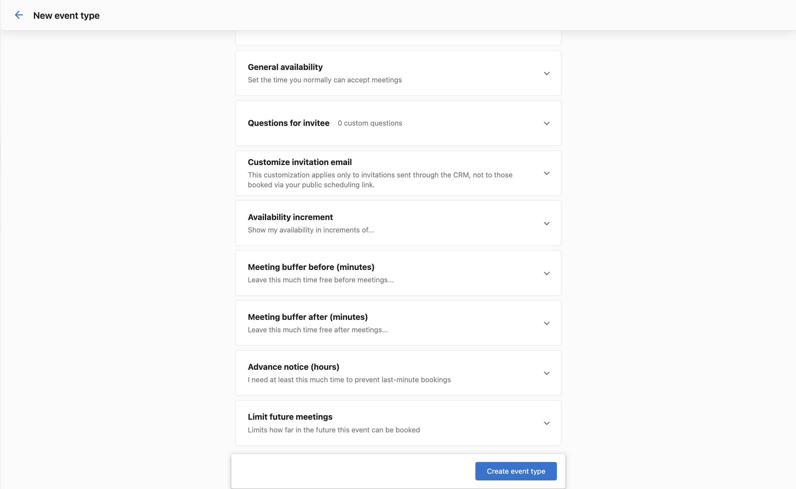

# My Meetings

Use My Meetings to share booking links, manage availability, and track upcoming meetings directly from the CRM.

## Why use My Meetings?

- Make it easy for prospects and customers to book time with you
- Reduce back-and-forth and no-shows with automated confirmations
- Keep meetings connected to contacts, companies, and opportunities

## What's included

- **Personal and team booking links**
- **Availability settings** and buffers
- **Calendar connections** (Google Calendar and Microsoft 365 / Outlook)
- **Microsoft Teams video conferencing integration**
- **Multi‑host events (up to five hosts)**
- **Groups and Service Menus** for organized booking catalogues
- **SMS confirmations and reminders** (requires Conversations AI Pro or Premium)

## Book a meeting

1. Go to `CRM` > `My Meetings`.
2. Click **Book a meeting**.

3. Fill in the **Book a meeting** form:
   - **Contact** — Search for an existing contact or click **+Add contact** to create one.
   - **Additional guest email(s)** — Add email addresses for other attendees.
   - **Event type** — Search and select the type of meeting.
   - **Timezone** — Confirm or change the timezone.
   - **Date & Time** — Select the meeting date and time.

4. Click **Book a meeting** to confirm.

Once booked, the meeting appears under the **Bookings** tab. Use **Upcoming** and **Past** toggles to filter your view, and switch to the **Recordings** tab to review past recordings.

## Initial setup

When you first open **My Meetings**, a setup wizard guides you through four steps:

1. **Set URL** — Customize your personal booking URL.
2. **Connect calendar** — Link your Google Calendar or Microsoft 365 / Outlook calendar.
3. **Choose meeting app** — Select your default meeting app (Google Meet, Zoom, or Microsoft Teams).
4. **Set default settings** — Configure availability, buffers, and timezone.

Once complete, update any of these at any time from **Meeting settings**.

## Meeting settings

Click the **three-dot menu** in the top-right corner of the My Meetings page and select **Meeting settings**.

From here you can configure:

- **General meeting URL** — Customize the URL people use to book with you.
- **Calendar settings** — Connect Google Calendar or Microsoft 365 / Outlook.
- **Choose meeting app** — Select Google Meet, Zoom, or Microsoft Teams as your default.
- **Scheduling settings**:
  - **Availability increment** — Show time slots in increments of 5, 10, 15, 30, or 60 minutes.
  - **Meeting buffer before/after** — Set buffer time before and after meetings for travel, notes, or preparation.

- **Advance notice** — Set the minimum lead time to prevent last-minute bookings.
- **General availability** — Set which days and hours you accept meetings.
- **Timezone** — Confirm or change your timezone.

## Manage booking links

Click **Manage booking links** to view all event types.

### Create a new event type

Click **Create event type** and fill in the details:

- **Name** — Give the event type a name.
- **Link** — A unique booking link is generated automatically.
- **Location** — Choose where the meeting takes place:
  - **Video** — Meeting is held over video conference (Google Meet, Zoom, or Teams link inserted automatically).
  - **In Person** — Meeting at a physical location. Choose who sets the address:
    - **I'll set the location** — You provide the address (pre-filled from your business profile). Optionally enable **Include video conferencing** to make it a hybrid meeting.
    - **Invitee sets the location** — The person booking provides their address at booking time. Useful for on-site service calls.
- **Duration** — 15, 30, 45, or 60 minutes, or a custom length.
- **Description** — Optional description.
- **Color** — Pick a color to identify this event type.

You can also configure additional options per event type. Settings here override your user-level defaults for this event type only:

- **General availability** — Override your default availability for this event type.
- **Questions for invitee** — Add custom questions invitees answer when booking. You can make **Phone Number** a required field. When phone is collected, choose the **notification channel** — **SMS** or **Email** — for booking confirmations and reminders sent to the invitee.

  :::note
  SMS confirmations and reminders require an active subscription to **Conversations AI Pro or Premium** (Reputation AI Premium and Campaigns Pro also unlock this). Your business phone number must be registered first. Configure at `Administration` → `SMS Configuration`.
  :::

  

- **Customize invitation email** — Customize the subject and body of the email sent when you request a meeting from a CRM contact.
- **Availability increment** — Override the default time slot increment (5, 10, 15, 30, or 60 minutes).
- **Meeting buffer before/after** — Override the default buffer times.
- **Advance notice** — Override the minimum lead time for this event type.
- **Add to my website** — Get an embed code to add your booking form as an inline widget on a website.

  

- **Limit future meetings** — Control how far into the future meetings can be scheduled. Set limits by days, weeks, months, or a custom date range.

  

:::note
If a meeting type is deleted, it will not cancel existing bookings. The link is deactivated and no longer accepts new bookings. Deleted event types cannot be restored — you will need to create a new one.
:::

## Frequently Asked Questions

Can I set different durations for meeting types?

Yes. Configure durations when creating or editing a booking link — choose 15, 30, 45, 60 minutes, or a custom length.

How many hosts can I add to a single event?

You can add up to five hosts to a multi-host event. All selected hosts are added to the calendar invite. All hosts must have their calendar connected for accurate availability checking.

Do I need anything special to connect Microsoft Outlook/Teams?

You'll need to sign in with a Microsoft 365 account you control. Some organizations require an administrator to approve new app connections — if you see a consent prompt, contact your Microsoft admin to enable it.

Which video link is used for multi‑host events?

The conferencing provider set in the booking link is used. If Microsoft Teams is connected and selected, a Teams meeting is created and included on the invite for all hosts and attendees.

How do I send SMS reminders to customers?

Add Phone Number as a required field in **Questions for invitee** and select **Phone** as the notification channel. SMS requires a Conversations AI Pro or Premium subscription and a registered business phone number. Configure at `Administration` → `SMS Configuration`. Supported countries: United States, Canada, and Italy.

