# My Meetings

Use My Meetings to share booking links, manage availability, and track upcoming meetings directly from the CRM.

## Why use My Meetings?

- Make it easy for prospects and customers to book time with you
- Reduce back-and-forth and no-shows with automated confirmations
- Keep meetings connected to contacts, companies, and opportunities

## What's included

- **Personal and team booking links**
- **Calendar views**: See your team's schedule in Column, Day, Week, Month, List, or Year view, filter by team member or service, and book, reschedule, or cancel meetings directly from the calendar
- **Availability settings** and buffers
- **Calendar connections** (Google Calendar and Microsoft 365 / Outlook)
- **Microsoft Teams video conferencing integration**
- **Multi‑host events (up to five hosts)**
- **Groups and Service Menus** for organized booking catalogues
- **Multi-Service Booking**: let customers book multiple services in a single session
- **AI Chat & Voice Receptionist booking**: your AI employees handle multi-service bookings end-to-end
- **Limit future meetings**: control how far ahead customers can schedule
- **SMS confirmations and reminders** (requires Conversations AI Pro or Premium)
- **Audio recording**: record in-person meeting audio from the My Meetings page and upload it to the CRM
- **Automatic booking page language**: booking pages display in your customer's browser language automatically

## Book a meeting

1. Go to `CRM` > `My Meetings`.
2. Click **Book a meeting**.

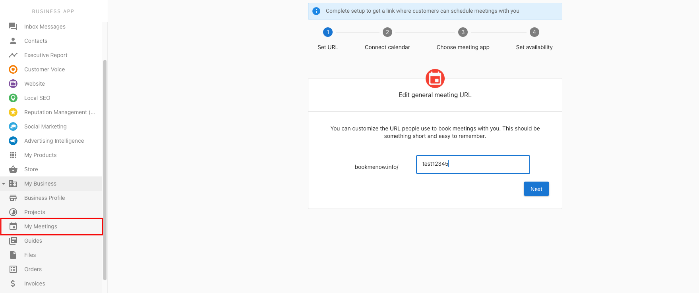

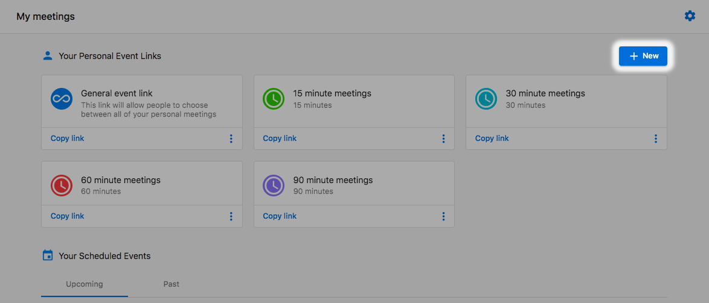

3. Fill in the **Book a meeting** form:
   - **Contact**: Search for an existing contact or click **+Add contact** to create one.
   - **Additional guest email(s)**: Add email addresses for other attendees.
   - **Event type**: Search and select the type of meeting.
   - **Timezone**: Confirm or change the timezone.
   - **Date & Time**: Select the meeting date and time.

4. Click **Book a meeting** to confirm.

Once booked, the meeting appears under the **Bookings** tab. Use **Upcoming** and **Past** toggles to filter your view, and switch to the **Recordings** tab to review past recordings.

You can also click any open time slot directly on the calendar to open the same booking dialog pre-filled with that time and date. See [Calendar Views](./calendar-views.md) for the full calendar experience, including filtering by team member or service and rescheduling from the calendar.

## Initial setup

When you first open **My Meetings**, a setup wizard guides you through four steps:

1. **Set URL**: Customize your personal booking URL.
2. **Connect calendar**: Link your Google Calendar or Microsoft 365 / Outlook calendar.
3. **Choose meeting app**: Select your default meeting app (Google Meet, Zoom, or Microsoft Teams).
4. **Set default settings**: Configure availability, buffers, and timezone.

Once complete, update any of these at any time from **Meeting settings**.

## Meeting settings

Click the **three-dot menu** in the top-right corner of the My Meetings page and select **Meeting settings**.

From here you can configure:

- **General meeting URL**: Customize the URL people use to book with you.
- **Calendar settings**: Connect Google Calendar or Microsoft 365 / Outlook.
- **Choose meeting app**: Select Google Meet, Zoom, or Microsoft Teams as your default.
- **Scheduling settings**:
  - **Availability increment**: Show time slots in increments of 5, 10, 15, 30, or 60 minutes.
  - **Meeting buffer before/after**: Set buffer time before and after meetings for travel, notes, or preparation.

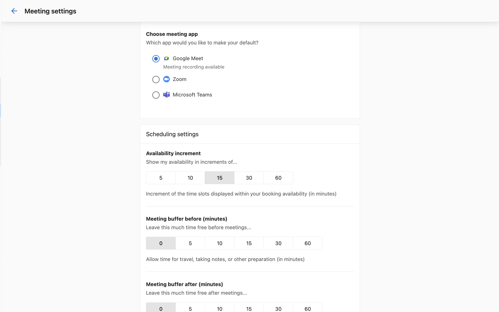

- **Advance notice**: Set the minimum lead time to prevent last-minute bookings.
- **General availability**: Set which days and hours you accept meetings.
- **Timezone**: Confirm or change your timezone.

## Manage booking links

Click **Manage booking links** to view all event types.

When you first set up My Meetings, a few event types are created for you automatically so you can start sharing links right away:

- `15 minute meetings`, `30 minute meetings`, and `60 minute meetings` on your personal booking page.
- `Online services`, a 30-minute team event type shared with your team.

You can edit or delete these like any other event type.

### Create a new event type

Click **Create event type** and fill in the details:

- **Name**: Give the event type a name.
- **Link**: A unique booking link is generated automatically.
- **Location**: Choose where the meeting takes place:
  - **Video**: Meeting is held over video conference (Google Meet, Zoom, or Teams link inserted automatically).
  - **In Person**: Meeting at a physical location. Choose who sets the address:
    - **I'll set the location**: You provide the address (pre-filled from your business profile). Optionally enable **Include video conferencing** to make it a hybrid meeting.
    - **Invitee sets the location**: The person booking provides their address at booking time. Useful for on-site service calls.
- **Duration**: 15, 30, 45, or 60 minutes, or a custom length.
- **Description**: Optional description.
- **Color**: Pick a color to identify this event type.

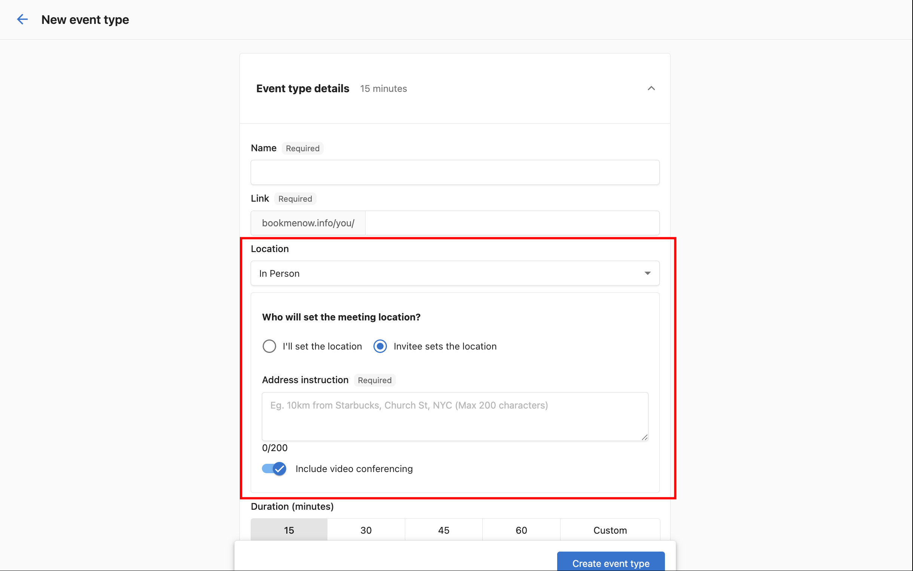

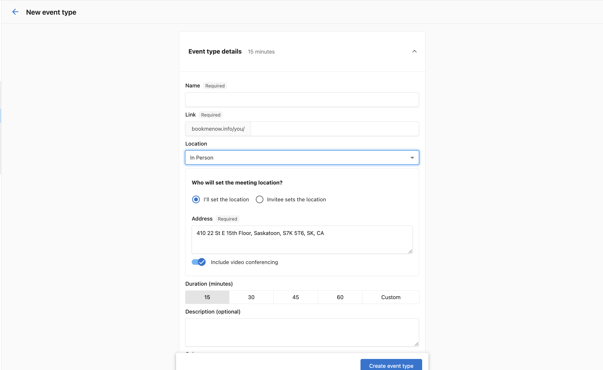

You can also configure additional options per event type. Settings here override your user-level defaults for this event type only:

- **General availability**: Override your default availability for this event type. On a personal event type, the hours you set here replace your general availability. On a team event type, they're combined with each team member's own general availability, so a team member is only offered at times that fall within both.
- **Questions for invitee**: Add custom questions invitees answer when booking. Making **Phone Number** and/or **Email** required fields controls which channels are available for confirmations and reminders.

  The default questions are `First Name`, `Last Name`, `Email`, and `Phone Number`. Turn on `Required` next to `Email` or `Phone Number` to make that detail mandatory. Custom questions can be a `Text box`, `Email field`, `Phone number field`, `Dropdown`, or `Multiple choice`, and each one can be marked required. Invitees' answers are saved with the booking and appear in the meeting's detail panel on the [calendar](./calendar-views.md#view-edit-reschedule-or-cancel-a-meeting).

  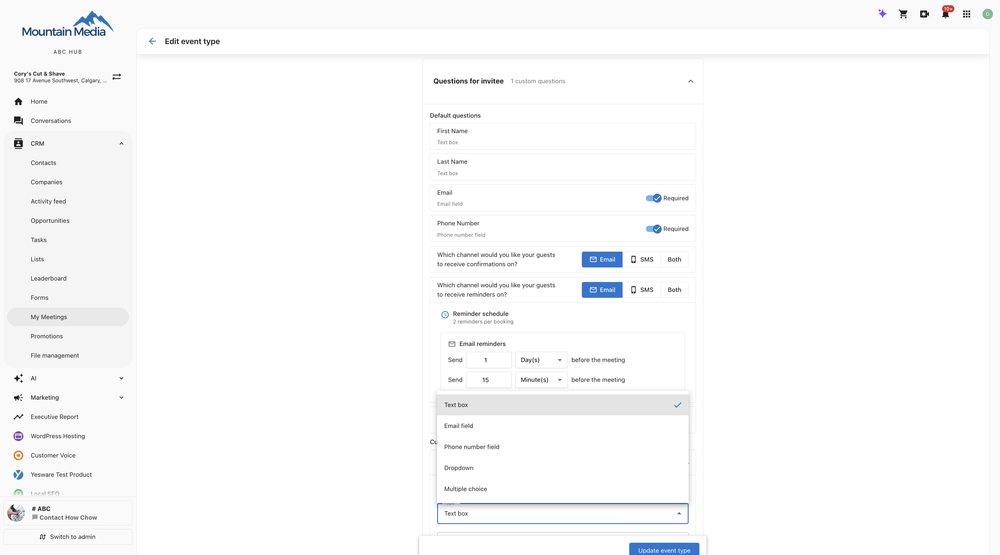

  Beyond short text, email, and phone, you can add **Multiple Choice** questions (invitees select one or more options, shown as a checkbox group) and **Dropdown** questions (invitees select exactly one option from a list). For either type, add a minimum of 2 and a maximum of 10 options, and optionally enable an **"Other"** write-in option that reveals a free-text field when selected. Mark the question required or optional. Required means the invitee must select at least one option.

  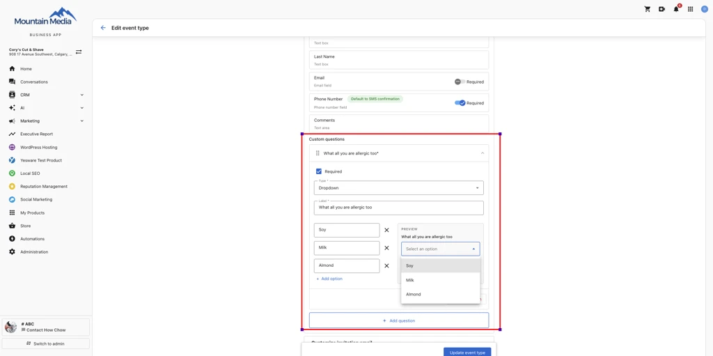

  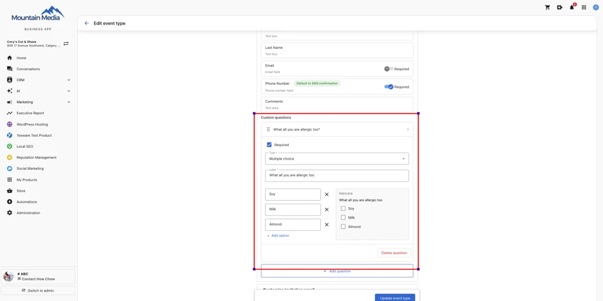

  Choose a **confirmation channel** (**Email**, **SMS**, or **Both**) for the confirmation guests receive when they book. Choose a **reminder channel** the same way; it defaults to your confirmation channel until you change it, after which the two work independently. For example, you can send an Email confirmation with an SMS reminder.

  - Turning off **Phone Number** required disables **SMS** and **Both** in both channel controls, and any current SMS/Both selection falls back to Email.
  - Turning off **Email** required disables **Email** and **Both** in both channel controls, and any current Email/Both selection falls back to SMS.
  - If both **Phone Number** and **Email** are off, all channel options are disabled and an inline warning appears. You must select at least one channel before you can save the event type.

  Under **Reminder schedule**, set when reminders are sent. For each reminder, enter a number and choose minutes, hours, or days before the meeting. The default is 24 hours, and the maximum is 10 days; values entered above the maximum are clamped, and switching units re-clamps the value. You can set more than one reminder per event type, for example one reminder 1 day before the meeting and another 15 minutes before. The card shows how many reminders each booking receives.

  :::note
  SMS confirmations and reminders require an active subscription to **Conversations AI Pro or Premium** (Reputation AI Premium and Campaigns Pro also unlock this). Your business phone number must be registered first. Configure at `Administration` → `SMS Configuration`.
  :::

- **Customize invitation email**: Customize the subject and body of the email sent when you request a meeting from a CRM contact.
- **Availability increment**: Override the default time slot increment (5, 10, 15, 30, or 60 minutes).
- **Meeting buffer before/after**: Override the default buffer times.
- **Advance notice**: Override the minimum lead time for this event type.
- **Add to my website**: Get an embed code to add your booking form as an inline widget on a website.

  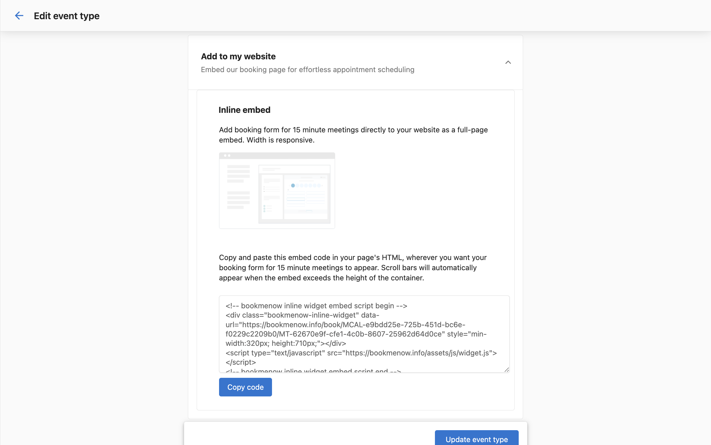

- **Limit future meetings**: Control how far into the future meetings can be scheduled. Two options are available:
  - **Rolling window**: Enter a number and select Days, Weeks, or Months (e.g., "4 weeks into the future"). The window advances daily, keeping availability a fixed look-ahead from today. Use this for ongoing event types.
  - **Fixed date range**: Set a specific start and end date. Useful for seasonal promotions, limited-availability campaigns, or events with a hard end date.

  If no limit is set, bookings are accepted with no future date restriction.

  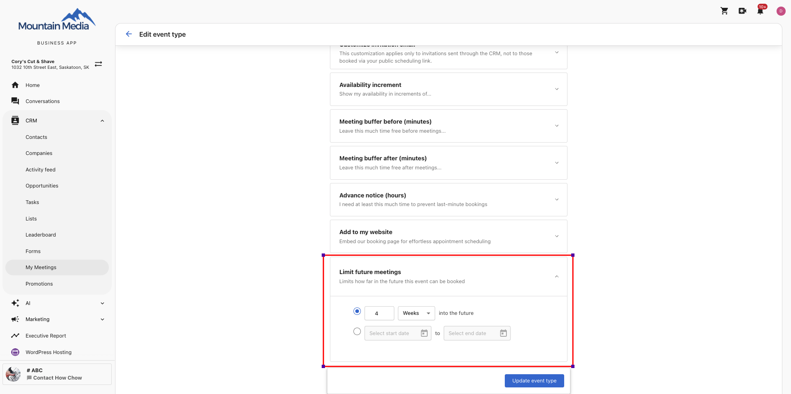

- **Redirect to a custom URL**: Turn on this toggle to send customers to a custom page after they book, instead of the default confirmation page. Enter an HTTPS URL (HTTP and malformed URLs are rejected) and, optionally, a delay in seconds before the redirect fires. The default is 3 seconds, the maximum is 60, and 0 redirects as soon as the confirmation page loads. The confirmation page always shows first. Turning the toggle off and back on keeps your last saved URL and delay. See [Redirect to a custom URL](./groups-and-service-menus#redirect-to-a-custom-url) for how this setting interacts with Groups and Service Menus.

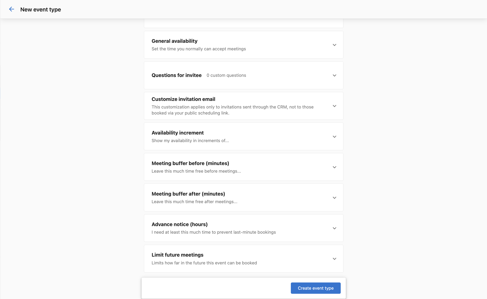

:::note
If a meeting type is deleted, it will not cancel existing bookings. The link is deactivated and no longer accepts new bookings. Deleted event types cannot be restored, so you will need to create a new one.
:::

## Booking page language

Booking pages automatically display in your customer's browser language, so customers can book without changing any settings themselves. This applies everywhere customers reach your booking pages: personal and team event type links, Groups, Service Menus, and the embedded website widget.

- Every step of the booking flow is translated, including service selection, date and time selection, the contact form, confirmations, cancellations, and rescheduling.
- If a customer's browser language isn't supported, the page displays in English.
- Content you write yourself, such as service names, descriptions, and staff bios, always displays exactly as you entered it and is not translated.

:::note
This only affects the booking page itself. To control the language of confirmation and reminder emails and SMS messages, set your [Primary operating language](../../administration/business_profile.md#primary-operating-language) on your Business Profile.
:::

## Booking page timezone

The booking page detects the visitor's timezone and shows your available times in it. Visitors can choose a different timezone from the dropdown on the booking page before they pick a time.

## What your invitee receives

After booking, the invitee receives a confirmation on the channel set for the event type (email, SMS, or both) with the meeting details and a link to their meeting page. From that page they can:

- `Join` the meeting when the event type uses a video location.
- `Reschedule` the meeting to another available time. Your calendar is updated, and reminders are scheduled for the new time.
- `Cancel` the meeting, with an optional reason for cancelling. The reason appears in the cancelled meeting activity on the contact's timeline in the CRM.

A cancelled meeting can't be rescheduled from the same link. If the invitee changes their mind, they book again from your booking link.

## How bookings connect to the CRM

Every booking is matched to a CRM contact:

- My Meetings looks for an existing contact by phone number first, then by email address. If there's no match, a new contact is created.
- The meeting is logged on the contact's activity timeline, so you can see booking history from the contact record.
- Meetings where the invitee is a member of your own business (for example, a colleague booking time with you) are treated as internal meetings and aren't logged to the CRM.

## Confirmation and reminder activity

When a confirmation or reminder is sent to a guest for a meeting booked through My Meetings, it's logged as a **Meeting - Reminder** activity on that guest's contact timeline.

- The activity appears in both the **All** and **Meetings** tabs of the contact profile.
- It shows the invitee name, event type, date, status, and duration, and can be expanded for more detail.
- The status updates as the send progresses (for example, from sent to delivered, or to failed if delivery doesn't succeed), so you can confirm whether a customer received their reminder.
- This is a read-only activity, with the same menu options available on other meeting activities.

## Frequently Asked Questions

Can I set different durations for meeting types?

Yes. Configure durations when creating or editing a booking link: choose 15, 30, 45, 60 minutes, or a custom length.

How many hosts can I add to a single event?

You can add up to five hosts to a multi-host event. All selected hosts are added to the calendar invite. All hosts must have their calendar connected for accurate availability checking. Each host also needs a meeting app connected (Google Meet, Zoom, or Microsoft Teams); a host missing either connection is left out of the availability check.

Do I need anything special to connect Microsoft Outlook/Teams?

You'll need to sign in with a Microsoft 365 account you control. Some organizations require an administrator to approve new app connections. If you see a consent prompt, contact your Microsoft admin to enable it.

Which video link is used for multi‑host events?

The conferencing provider set in the booking link is used. If Microsoft Teams is connected and selected, a Teams meeting is created and included on the invite for all hosts and attendees.

How do I send SMS reminders to guests?

Add **Phone Number** as a required field in **Questions for invitee**, then choose **SMS** or **Both** as the reminder channel. SMS requires a Conversations AI Pro or Premium subscription and a registered business phone number. Configure at `Administration` → `SMS Configuration`. Supported countries: United States, Canada, and Italy.

Why do available times start on 15-minute marks?

The first time slot offered is rounded up to the next 15-minute mark after your advance notice period. Existing events on your connected calendar also block time rounded out to the nearest 15 minutes on either side, so a meeting from 9:05 to 9:35 blocks 9:00 to 9:45. Within your available hours, time slots follow your availability increment.

