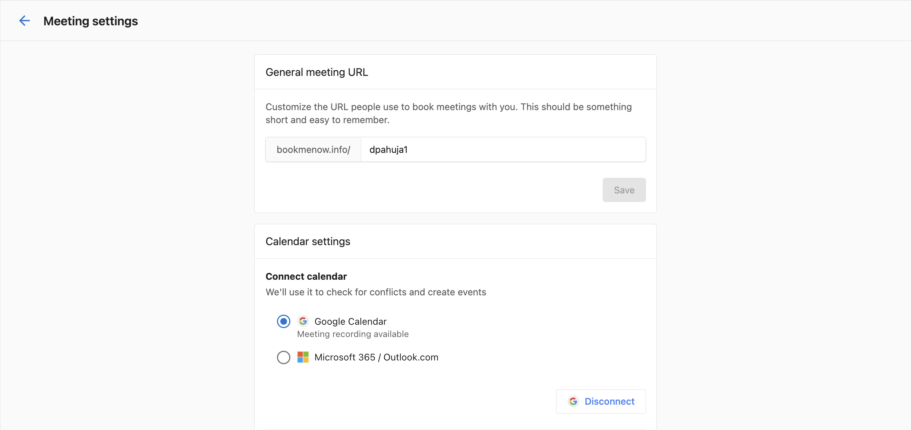

## Overview

Calendar integration connects your Google Calendar or Microsoft 365 / Outlook calendar to the platform, enabling availability checking, conflict detection, and automatic creation of meeting events when bookings are confirmed.

:::note
Only one calendar can be active at a time — either Google Calendar or Microsoft 365 / Outlook. Switching calendars later does not retroactively migrate existing meetings.
:::

## Prerequisites

Before setting up calendar integration, ensure you have:

- A Google Workspace / personal Google account **or** a Microsoft 365 / Outlook.com account
- Access to the My Meetings feature in your account

## Connecting your calendar

You can connect your calendar during the initial setup wizard or at any time from Meeting Settings.

### Option A — During initial setup

When you first visit **My Meetings**, the setup wizard walks you through four steps. On step 2 (**Connect calendar**), select your calendar provider:

- **Google Calendar** — Click **Sign in with Google** and grant the required permissions.
- **Microsoft 365 / Outlook.com** — Select **Microsoft 365 / Outlook.com**, then click **Sign in with Microsoft** and grant the required permissions.

### Option B — From Meeting Settings

1. Navigate to **My Meetings** from the main menu.
2. Click the **three-dot menu** in the top-right corner and select **Meeting settings**.
3. Under **Calendar settings**, select your calendar provider and sign in.

**Demo:**

  <iframe 
    src="https://drive.google.com/file/d/1cgcuBW4zyQ1AzlkJXqf-9RsDWfO8JIU8/view?usp=drive_link" 
    frameBorder="0" 
    webkitallowfullscreen="true" 
    mozallowfullscreen="true" 
    allowFullScreen 
    style={{position: "absolute", top: 0, left: 0, width: "100%", height: "100%"}}>
  </iframe>

## What happens after connection

Once your calendar is connected:

- **Availability checking** — The platform checks your calendar for conflicts when invitees try to book, so only genuinely free slots are shown.
- **Automatic event creation** — Confirmed bookings create calendar events in your connected calendar automatically.
- **Notetaker scheduling** — The platform automatically schedules notetakers for your upcoming meetings.
- **Meeting insights** — AI-powered summaries and transcripts are generated for recorded meetings.

## Choosing a meeting app

After connecting your calendar, select your default video conferencing app:

- **Google Meet** — Recommended for Google Workspace users.
- **Zoom** — Requires a Zoom account.
- **Microsoft Teams** — Recommended for Microsoft 365 / Outlook users and Teams-based organizations.

Your chosen app is used to generate video conference links for all Video meeting event types.

## Managing your calendar connection

### Viewing your connected calendar

Navigate to **My Meetings → Meeting Settings** to view your connected calendar status.

### Disconnecting your calendar

1. Go to **My Meetings → Meeting Settings**.
2. Click on your connected calendar.
3. Select **Disconnect**.

> **Note:** Disconnecting your calendar will stop automatic notetaker scheduling for future meetings.

### Switching calendar providers

To switch from Google to Microsoft (or vice versa):

1. Disconnect your current calendar in **Meeting Settings**.
2. Connect the new calendar provider following the steps above.

Meetings already scheduled are not migrated — only new bookings going forward will use the new calendar.

## Troubleshooting

  
My calendar events aren't syncing

  Try disconnecting and reconnecting your calendar. Ensure you've granted all required permissions during the connection process.

  
I don't see the Connect Calendar option

  Ensure you have the appropriate permissions in your account. Contact your administrator if the option is not available.

  
Microsoft sign-in is failing

  Ensure your Microsoft 365 account has calendar access permissions enabled by your IT administrator. Use your work email when authenticating. Personal Outlook.com accounts are also supported.

## Related articles

- [Managing Visibility Settings](./visibility-settings.md)
