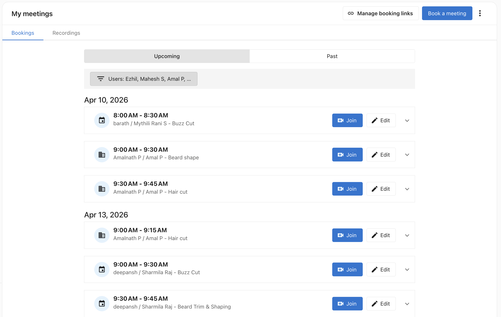

# List View — All Meetings

The **All Meetings** list view lets you see every scheduled meeting across your entire team from one place in My Meetings. Use it to monitor team bookings, reschedule on someone's behalf, or review past meetings from staff members who have since left.

:::note
This feature shows meetings booked through the platform only. Private calendar events that exist in a team member's personal calendar but were not booked through My Meetings are not shown.
:::

---

## Accessing the list view

1. Navigate to `CRM` > `My Meetings`.
2. The **Bookings** tab shows all upcoming and past meetings.

   

3. Use the **Upcoming** / **Past** toggle to switch between future and historical meetings.

---

## Filtering by team member

By default, the list shows meetings for all team members. Use the **Users** filter to narrow the view:

1. Click the **Users** filter above the meeting list.
2. Select one or more team members from the dropdown.
3. The list updates immediately to show only meetings for the selected users.

Filter selections are saved automatically — the next time you open My Meetings, your filter is preserved.

---

## Managing a team member's meetings

From the list view, you can act on any meeting regardless of who it belongs to:

- **Reschedule** — Click **Edit** next to a meeting to reschedule it to a new date and time.
- **Cancel** — Click **Edit** to open the meeting, then use the cancel option.
- **View details** — Click the dropdown arrow next to **Edit** to expand the full meeting details without opening the edit form.

---

## Past meetings from former staff

Meetings booked by team members who have since left the business remain visible in the list view. You can use the **Past** toggle and the **Users** filter to look up historical appointments for any former staff member.

---

## Related articles

- [My Meetings](./index.md)
- [Team Booking Links](./team-booking-links.md)
