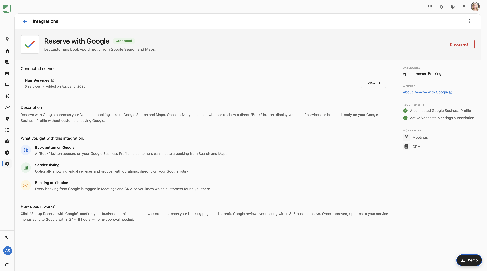

## Overview

Reserve with Google lets customers book your services directly from your Google Business Profile. If you no longer want your booking option to appear on Google, you can disconnect the integration at any time.

## Content quality standards

Google reviews the business details and services you share through Reserve with Google. To keep your services visible and bookable on Google, your business information, service names, and service descriptions need to meet Google's content quality standards.

### Business name and address

- Your business name accurately reflects the legal business name you operate under.
- Your business address is the place where you provide your services, and a location your business owns. Booth rentals aren't eligible.

### Service names and descriptions

- Service names clearly describe the type of service a customer is booking.
- Service descriptions accurately describe the service you provide.
- Names and descriptions use standard capitalization and punctuation for your language.
- Names and descriptions don't use all capital letters, emoji, or emoticons.
- Names and descriptions don't include vulgar or offensive language.
- Names and descriptions don't include promotional content, website links, email addresses, phone numbers, or payment methods.
- Details such as price and cancellation policy belong in their own fields, not in the service name or description.
- Services are bookable by the general public, without requiring a membership or belonging to an organization.

### Examples

| Meets the standards | Doesn't meet the standards | Reason |
| --- | --- | --- |
| Men's Haircut | MEN'S HAIRCUT | All capital letters |
| Deep Tissue Massage | Deep Tissue Massage - $95 | Price included in the name |
| Brake Inspection | Brake Inspection 🚗 | Emoji in the name |
| Initial Consultation | Book Now! Initial Consultation | Promotional content |
| Teeth Cleaning | Teeth Cleaning, call 555-0134 | Phone number in the name |

:::tip
When you set up Reserve with Google, services with names or descriptions that don't meet these standards are flagged so you can update them before they're shared with Google.
:::

For the complete list of requirements, see Google's [content quality standards for service names and descriptions](https://developers.google.com/actions-center/verticals/appointments/redirect/policies/platform-policies#services_name_descriptions).

## Disconnect Reserve with Google

### Before you start

You need access to your business account in Business App, and permission to manage integrations.

### Steps to disconnect

1. Sign in to Business App.
2. In the left menu, go to `Administration` → `Integrations`.
3. Find `Reserve with Google` in your list of integrations and open it.
4. Click `Disconnect`.
5. Confirm when prompted.

Your integration is now disconnected.

### What happens after you disconnect

- Your business is removed from the next daily update sent to Google. Your booking option stops appearing on your Google Business Profile within 24–48 hours.
- Appointments customers already booked are not affected. You can still see and manage them as usual.
- Your existing service and booking settings stay in place. Only the connection to Google is removed.
- You can reconnect at any time by going to `Administration` → `Integrations` → `Reserve with Google` and setting it up again.

## Related articles

- [Groups and Service Menus](./groups-and-service-menus.md)
- [Setting up calendar integration](./integrating-google-meet.md)
