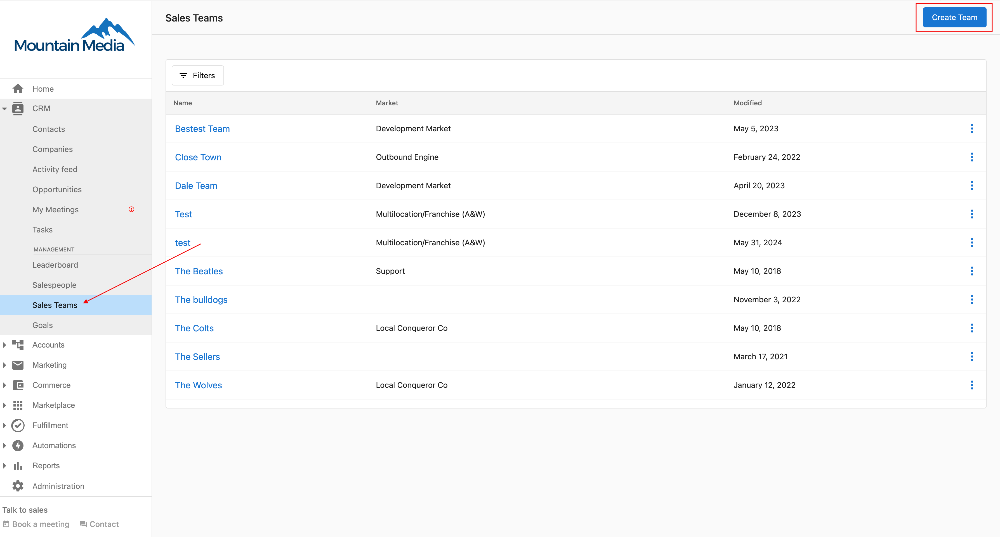
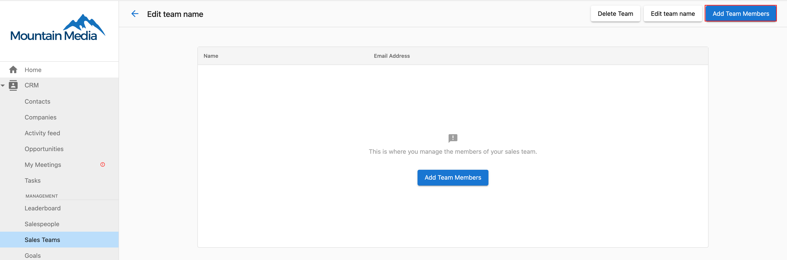
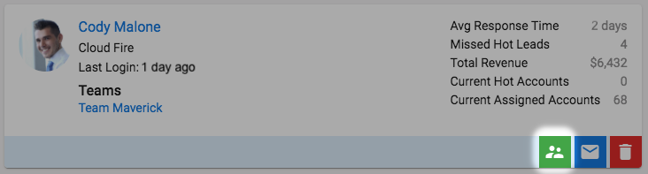
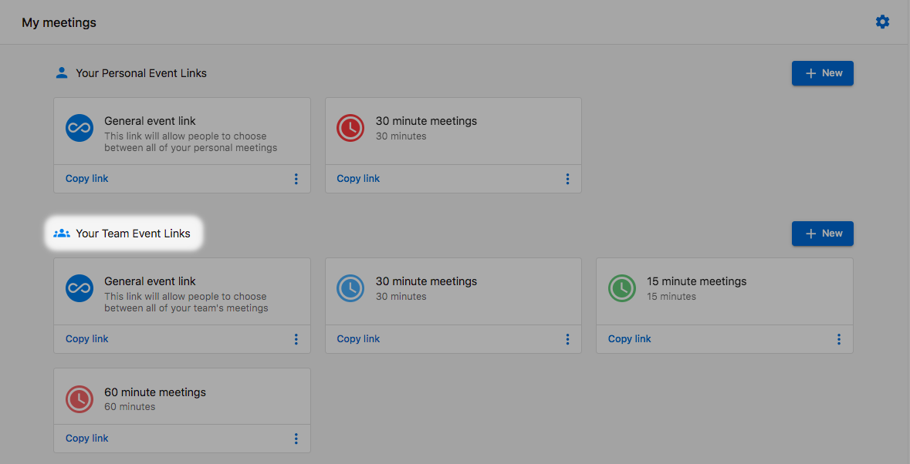
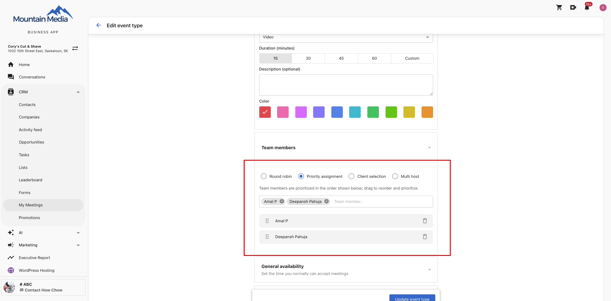
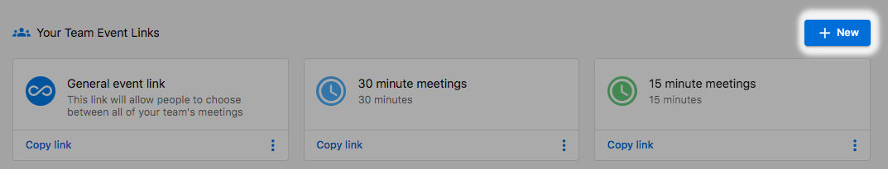
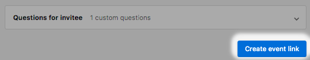
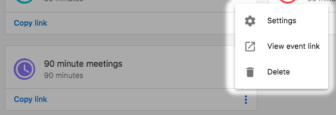
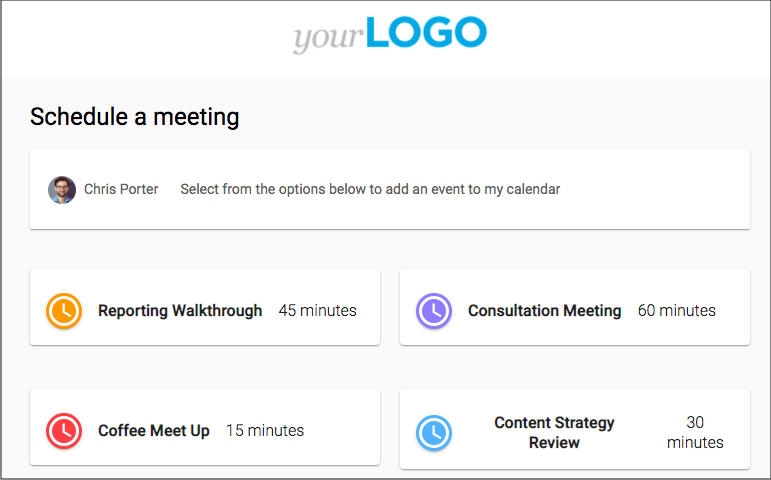

# Team booking links

Team booking links let you create a single booking link that distributes meetings across a team. For example, your business might run a qualification call before handing a prospect to a sales rep — create one team link and let My Meetings distribute bookings automatically.

## Prerequisites

You will need admin permissions to set up team booking links.

In the Business App, all members of a business are part of a single team. Team event types are available to all valid users of the business.

## Create a new team booking link

1. Go to `CRM` > `My Meetings`.
2. Click **Manage booking links**.
3. Click **+ New** under **Your Team Event Links**.

4. Click **+ New Team booking**.

5. Configure the following fields:

- **Event Title** — What clients see when they book.
- **Event Link Name** — Creates the URL for your booking link (e.g., `/team-meeting`).
- **Description** — Optional description of the meeting.
- **Duration** — Length of the meeting.
- **Team Members** — Select the team members included in this booking link.

6. Click **Save** to create the team booking link.

## Assignment methods

Choose how meetings are distributed to team members.

### Round robin

Meetings rotate evenly across all available team members in a set sequence. Each team member gets an equal number of meetings over time. Only members with calendar availability are included in the rotation.

**Best for:** Balanced workload distribution across equal team members.

### Priority assignment

Customers see available time slots only — the system silently assigns the right provider based on your ranked order. No customer input required.

**How it works:**

- When a customer selects a time slot, the system checks your ranked list and assigns the highest-priority provider who is free at that moment.
- **Priority waterfall** — If your top-ranked provider is not available at the selected time, the system moves to the next in line and keeps going until a free provider is found. Your order is always respected.
- **Combined availability** — Customers see a unified calendar of slots across your entire team. A slot appears as long as at least one provider is free.
- **No provider picker on the booking page** — Customers see times, pick one, and confirm. Provider selection controls are not shown.
- **Default order** — If you have not manually ranked your providers, the system defaults to the order they were added to the event type.

To reorder providers, drag team members up or down in the event type editor. The order you set drives assignment logic.

**Best for:** Service businesses where specific staff should be booked first (e.g., master stylist, top closer, most experienced practitioner), or hierarchical structures where senior members should handle most bookings.

:::note
Customers are not shown their assigned provider before confirming. The assignment happens at booking confirmation — the customer selects a time, confirms, and the system assigns. To allow customers to choose a specific provider, use the **Client selection** assignment method instead.
:::

### Client selection

The person booking chooses which team member they want to meet with. Only members available at the selected time are shown.

**Best for:** Service businesses where clients have preferences, or teams with different specializations.

### Multi host

Multiple team members attend the same meeting together rather than one person being assigned.

- Only time slots when **all** selected hosts are simultaneously available are shown.
- The invitee sees all host names on the booking page before confirming.
- All hosts are notified and added to the calendar invite once confirmed.

**Limits and requirements:**
- Maximum **5 hosts** per multi-host event type.
- All selected hosts must have their calendar connected for accurate availability checking.

**Best for:** Complex sales processes requiring multiple stakeholders (e.g., Sales Rep + Solutions Engineer), onboarding sessions, or consultations needing multiple experts.

## Selecting team members

For all assignment methods:

1. Click in the team member selection field and choose from your available team members.
2. Click the **X** next to any team member to remove them.
3. Each selected team member must have their calendar connected and properly configured.

## Managing availability

Team members can be assigned to different days and time periods. For example, some members might be available Monday–Wednesday while others are available Thursday–Friday. Each member's individual availability settings and buffer times are respected.

## Calendar customization

### Calendar integration requirements

For team members to appear as available:
- Each team member must have their personal calendar connected to My Meetings (Google Calendar or Microsoft 365 / Outlook).
- Events marked as "busy" in personal calendars automatically block availability.
- All-day events prevent bookings for the entire day.

## Timezone settings

Choose how timezones are handled:
- Use the company timezone.
- Adjust to the visitor's timezone.
- Set a specific timezone.

## Customizing your booking page

Personalize the team booking page with custom colors and questions. Custom questions are answered by visitors at booking time and are available to the assigned team member.

## Viewing and sharing your team booking link

1. Click **View** to preview your booking page as visitors see it.
2. Click **Copy link** to copy the booking URL.
3. Share via email, social media, or add to your website.
