# Team booking links

Team booking links let you create a single booking link that distributes meetings across a team. For example, your business might run a qualification call before handing a prospect to a sales rep — create one team link and let My Meetings distribute bookings automatically.

## Prerequisites

You will need admin permissions to set up team booking links.

In the Business App, all members of a business are part of a single team. Team event types are available to all valid users of the business.

## Create a new team booking link

1. Go to `CRM` > `My Meetings`.

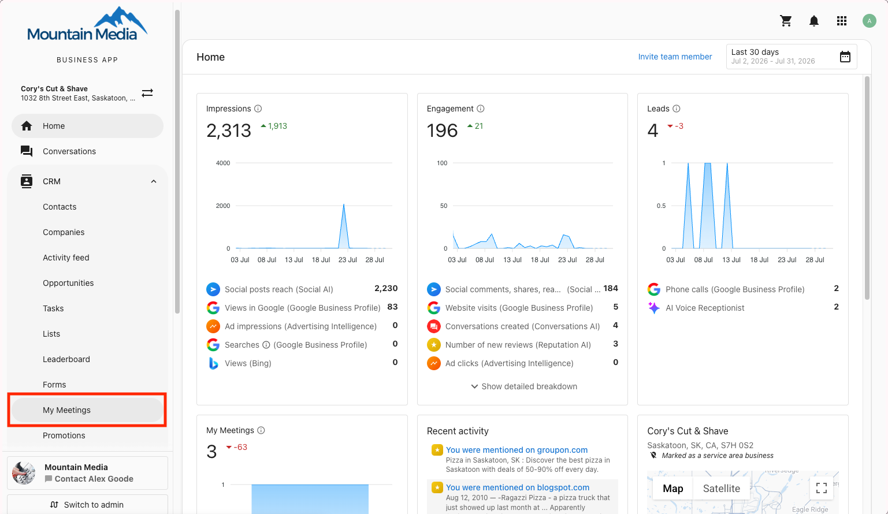

2. Click **Manage booking links**.

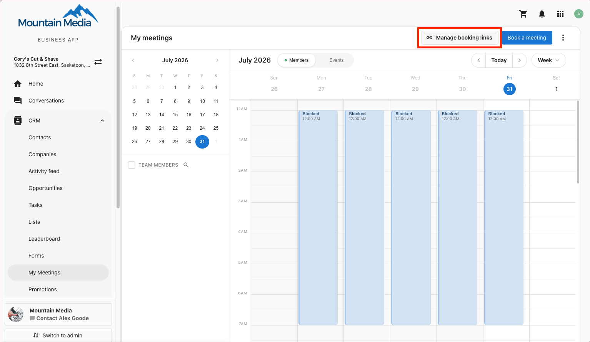

3. On the **Event types** tab, click **Create event type**, then select **Team**.

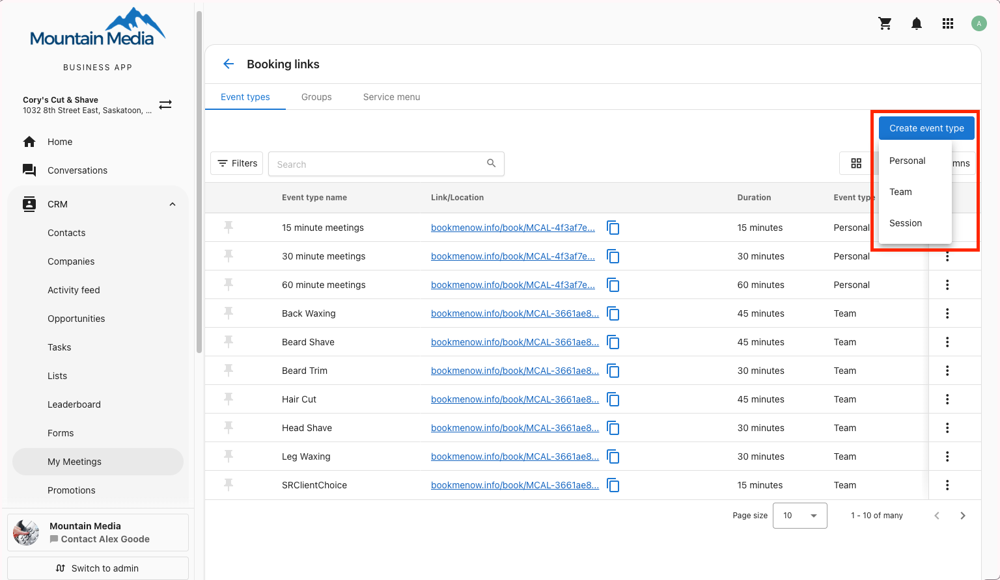

4. Configure the event type details:

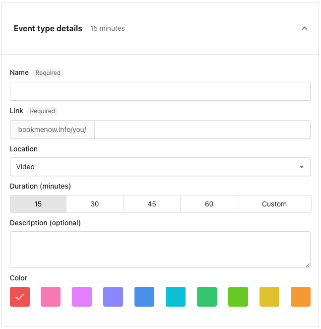

- **Name** — What clients see when they book.
- **Link** — Creates the URL for your booking page (e.g., `bookmenow.info/you/team-meeting`).
- **Location** — Choose **Video** or **In-Person** for how the meeting takes place.
- **Duration** — Length of the meeting, in minutes. Choose a preset or select **Custom**.
- **Description** (optional) — Details about the meeting shown to clients.
- **Color** — Choose a color to identify this event type on your calendar.

## Team members and assignment method

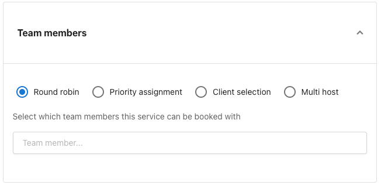

Under **Team members**, choose how meetings are distributed, then select which team members are included.

### Round robin

Meetings rotate evenly across all available team members in a set sequence. Each team member gets an equal number of meetings over time. Only members with calendar availability are included in the rotation.

**Best for:** Balanced workload distribution across equal team members.

### Priority assignment

Customers see available time slots only, the system silently assigns the right provider based on your ranked order. No customer input required.

**How it works:**

- When a customer selects a time slot, the system checks your ranked list and assigns the highest-priority provider who is free at that moment.
- **Priority waterfall** — If your top-ranked provider is not available at the selected time, the system moves to the next in line and keeps going until a free provider is found. Your order is always respected.
- **Combined availability** — Customers see a unified calendar of slots across your entire team. A slot appears as long as at least one provider is free.
- **No provider picker on the booking page** — Customers see times, pick one, and confirm. Provider selection controls are not shown.
- **Default order** — If you have not manually ranked your providers, the system defaults to the order they were added to the event type.

To reorder providers, drag team members up or down in the event type editor. The order you set drives assignment logic.

**Best for:** Service businesses where specific staff should be booked first (e.g., master stylist, top closer, most experienced practitioner), or hierarchical structures where senior members should handle most bookings.

:::note
Customers are not shown their assigned provider before confirming. The assignment happens at booking confirmation — the customer selects a time, confirms, and the system assigns. To allow customers to choose a specific provider, use the **Client selection** assignment method instead.
:::

### Client selection

The person booking chooses which team member they want to meet with. Only members available at the selected time are shown.

**Best for:** Service businesses where clients have preferences, or teams with different specializations.

### Multi host

Multiple team members attend the same meeting together rather than one person being assigned.

- Only time slots when **all** selected hosts are simultaneously available are shown.
- The invitee sees all host names on the booking page before confirming.
- All hosts are notified and added to the calendar invite once confirmed.

**Limits and requirements:**
- Maximum **5 hosts** per multi-host event type.
- All selected hosts must have their calendar connected for accurate availability checking.

**Best for:** Complex sales processes requiring multiple stakeholders (e.g., Sales Rep + Solutions Engineer), onboarding sessions, or consultations needing multiple experts.

### Selecting team members

For all assignment methods:

1. Click in the team member selection field and choose from your available team members.
2. Click the **X** next to any team member to remove them.
3. Each selected team member must have their calendar connected and properly configured.

## General availability

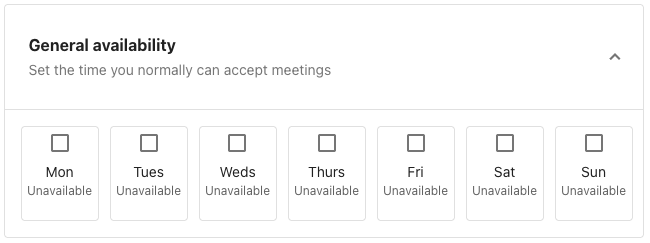

Set the days you're generally available to accept meetings for this event type.

- Turn on each day you want to accept bookings, then set your available hours for that day.
- Days left off show as **Unavailable** and won't offer any booking times to clients.

## Additional settings

The following settings are optional and turned off by default. Review each one and turn on whatever fits how your team takes bookings.

### Questions for invitee

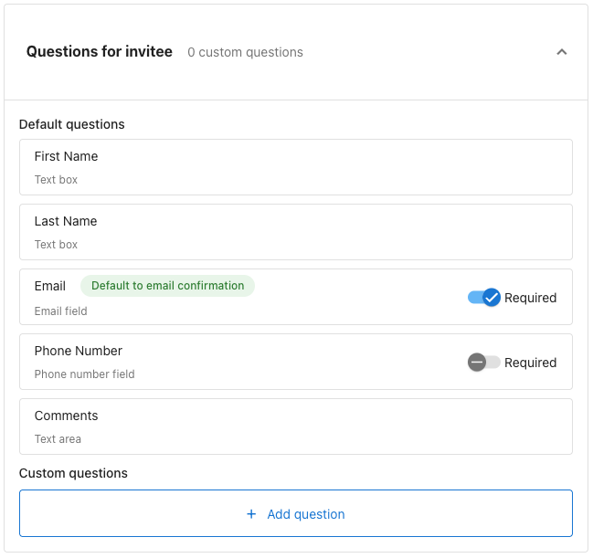

By default, clients are asked for their **First Name**, **Last Name**, and **Email** when booking. You can also collect a **Phone Number** and **Comments**.

- Turn on **Required** next to **Phone Number** and/or **Email** to control which channels are available for confirmations and reminders. At least one must stay required — if both are off, all channel options are disabled and the event type can't be saved.
- Choose a **confirmation channel** — **Email**, **SMS**, or **Both** — for the confirmation guests receive when they book.
- Choose a **reminder channel** the same way. It defaults to your confirmation channel until you change it, after which the two work independently — for example, an Email confirmation with an SMS reminder.
- Turning off **Phone Number** required disables **SMS** and **Both** in both channel controls and falls back any current SMS/Both selection to Email. Turning off **Email** required disables **Email** and **Both**, and falls back to SMS.
- Set the **reminder lead time** — an integer plus minutes, hours, or days — to control how far ahead of the meeting the reminder sends. The default is 24 hours, and the maximum is 10 days; values above the maximum are clamped, and switching units re-clamps the value. Only one reminder can be configured per event type.
- Click **+ Add question** to create custom questions for guests to answer when booking. Their answers are available to the assigned team member.

### Customize invitation email

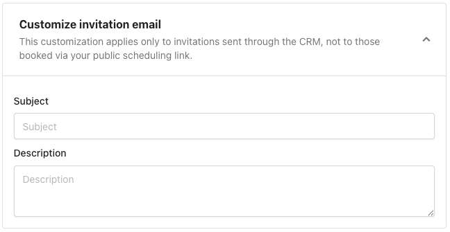

Write a custom **Subject** and **Description** for meeting invitations. This customization only applies to invitations sent through the CRM — not to meetings booked through your public scheduling link.

### Redirect to a custom URL

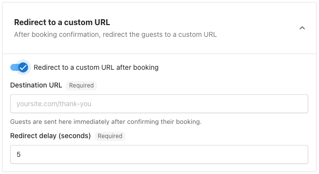

Turn on **Redirect to a custom URL after booking** to send clients to a page of your choice — like a thank-you page — right after they confirm their booking. Enter the **Destination URL** and set a **Redirect delay** in seconds.

### Meeting limits

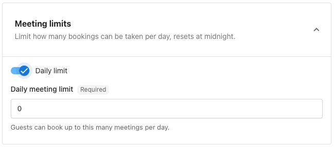

Turn on **Daily limit** to cap how many meetings can be booked per day for this event type. Set your **Daily meeting limit** — clients can't book more than this number of meetings in a single day. The limit resets at midnight.

### Availability increment

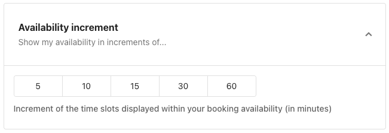

Choose the increment — 5, 10, 15, 30, 60, or 90 minutes — used to display your available time slots to clients.

### Meeting buffers

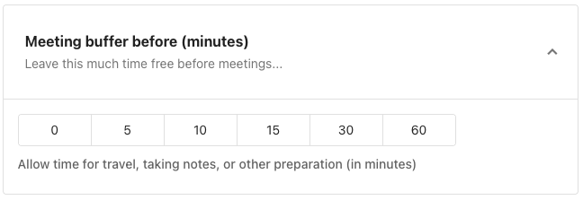

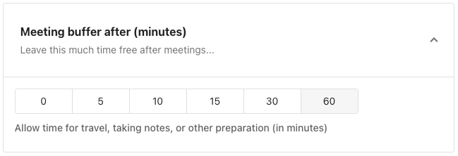

Set a buffer **before** and/or **after** each meeting (0, 5, 10, 15, 30, or 60 minutes) to leave time for travel, notes, or other preparation.

### Advance notice

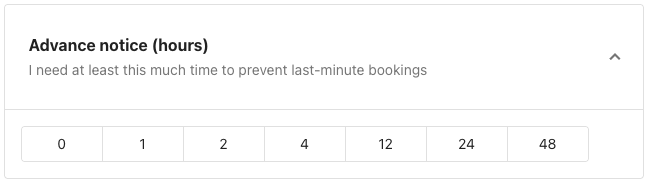

Set how much advance notice you need before a meeting can be booked (0, 1, 2, 4, 12, 24, or 48 hours) to prevent last-minute bookings.

### Limit future meetings

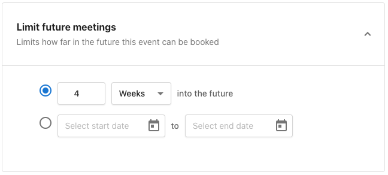

Control how far in the future this event type can be booked:

- Limit bookings to a set number of days, weeks, or months into the future, or
- Limit bookings to a specific date range by entering a start and end date.

## Save your team booking link

Once you've configured your event type, click **Save** to create the team booking link.

## Calendar customization

### Calendar integration requirements

For team members to appear as available:
- Each team member must have their personal calendar connected to My Meetings (Google Calendar or Microsoft 365 / Outlook).
- Events marked as "busy" in personal calendars automatically block availability.
- All-day events prevent bookings for the entire day.

## Timezone settings

Choose how timezones are handled:
- Use the company timezone.
- Adjust to the visitor's timezone.
- Set a specific timezone.

## Viewing and sharing your team booking link

1. Click **View** to preview your booking page as visitors see it.
2. Click **Copy link** to copy the booking URL.
3. Share via email, social media, or add to your website.
