# Team booking links

Team booking links let you create a single booking link that distributes meetings across a team. For example, your business might run a qualification call before handing a prospect to a sales rep. Create one team link and let My Meetings distribute bookings automatically.

## Prerequisites

You will need admin permissions to set up team booking links.

In the Business App, all members of a business are part of a single team. Team event types are available to all valid users of the business.

## Create a new team booking link

1. Go to `CRM` > `My Meetings`.

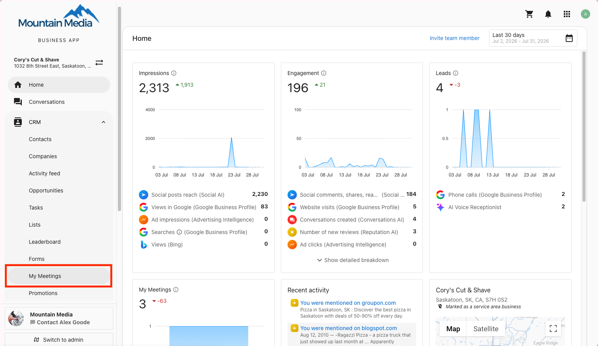

2. Click **Manage booking links**.

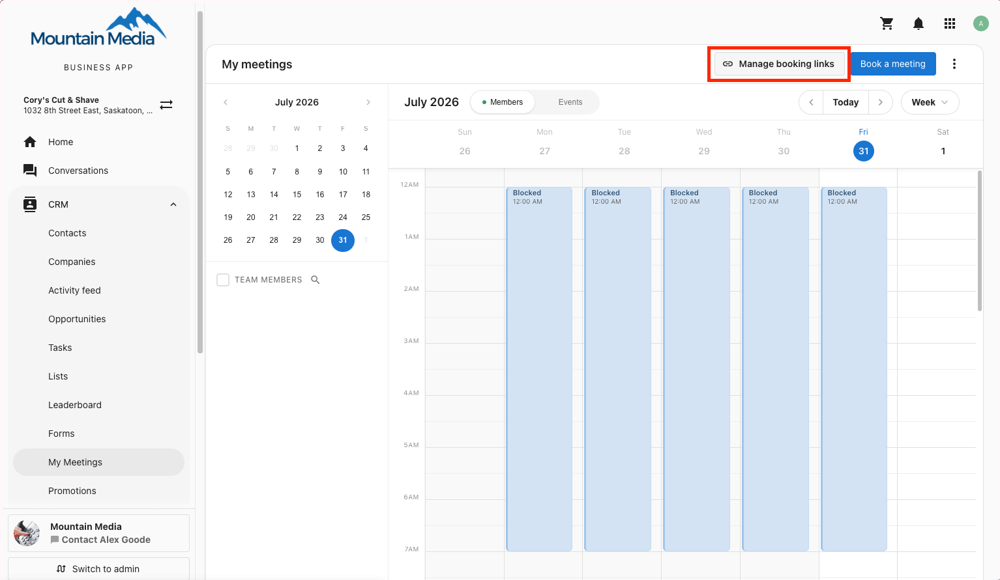

3. On the **Event types** tab, click **Create event type**, then select **Team**.

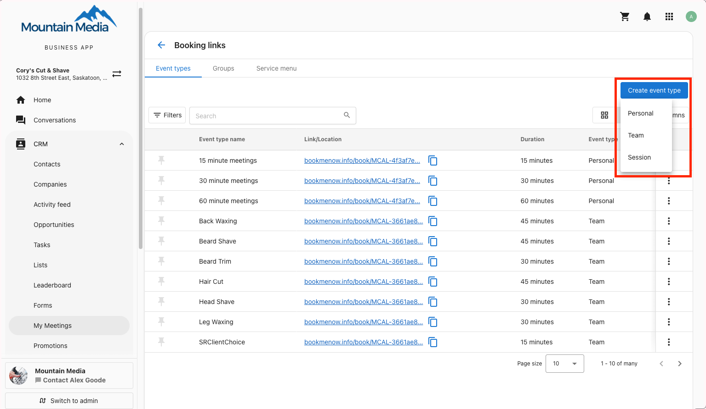

4. Configure the event type details:

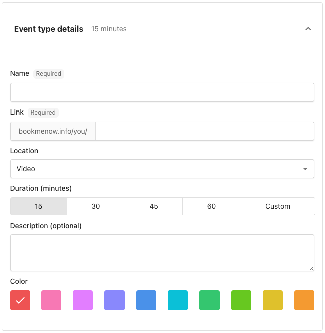

- **Name**: What clients see when they book.
- **Link**: Creates the URL for your booking page (e.g., `bookmenow.info/you/team-meeting`).
- **Location**: Choose **Video** or **In-Person** for how the meeting takes place.
- **Duration**: Length of the meeting, in minutes. Choose a preset or select **Custom**.
- **Description** (optional): Details about the meeting shown to clients.
- **Color**: Choose a color to identify this event type on your calendar.

## Team members and assignment method

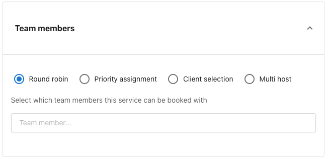

Under **Team members**, choose how meetings are distributed, then select which team members are included.

### Round robin

Meetings rotate evenly across all available team members in a set sequence. Each team member gets an equal number of meetings over time. Only members with calendar availability are included in the rotation.

**Best for:** Balanced workload distribution across equal team members.

### Priority assignment

Customers see available time slots only, the system silently assigns the right provider based on your ranked order. No customer input required.

**How it works:**

- When a customer selects a time slot, the system checks your ranked list and assigns the highest-priority provider who is free at that moment.
- **Priority waterfall**: If your top-ranked provider is not available at the selected time, the system moves to the next in line and keeps going until a free provider is found. Your order is always respected.
- **Combined availability**: Customers see a unified calendar of slots across your entire team. A slot appears as long as at least one provider is free.
- **No provider picker on the booking page**: Customers see times, pick one, and confirm. Provider selection controls are not shown.
- **Default order**: If you have not manually ranked your providers, the system defaults to the order they were added to the event type.

To reorder providers, drag team members up or down in the event type editor. The order you set drives assignment logic.

**Best for:** Service businesses where specific staff should be booked first (e.g., master stylist, top closer, most experienced practitioner), or hierarchical structures where senior members should handle most bookings.

:::note
Customers are not shown their assigned provider before confirming. The assignment happens at booking confirmation: the customer selects a time, confirms, and the system assigns. To allow customers to choose a specific provider, use the **Client selection** assignment method instead.
:::

### Client selection

The person booking chooses which team member they want to meet with. Only members available at the selected time are shown.

:::note
Client selection applies to bookings made through your booking page. When an AI Chat or AI Voice Receptionist books on a customer's behalf, the customer isn't offered a choice of team member. The host is assigned automatically from the available members. See [AI booking limitations](./groups-and-service-menus.md#ai-booking-limitations).
:::

**Best for:** Service businesses where clients have preferences, or teams with different specializations.

### Multi host

Multiple team members attend the same meeting together rather than one person being assigned.

- Only time slots when **all** selected hosts are simultaneously available are shown.
- The invitee sees all host names on the booking page before confirming.
- All hosts are notified and added to the calendar invite once confirmed.

**Limits and requirements:**
- Maximum **5 hosts** per multi-host event type.
- All selected hosts must have their calendar connected for accurate availability checking.

**Best for:** Complex sales processes requiring multiple stakeholders (e.g., Sales Rep + Solutions Engineer), onboarding sessions, or consultations needing multiple experts.

### Selecting team members

For all assignment methods:

1. Click in the team member selection field and choose from your available team members.
2. Click the **X** next to any team member to remove them.
3. Each selected team member must have their calendar connected and properly configured.

Team members also need a meeting app connected (Google Meet, Zoom, or Microsoft Teams). A team member whose calendar or meeting app is disconnected is left out of the available times for every team event type until they reconnect, even though they still appear in the member list. See [Calendar integration requirements](#calendar-integration-requirements).

Team members who are removed from your business are excluded from team booking links automatically. You don't need to remove them from each event type.

## General availability

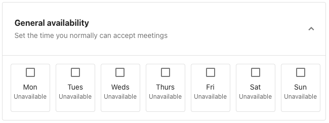

Set the days you're generally available to accept meetings for this event type.

- Turn on each day you want to accept bookings, then set your available hours for that day.
- Days left off show as **Unavailable** and won't offer any booking times to clients.

For team event types, the hours you set here are combined with each team member's own general availability from their Meeting settings. A team member is only offered at times that fall within both, so nobody can be booked outside their own hours.

## Additional settings

The following settings are optional and turned off by default. Review each one and turn on whatever fits how your team takes bookings.

### Questions for invitee

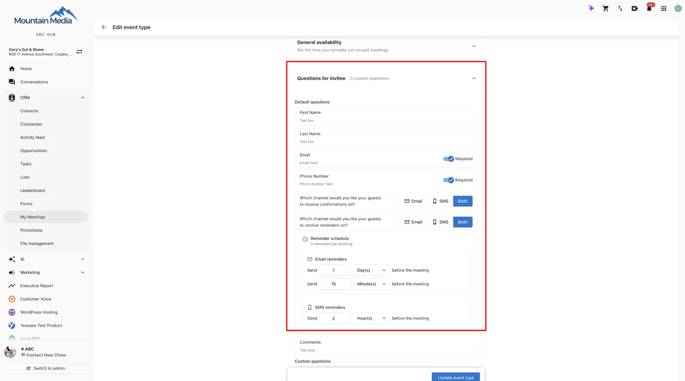

By default, clients are asked for their **First Name**, **Last Name**, and **Email** when booking. You can also collect a **Phone Number** and **Comments**.

- Turn on **Required** next to **Email** and/or **Phone Number** to control which channels are available for confirmations and reminders. See [Confirmation and reminder channels](#confirmation-and-reminder-channels).
- Click **+ Add question** to create custom questions for guests to answer when booking. Their answers are available to the assigned team member.
- Custom questions can be a `Text box`, `Email field`, `Phone number field`, `Dropdown`, or `Multiple choice`, and each one can be marked required. See [Create a new event type](./index.md#create-a-new-event-type) for details on Dropdown and Multiple choice options.

#### Confirmation and reminder channels

Two controls set how guests hear from you about their booking:

- **Which channel would you like your guests to receive confirmations on?**: Choose **Email**, **SMS**, or **Both** for the confirmation sent when a guest books.
- **Which channel would you like your guests to receive reminders on?**: Choose **Email**, **SMS**, or **Both** for the reminders sent before the meeting.

The reminder channel starts out matching your confirmation channel. After that, the two are set independently, so changing the confirmation channel doesn't change the reminder channel. For example, you can send an Email confirmation and SMS reminders.

The channels you can choose depend on the **Required** toggles:

- If **Phone Number** isn't required, **SMS** and **Both** are disabled in both controls, and any SMS or Both selection switches to Email.
- If **Email** isn't required, **Email** and **Both** are disabled in both controls, and any Email or Both selection switches to SMS.
- If neither is required, all channel options are disabled and a warning appears: "You must select at least one channel to receive confirmations." You can't save the event type until at least one is required.

The booking form lets guests know that providing a phone number opts them in to SMS confirmations and reminders.

:::note
SMS confirmations and reminders require an active subscription to **Conversations AI Pro or Premium** (Reputation AI Premium and Campaigns Pro also unlock this). Your business phone number must be registered first. Configure at `Administration` > `SMS Configuration`. Supported countries: United States, Canada, and Italy.
:::

#### Reminder schedule

**Reminder schedule** appears below the reminder channel control. It shows the reminders for the channel you selected, and its header shows how many reminders each booking gets.

| Reminder channel | Reminders sent | Reminders per booking |
| --- | --- | --- |
| Email | Two email reminders | 2 |
| SMS | One SMS reminder | 1 |
| Both | Two email reminders and one SMS reminder | 3 |

By default, email reminders are sent 1 day and 15 minutes before the meeting, and the SMS reminder is sent 2 hours before. If you don't change the schedule, bookings use these default timings.

To change when a reminder is sent:

1. Under **Email reminders** or **SMS reminders**, find the reminder you want to change.
2. In the **Send** field, enter a number.
3. Choose **Minute(s)**, **Hour(s)**, or **Day(s)** before the meeting.
4. Save the event type.

Keep these rules in mind:

- The number of reminders is fixed. You can change when each reminder is sent, but you can't add or remove reminders.
- Each value must be at least 1, and no reminder can be more than 10 days before the meeting. Values above 10 days are reduced to 10 days, including when you switch units.
- The two email reminders must be set to different times.

Guests receive one message per reminder, at its scheduled time, on its channel. When a meeting is rescheduled, all of its pending reminders move to match the new time. When a meeting is cancelled, all of its pending reminders are cancelled. This also applies to [multi-service bookings](./groups-and-service-menus.md#multi-service-booking).

#### Host reminders

Hosts get their own email reminders, separate from the guest reminder schedule:

- Every host on a meeting, including additional hosts, gets an email 24 hours and 15 minutes before the meeting starts.
- Host reminders are always sent by email. They don't follow the guest reminder schedule or channel, and you can't change their timing.
- Guest reminders go only to guests. Hosts don't get a copy.
- If a meeting is booked or rescheduled less than 24 hours before it starts, hosts get only the 15-minute reminder. If it's less than 15 minutes before the start, hosts don't get a reminder. If a meeting is rescheduled to more than 24 hours away, hosts get both reminders.
- In a multi-service booking, each host gets their own pair of reminders for each meeting they're on, timed to that meeting's start.

#### Reminder activity in the CRM

Each confirmation and reminder sent to a guest is logged as a **Meeting - Reminder** activity on the guest's contact timeline. Its status updates as the message is delivered, so you can check whether a guest received their reminder. See [Confirmation and reminder activity](./index.md#confirmation-and-reminder-activity).

### Customize invitation email

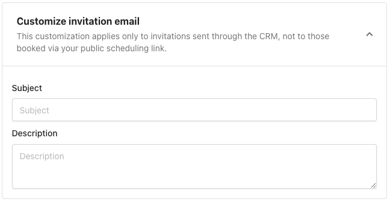

Write a custom **Subject** and **Description** for meeting invitations. This customization only applies to invitations sent through the CRM, not to meetings booked through your public scheduling link.

### Redirect to a custom URL

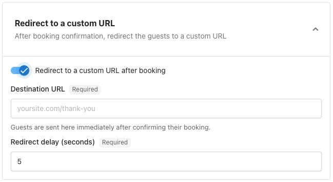

Turn on **Redirect to a custom URL after booking** to send clients to a page of your choice, like a thank-you page, right after they confirm their booking. Enter the **Destination URL** and set a **Redirect delay** in seconds.

### Meeting limits

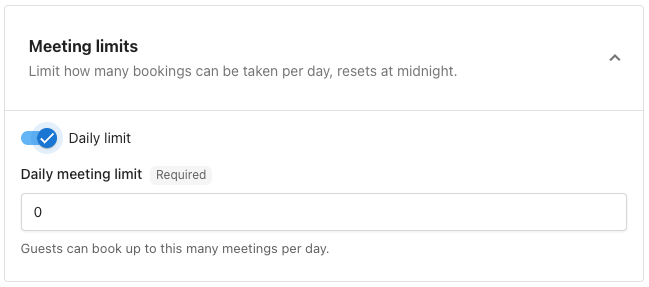

Turn on **Daily limit** to cap how many meetings can be booked per day for this event type. Set your **Daily meeting limit**. Clients can't book more than this number of meetings in a single day. The limit resets at midnight.

### Availability increment

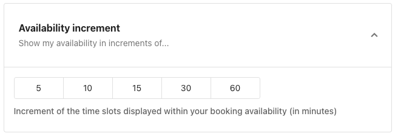

Choose the increment (5, 10, 15, 30, or 60 minutes) for displaying your available time slots to clients.

### Meeting buffers

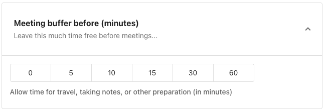

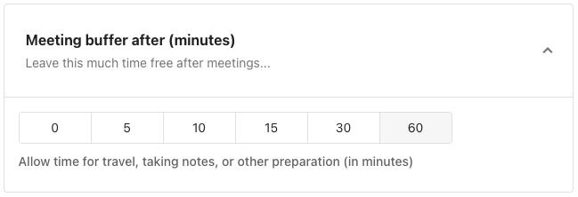

Set a buffer **before** and/or **after** each meeting (0, 5, 10, 15, 30, or 60 minutes) to leave time for travel, notes, or other preparation.

### Advance notice

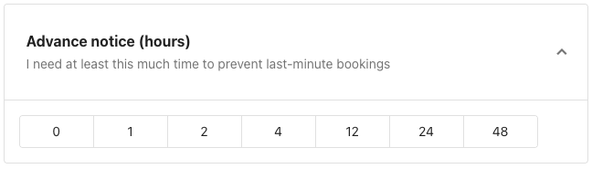

Set how much advance notice you need before a meeting can be booked (0, 1, 2, 4, 12, 24, or 48 hours) to prevent last-minute bookings.

### Limit future meetings

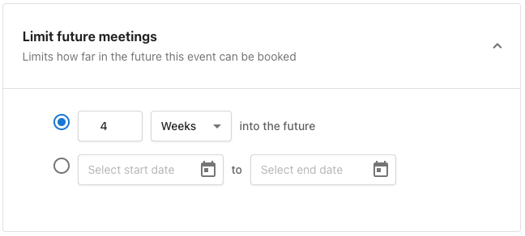

Control how far in the future this event type can be booked:

- Limit bookings to a set number of days, weeks, or months into the future, or
- Limit bookings to a specific date range by entering a start and end date.

## Save your team booking link

Once you've configured your event type, click **Save** to create the team booking link.

## Calendar customization

### Calendar integration requirements

For team members to appear as available:
- Each team member must have their personal calendar connected to My Meetings (Google Calendar or Microsoft 365 / Outlook).
- Each team member must also have a meeting app connected (Google Meet, Zoom, or Microsoft Teams). If either connection is missing, that team member is left out of the team's available times until they reconnect.
- Events marked as "busy" in personal calendars automatically block availability.
- All-day events prevent bookings for the entire day.

## Timezone settings

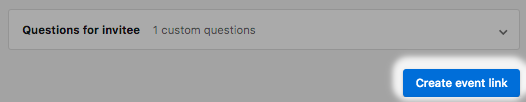

Choose how timezones are handled:
- Use the company timezone.
- Adjust to the visitor's timezone.
- Set a specific timezone.

## Viewing and sharing your team booking link

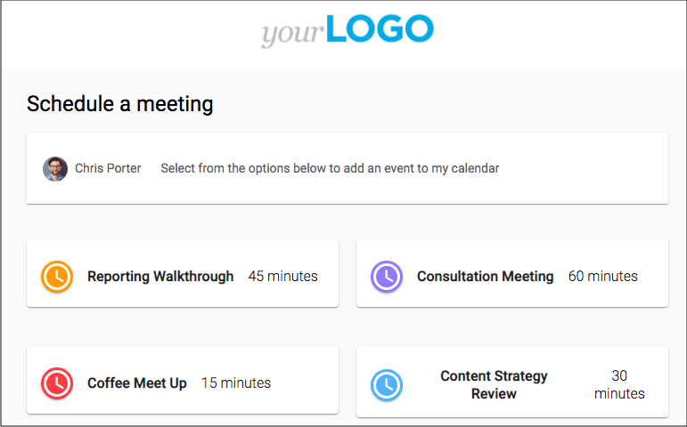

1. Click **View** to preview your booking page as visitors see it.
2. Click **Copy link** to copy the booking URL.
3. Share via email, social media, or add to your website.

## Frequently Asked Questions

Can I add or remove reminders?

No. The reminder schedule always has two email reminders and one SMS reminder. You can change when each one is sent, and your reminder channel controls which ones go out. See [Reminder schedule](#reminder-schedule).

Why are the SMS and Both options disabled?

**Phone Number** isn't marked **Required** in **Questions for invitee**. Turn on **Required** next to **Phone Number** to enable SMS for confirmations and reminders.

Can I send an email confirmation and SMS reminders?

Yes. Set the confirmation channel to **Email** and the reminder channel to **SMS**. The two channels are set independently.

What happens to reminders when a guest reschedules or cancels?

When a meeting is rescheduled, all of its pending reminders move to match the new time. When it's cancelled, all of its pending reminders are cancelled.

Can I change when hosts get reminders?

No. Hosts always get email reminders 24 hours and 15 minutes before each meeting they're on, regardless of the guest reminder schedule.

Why did a host only get the 15-minute reminder?

The meeting was booked or rescheduled less than 24 hours before it starts, so the 24-hour reminder couldn't be sent. Meetings booked less than 15 minutes before they start don't send host reminders.

How can I check whether a guest received a reminder?

Open the guest's contact in the CRM and look for the **Meeting - Reminder** activity in the **All** or **Meetings** tab. Its status shows whether the message was delivered or failed.

