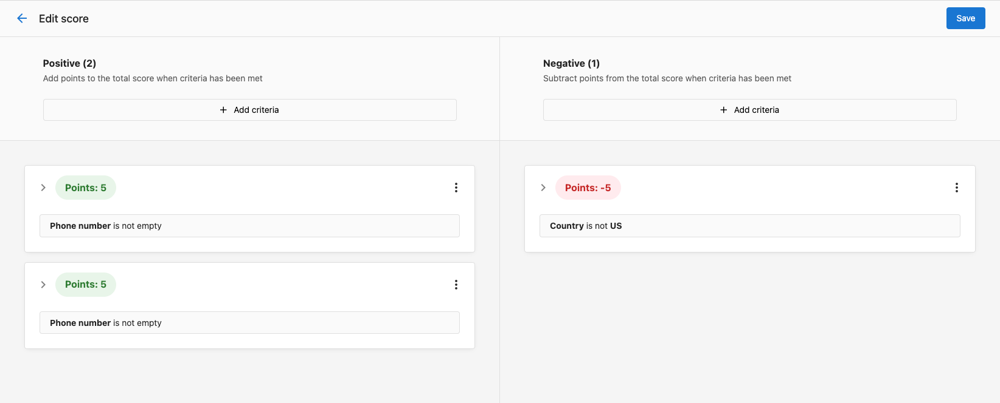

Use Companies to manage the organizations you sell to and serve. Keep company data accurate, track engagement, and associate contacts, opportunities, tasks, and lists.

## Why use Companies?

- Central reference for organization data and relationships
- Track engagement across emails, tasks, and meetings
- Associate contacts and opportunities to see full context
- Enrich with custom fields and segment for targeting

## What’s Included with Companies?

- **Companies table and profile** for searching, filtering, and editing records
- **Default fields** (name, website, address, lifecycle, UTM, source, social URLs, etc.) and support for custom fields
- **Engagement fields** (last activity, campaign interactions, last contact)
- **Associations** to contacts, opportunities, and tasks
- **Activity logging** for notes, emails, calls, meetings, and tasks
- **Find Accounts** to discover and add local businesses in bulk

## How to Use Companies

### View and manage companies

1. Go to `CRM` > `Companies`.
2. Search, sort, and filter the table to find the right records.
3. Click a company to open the profile and edit details, review engagement, and manage associations.

### Log activity on a company

1. Open a company profile.
2. In the activity area, choose the activity type: note, email, call, meeting, task, or more.
3. Add details, outcomes, and follow-up tasks as needed.

### Associate contacts and opportunities

1. From a company profile, associate related contacts and opportunities.
2. Use associations to get full context when communicating and forecasting.

### Discover companies with Find Accounts

1. Go to `CRM` > `Companies` and click `Find Accounts`.
2. Search by business type and location, select new businesses, and click `Create companies`.
3. Open `View companies` to work your new list.

### Set or change the Owner

The **Owner** field controls which team member is responsible for a company. This is the field to use when you want to assign a salesperson or team member to a company.

1. Open a company profile.
2. Find the **Owner** field in the company details panel.
3. Click the field and select a team member from the dropdown.

:::tip
Looking for a "Salesperson" or "Assign salesperson" field? The field is called **Owner**. Set this field to assign a team member to the company.
:::

### Take bulk actions on companies

Select one or more companies from the table, then click the **⚡ Actions** button to act on them without leaving the page. Available actions include:

- **Add to list** — add selected companies to an existing list
- **Remove from list** — remove selected companies from a list
- **Assign owner** — set or change the owner for all selected companies at once
- **Start automation** — run an automation on the selected companies immediately
- **Export** — download the selected companies as a CSV

To start an automation in bulk:

1. Go to `CRM` > `Companies`.
2. Select the companies you want to include (use filters and search to narrow the list first, if needed).
3. Click **⚡ Actions** > **Start automation**.
4. Choose the automation you want to run from the list.
5. Confirm to start the automation for all selected companies.

:::tip
Bulk actions are a fast way to run automations on demand — for example, sending a campaign to a segment of companies or assigning owners across a batch of new accounts. You don't need to build a new automation; just pick an existing one.
:::

### Optional: Lead Scoring

If enabled, configure scoring criteria in `Administration` > `Score` and use the score to prioritize outreach in the company table.

:::tip
Start with a simple score combining profile fit and engagement. Iterate after you review early results.
:::

## Frequently Asked Questions (FAQs)

What default fields are available for companies?

Company records include identifiers, name, website, address, contact details, lifecycle stage, UTM/source, social URLs, engagement dates, owner, parent company, and more. You can also create custom fields.

How do I assign a salesperson to a company?

Use the **Owner** field. There is no separate "Salesperson" or "Assign salesperson" field. Open the company profile, find the **Owner** field, and select the team member from the dropdown.

Can I log activities automatically?

Yes. Platform actions like company creation, owner changes, and opportunity wins/losses are logged automatically. You can also enable email auto-capture and use automations for additional activity logging.

Can I bulk add companies from local search?

Yes. Use `Find Accounts` to search for local businesses and add them in bulk without duplicates.

