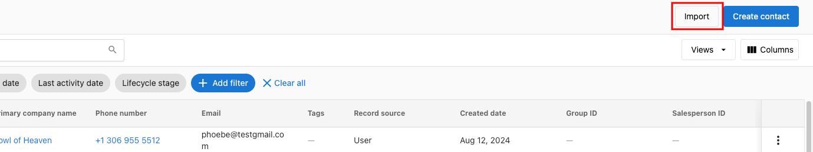
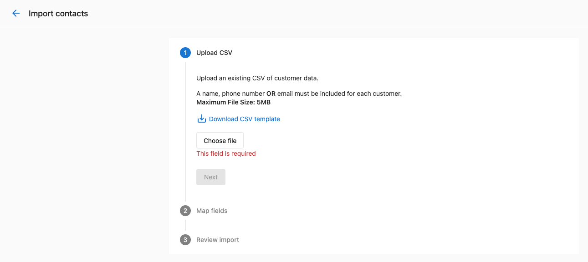
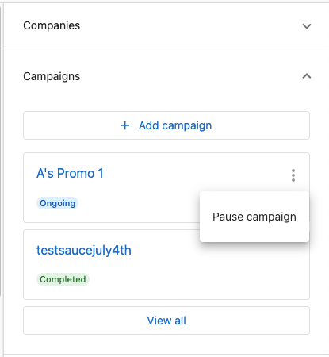

Use Contacts to manage the people you engage with. Create and update contact records, import and export in bulk, associate contacts with companies and opportunities, and take action with campaigns, lists, and tasks.

## Why use Contacts?

- Centralize people data for sales and marketing
- Keep profiles up to date with default and custom fields
- Start campaigns and automations from contact segments
- Track activity and tasks to move deals forward

## What’s Included with Contacts?

- **Contacts table and profile** for searching, filtering, and editing records
- **Import and export** to manage data at scale
- **Default fields** (name, email, phone, lifecycle, UTM, source, etc.) and support for custom fields
- **Associations** with companies, opportunities, tasks, and lists
- **Campaign actions** including scheduling, pausing, or resuming campaigns

## Contacts vs. users

**Contacts** are people you track in the CRM—customers, leads, or other individuals. They do not have access to Business App. **Users** are people who can log in to Business App and use the products available on your account.

Contacts and users are separate. In some cases a user may have a corresponding contact record; the two can be linked by email. Changing a contact’s email disassociates that contact from any linked user. Removing a contact does not remove a user.

## Where contacts come from

Contacts can be added manually or imported via CSV. They are also created or updated automatically when data syncs from other products:

- **Conversations** – When a message is sent or received to a new contact
- **Customer Voice** – When a contact is created in Customer Voice
- **Website** – When a contact form is submitted on your website
- **Constant Contact** – When a contact is created there

You can add, edit, and delete contacts to keep your data organized. Create contacts by first name, last name, phone number, or email, or use the import feature for bulk uploads.

## How to Use Contacts

### View and manage contacts

1. Go to `CRM` > `Contacts`.
2. Search by first name, last name, email, or phone number. Filter by tags and other fields, and sort the table to find the right records.
3. Click a contact to open the profile and edit details, log activity, and manage tasks.

### Import contacts (and companies)

1. In `CRM` > `Contacts`, click `Import`.
2. Upload a CSV (up to 5 MB) and map columns to contact/company fields. You can add multiple columns as tags during the mapping step.
3. Review, choose whether to update existing matches, and finish the import.

If you upload a CSV that includes the same contacts again (matching by ID, external ID, or email), they will not be duplicated; existing records will be updated with the new information.

:::warning
Updating existing contacts during import will overwrite the mapped fields on matching records (by ID, external ID, or email). Export a backup first if you’re unsure.
:::

:::note
Each contact should include at least one of: first name, last name, email, or phone. Company name is required for any new company rows created during import.
:::

### Export contacts

1. In `CRM` > `Contacts`, set filters if needed, then select the checkbox at the top-left of the table.
2. Choose `Select all…` (or select specific rows), then `Actions` > `Export`.
3. A notification is sent when your CSV is ready to download.

:::info
Exports respect your current filters and the set of rows displayed.
:::

### Start, pause, or resume campaigns

1. Open a contact profile and go to the `Campaigns` section.
2. Use the action menu to schedule, pause, or resume campaigns for that contact.

### Add contacts to lists or automations

1. From the Contacts table, select records and use actions to add them to a `List`.
2. Trigger or schedule automations for the selected list.

### Log activity and create tasks

1. On a contact profile, use the activity area to log notes, emails, calls, messages, and meetings.
2. Create tasks for follow-up and associate them with the contact (and related company or opportunity).

## Frequently Asked Questions (FAQs)

What file size can I import?

CSV imports up to 5 MB are supported. Depending on fields, this typically allows tens of thousands of contacts per import.

Can I import companies at the same time?

Yes. During import, map CSV columns to either contact or company fields. New companies will be created when needed.

Can I update existing contacts during import?

Yes. Choose to update matches by ID, external ID, or email when reviewing the import.

Where can I see import history and errors?

After an import completes, review the import summary in `CRM` > `Contacts` to see successes, failures, and error details for each row.

How do I assign an owner during import?

In the CSV, include an Owner Email column and map it during import. Matching is done against existing users; when a match is found, that user is set as the contact owner.

Can I automatically log emails?

Yes. Set up email auto-BCC and forwarding so sales emails are captured to the appropriate contact records.

How are contacts different from users?

Contacts are people you store in the CRM (e.g. customers, leads); they do not log in to Business App. Users are people who have access to Business App. The two are separate; changing a contact’s email disassociates them from any linked user, and removing a contact does not remove a user.

