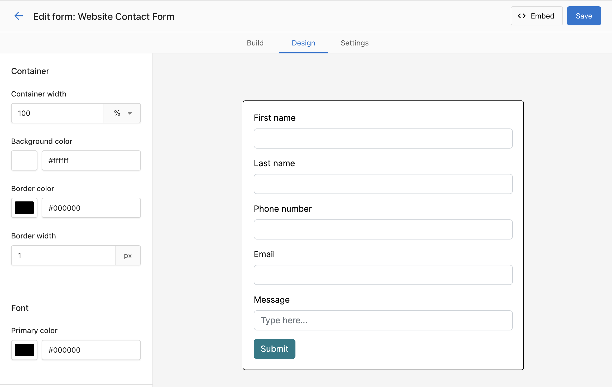
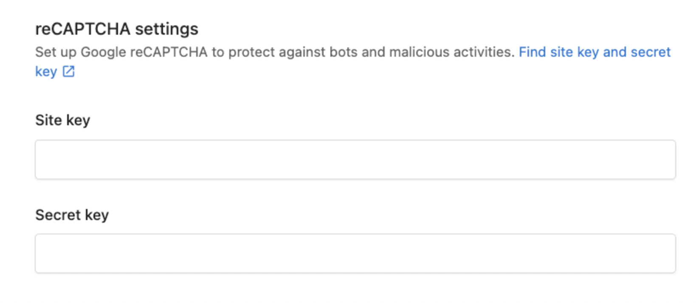
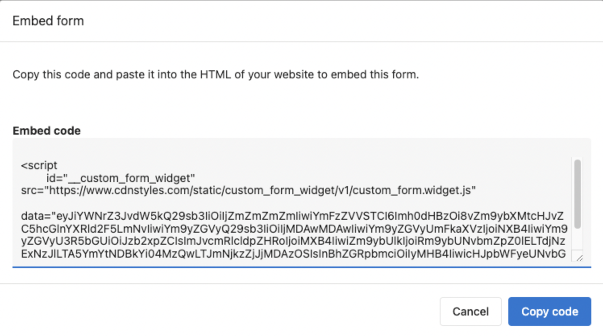

## Step 1: Navigate to CRM > Forms


Add the key fields you'd like to capture. Keep forms short—[conversion rates drop as fields increase](https://medium.com/@raminzamani/how-many-fields-should-you-have-on-a-form-4a3447661209) (e.g. forms with 5 fields or fewer tend to convert better than those with 10+).

### Field settings

**For all field types:**

- You can set a default value, which will be submitted when the user submits an empty field.
- You can mark the field as required, and the user can't submit the form without filling in the required field.
- You can make the field hidden, so users won't see the field and can't edit it when they fill out the form.
- You can populate the specific form field dynamically using a query parameter from the URL.
  - Example: form at `https://www.example.com/form?campaign=spring-promotion` with "campaign" set in the field → the field pre-fills with "spring-promotion" when the user submits.

**For the string field:** you can switch it to an open text field, drop-down, or radio button options.

:::tip
Short forms convert better. Consider deferring lower-priority questions to a follow-up email or meeting.
:::

### Adding a file upload field

You can add a **File upload** field so visitors can attach a document or image when they submit. Files are attached to the Contact or Company record the form creates and receive an AI-generated summary for easier review.

1. In the form builder, choose **Add field** and select **File upload**.
2. Configure the field label and whether the file is **required**.
3. Optionally set accepted file types (e.g. PDF, PNG, JPEG, DOCX) and a maximum file size.
4. Save the form and test a submission to confirm the file attaches to the created record.

:::info
Files submitted through Forms are processed the same as files uploaded in CRM: a single file per submission is supported and an AI-generated summary appears after processing.
:::

## Step 2: Customize the styling

Set the form width (e.g. 100%) and manage the width in your page builder. In the **Design** tab, style the container, font, and button.



### Advanced Styling with Custom CSS

1. In the form builder, go to the **Design** tab.
2. Scroll down to the **Custom CSS** section.
3. Add your CSS rules to customize colors, fonts, spacing, and layout.
4. Preview changes in real-time.

**Example custom CSS:**

```css
/* Customize form background */
.form-container {
    background: linear-gradient(135deg, #667eea 0%, #764ba2 100%);
    border-radius: 10px;
    padding: 20px;
}

/* Style input fields */
input[type="text"], input[type="email"] {
    border: 2px solid #4CAF50;
    border-radius: 5px;
    padding: 10px;
}

/* Customize submit button */
.submit-button {
    background-color: #4CAF50;
    color: white;
    border-radius: 25px;
    padding: 12px 30px;
    font-weight: bold;
}
```

:::tip
Test your custom CSS on different devices to ensure your form looks great on desktop, tablet, and mobile.
:::

## Step 3: Set up reCAPTCHA

In the form builder, under **Settings**, use the reCAPTCHA section. After generating the site key and secret key, setup completes automatically (this can take a few minutes).



## Step 4: Copy the embed code

Copy the embed code and place it on your website landing page or contact page. If using WordPress (e.g., Divi), add a "Code" block and paste the embed code.



## Step 5: Test your form

Submit a test response to confirm that a contact is captured in the CRM and any automations run as expected.
