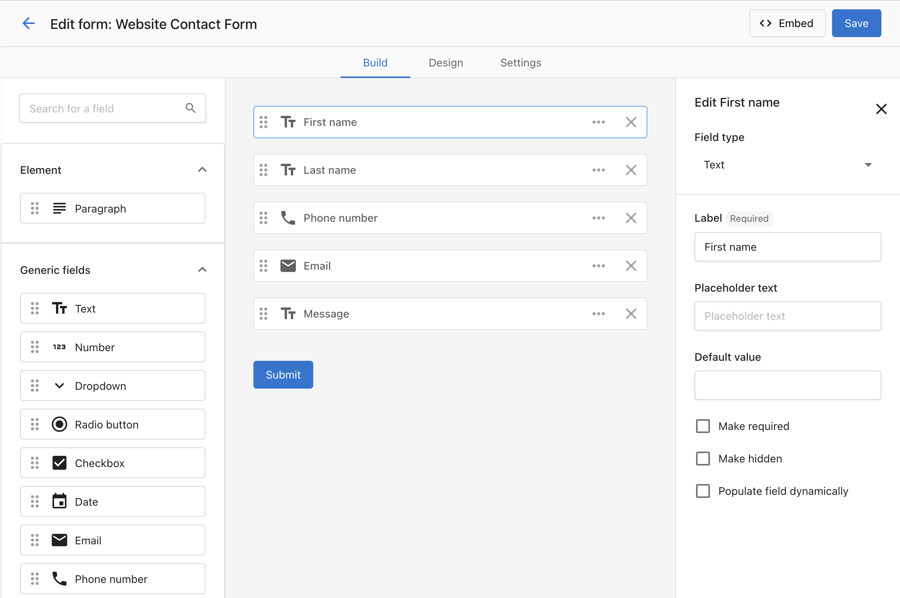

Use Forms to capture leads from your website directly into the CRM. Embed a form on any page, create the contact automatically, start a conversation in Conversations, and trigger automations for instant follow-up.

## Why use Forms?

- Convert website visitors into contacts automatically
- Reduce manual data entry with mapped fields and defaults
- Keep CRM records current — form submission values automatically overwrite the corresponding CRM fields, so your data stays accurate without manual updates. Every change is tracked in the CRM timeline with attribution showing what was updated and by whom
- Trigger automations (auto-reply, nurture campaigns, routing)
- Improve data quality with reCAPTCHA and UTM capture

:::tip
Use UTM parameters in the links you publish (ads, social media, email) so form submissions capture where leads came from and you can see which channels perform best.
:::

## What’s included

- **Form Builder** with configurable fields and defaults
- **Design** controls for container, fonts, button, and custom CSS
- **reCAPTCHA** integration
- **Embed code** for easy installation on any site
- **File upload** field so visitors can attach documents or images
- **Form automations** – trigger follow-up from the form’s Automation tab
- **Public landing page and QR code flyer** – every form has a shareable public URL and a printable QR code flyer with your account branding

For the full list of contact, company, and generic fields you can add, see [Form field reference](supported-fields.md).

## Share a form with a QR code flyer

Every form has a default public landing page. From the form, you can generate a printable QR code flyer that links directly to that page. The flyer pulls your account branding automatically, so it's ready to print and display in-store, at events, or anywhere you want customers to scan and submit.

This works for any form — lead capture, promotions, surveys, or any other type you build.

## What's in this section

- **[Build and publish a form](form-builder.md)** – Add fields (including file upload), style with Design and custom CSS, set up reCAPTCHA, embed, and test.
- **[Automate follow-up from your form](form-automations.md)** – Use the Automation tab to send follow-up emails, add to campaigns, or run multi-step workflows.
- **[Form field reference](supported-fields.md)** – Full list of contact, company, and generic field types.

## Frequently Asked Questions (FAQs)

My form isn't always capturing UTM fields, why might that be?

A few things can cause this: UTM parameters must still be present in the browser address bar when the form is submitted, your form needs the relevant UTM fields (Campaign, Medium, Source, Content, Term) added to it, and any redirect before the form loads must preserve the URL parameters. If a visitor clicks to a second page on your site before submitting and you don't have a UTM preservation tool active, the values can be lost, so removing links from your landing page is one way to keep leads on the page with the form. See [Form field reference](supported-fields.md).

Can I include a file upload on a form?

Yes. Add a **File upload** field to let visitors attach a document or image when submitting. Files uploaded through forms attach to the Contact or Company the form creates and an AI-generated summary is created for easier review. See [Build and publish a form](form-builder.md#adding-a-file-upload-field).

Can I trigger automations from a specific form?

Yes. Open your form and use the `Automation` tab to create or manage a workflow for that specific form. You can also build it from the Automations area by choosing the "When a form is submitted" trigger. See [Automate follow-up from your form](form-automations.md).

Where do I find the automation tab?

Go to CRM > Forms, open a form, and click the `Automation` tab.

Can I use a template to set up a form automation?

Yes. If no automation exists yet, you'll see options to start from a template or from blank.

Can I add multiple steps to a form automation?

Yes. Click `Advanced mode` to open the full builder and add Conditions and Actions, just like any other automation.

How do I enable or disable a form automation?

Use the toggle at the top-right of the `Automation` tab.

Can I delete a form automation from the tab?

Not yet. To delete, go to the main Automations page, open the automation, and delete it there.

How do I add custom CSS to style my forms?

In the form builder, go to the **Design** tab and scroll down to the **Custom CSS** section. See [Build and publish a form](form-builder.md#advanced-styling-with-custom-css).

Can I use custom CSS to make my forms responsive?

Yes! You can add media queries and responsive CSS rules in the Custom CSS section to ensure your forms look great on all devices.

What CSS can I use to style my form from my website?

CSS entered in the **Design tab** (Custom CSS editor) works normally — you can use standard selectors like `input`, `label`, or `.submit-button` there. If you want to apply styles from your website's own stylesheet, use the `::part()` pseudo-element instead, since the form renders in an isolated container that blocks outside selectors. See [Style a form from your website's stylesheet](form-builder.md#style-a-form-from-your-websites-stylesheet) for the full list of available part names and examples.

What fields can I add to a form?

Forms support many contact fields, company fields, and generic types (text, paragraph, number, dropdown, radio, checkbox, date). See [Form field reference](supported-fields.md) for the full list.

Why is Company name a required field on my form?

`Company name` is required whenever you add the company fields group to a form and can't be made optional, similar to how `Email` is always required for contact fields. If you don't need to capture company data, use contact fields only and leave out the company fields group.

I submitted a form but the record I expected wasn't updated, why?

Forms have two separate field groups, contact fields and company fields, that write to two different record types. If your form only includes contact fields, submissions only create or update a Contact record, so add fields from the company fields group if you also want to create or update a Company record. See [Form field reference](supported-fields.md).

Can I change the default country code for phone number fields?

Yes. Phone number fields default to `+1`. Select the field in the form builder and set a different `Default country code` in its field settings. See [Build and publish a form](form-builder.md#setting-a-default-country-code).

Can I let visitors select multiple checkbox options?

There's no dedicated multi-select field type. Add the `Checkbox` field once for each option you want to offer, and label each one clearly. See [Build and publish a form](form-builder.md#adding-multiple-checkbox-options).

