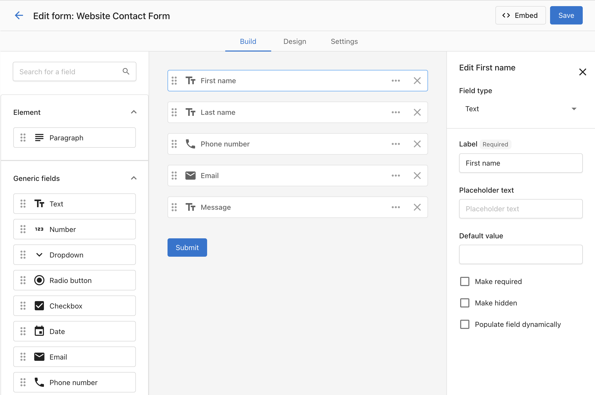

Use Forms to capture leads from your website directly into the CRM. Embed a form on any page, create the contact automatically, start a conversation in Conversations, and trigger automations for instant follow-up.

## Why use Forms?

- Convert website visitors into contacts automatically
- Reduce manual data entry with mapped fields and defaults
- Trigger automations (auto-reply, nurture campaigns, routing)
- Improve data quality with reCAPTCHA and UTM capture

:::tip
Use UTM parameters in the links you publish (ads, social media, email) so form submissions capture where leads came from and you can see which channels perform best.
:::

## What's included

- **Form Builder** with configurable fields and defaults
- **Design** controls for container, fonts, button, and custom CSS
- **reCAPTCHA** integration
- **Embed code** for easy installation on any site
- **File upload** field so visitors can attach documents or images
- **Form automations** – trigger follow-up from the form’s Automation tab

For the full list of contact, company, and generic fields you can add, see [Form field reference](supported-fields.md).

## What's in this section

- **[Build and publish a form](form-builder.md)** – Add fields (including file upload), style with Design and custom CSS, set up reCAPTCHA, embed, and test.
- **[Automate follow-up from your form](form-automations.md)** – Use the Automation tab to send follow-up emails, add to campaigns, or run multi-step workflows.
- **[Form field reference](supported-fields.md)** – Full list of contact, company, and generic field types.

## Frequently Asked Questions (FAQs)

My form isn't always capturing UTM fields, why might that be?

For the form to capture UTM, they must be still present in the browser address bar. If a user clicks away from your landing page, to visit a second page on your website, and you don't have a UTM preservation tool active, the UTM can be lost and won't be captured if they fill out a form. One tactic to prevent this is removing all links from your landing page, to ensure leads fill out the form on the landing page and nowhere else.

Can I include a file upload on a form?

Yes. Add a **File upload** field to let visitors attach a document or image when submitting. Files uploaded through forms attach to the Contact or Company the form creates and an AI-generated summary is created for easier review. See [Build and publish a form](form-builder.md#adding-a-file-upload-field).

Can I trigger automations from a specific form?

Yes. Open your form and use the `Automation` tab to create or manage a workflow for that specific form. You can also build it from the Automations area by choosing the "When a form is submitted" trigger. See [Automate follow-up from your form](form-automations.md).

Where do I find the automation tab?

Go to CRM > Forms, open a form, and click the `Automation` tab.

Can I use a template to set up a form automation?

Yes. If no automation exists yet, you'll see options to start from a template or from blank.

Can I add multiple steps to a form automation?

Yes. Click `Advanced mode` to open the full builder and add Conditions and Actions, just like any other automation.

How do I enable or disable a form automation?

Use the toggle at the top-right of the `Automation` tab.

Can I delete a form automation from the tab?

Not yet. To delete, go to the main Automations page, open the automation, and delete it there.

How do I add custom CSS to style my forms?

In the form builder, go to the **Design** tab and scroll down to the **Custom CSS** section. See [Build and publish a form](form-builder.md#advanced-styling-with-custom-css).

Can I use custom CSS to make my forms responsive?

Yes! You can add media queries and responsive CSS rules in the Custom CSS section to ensure your forms look great on all devices.

What CSS classes can I target for form styling?

You can target standard form elements like `.form-container`, `input[type="text"]`, `input[type="email"]`, `.submit-button`, and other standard HTML form elements. Use your browser's developer tools to inspect the form structure.

What fields can I add to a form?

Forms support many contact fields, company fields, and generic types (text, paragraph, number, dropdown, radio, checkbox, date). See [Form field reference](supported-fields.md) for the full list.

