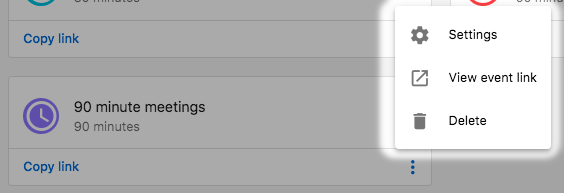
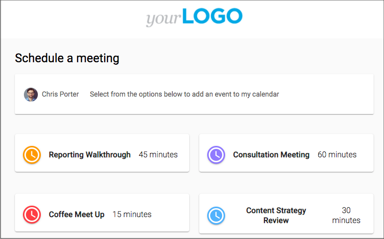

Use My Meetings to share booking links, manage availability, and track upcoming meetings.

## Why use My Meetings?

- Make it easy for prospects and customers to book time with you
- Reduce back-and-forth and no-shows with automated confirmations
- Keep meetings connected to contacts, companies, and opportunities

## What’s included

- **Personal and team booking links**
- **Availability settings** and buffers
- **Calendar connections**
- **Microsoft Outlook/365 calendar integration**
- **Microsoft Teams video conferencing integration**
- **Multi‑host events (up to five hosts)**

## How to use My Meetings

1. Go to `CRM` > `My Meetings`.
2. Connect your calendar and configure availability.
3. Create personal or team booking links and share them.

## Frequently Asked Questions (FAQs)

Can I set different durations for meeting types?

Yes. Configure durations when creating booking links.

How many hosts can I add to a single event?

You can add up to five hosts to one event. All selected hosts are added to the calendar invite so everyone stays in the loop.

Do I need anything special to connect Microsoft Outlook/Teams?

You’ll need to sign in with a Microsoft 365 account you control. Some organizations require an administrator to approve new app connections—if you see a consent prompt, contact your Microsoft admin to enable it.

Which video link is used for multi‑host events?

The conferencing provider set in the booking link is used. If Microsoft Teams is connected and selected for the link, a Teams meeting is created and included on the invite that all hosts and attendees receive.

