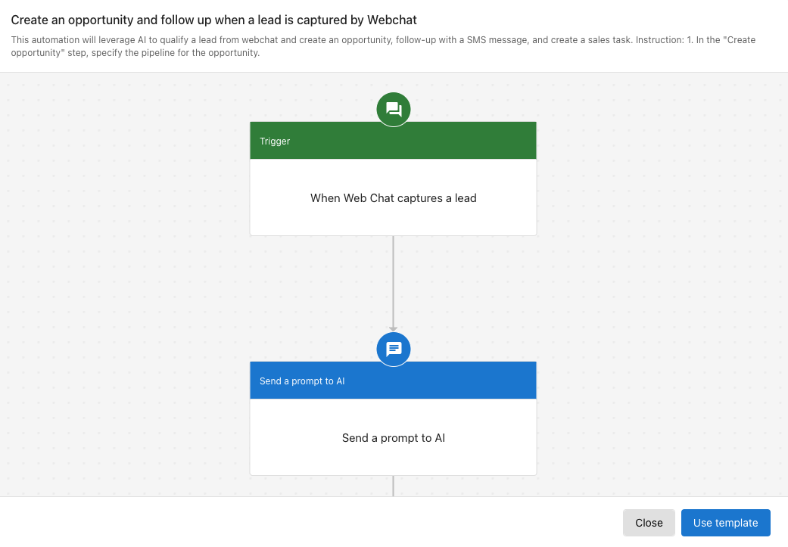
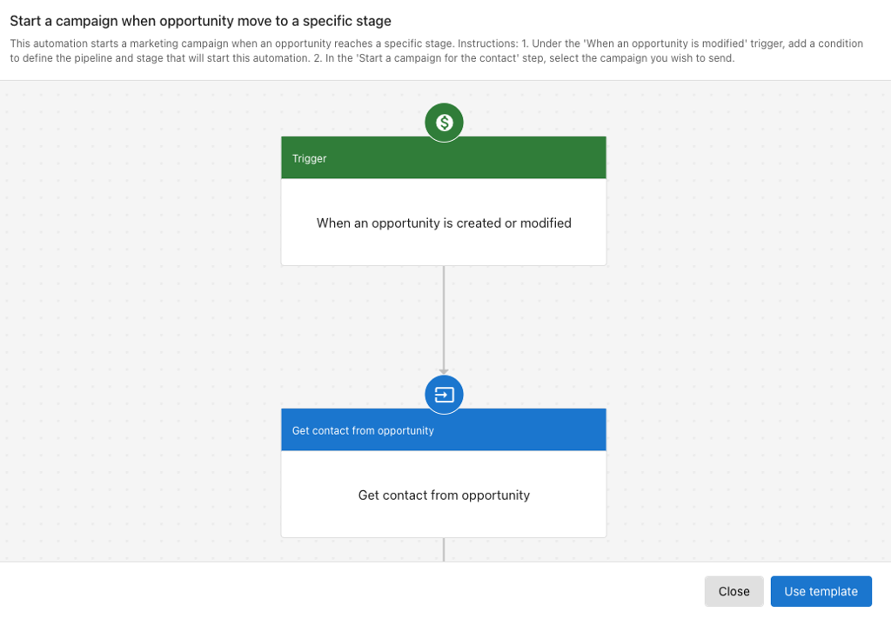
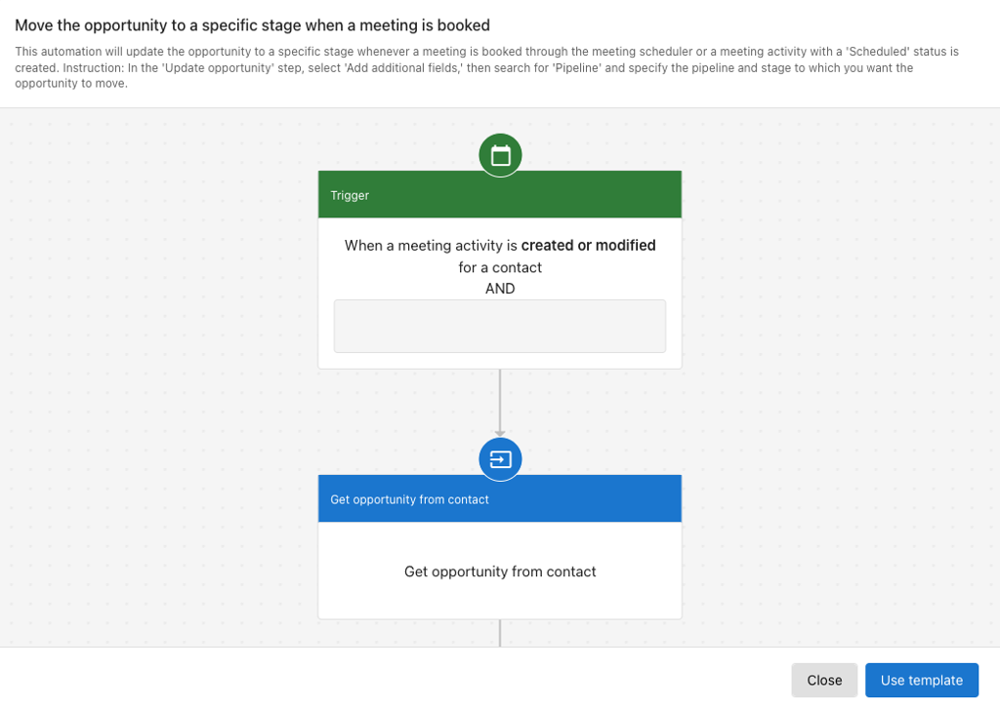

## Create opportunities automatically from webchat

You can create an opportunity when a lead is captured from webchat.

### Example: Create an opportunity and follow up from webchat

**Requirements:** Conversation AI must be active.

Automation behavior:

- Triggered when a lead is captured through webchat
- Webchat summary is sent to AI
- AI identifies the requested service and creates an opportunity
- A follow-up SMS message is sent to the contact
- A sales task is created for further follow-up

### Steps to set it up

1. Go to `Automation`.
2. Click `Create automation`.
3. Search for the template **Create an opportunity and follow up when a lead is captured by Webchat**.
4. In the `Create opportunity` step, choose the appropriate pipeline.
5. Review and customize the steps to match your workflow.

## Automate actions based on opportunity stages

You can start nurturing campaigns or send communications when an opportunity reaches a specific stage.

### Example: Trigger a campaign when an opportunity moves to a nurturing stage

**Requirements:** Campaign Pro with SMS credits must be active.

Automation behavior:

- Triggered when an opportunity enters a specified nurturing stage
- Finds the contact associated with the opportunity
- Starts a predefined campaign

### Steps to set it up

1. Go to `Automation`.
2. Click `Create automation`.
3. Search for the template **Start a campaign when opportunity move to a specific stage**.
4. In the `When an opportunity is created or modified` step, set the pipeline and stage conditions.
5. In the `Start a campaign for contact` step, select the desired campaign.
6. Review and adjust the automation as needed.

## Move opportunities to a stage automatically

You can move an opportunity to a specific stage when a defined trigger occurs, such as booking a meeting.

### Example: Move opportunity to "Appointment Set" when a meeting is booked

Automation behavior:

- Triggered when a meeting activity is created or modified
- If the meeting status is `Scheduled`, the opportunity is moved to the "Appointment set" stage

### Steps to set it up

1. Go to `Automation`.
2. Click `Create automation`.
3. Search for the template **Move the opportunity to a specific stage when a meeting is booked**.
4. In the `Update opportunity` step, set the correct pipeline and target stage.
5. Customize the steps as needed for your process.

See [Automations](../../automations/index) for more on building and managing automations.
