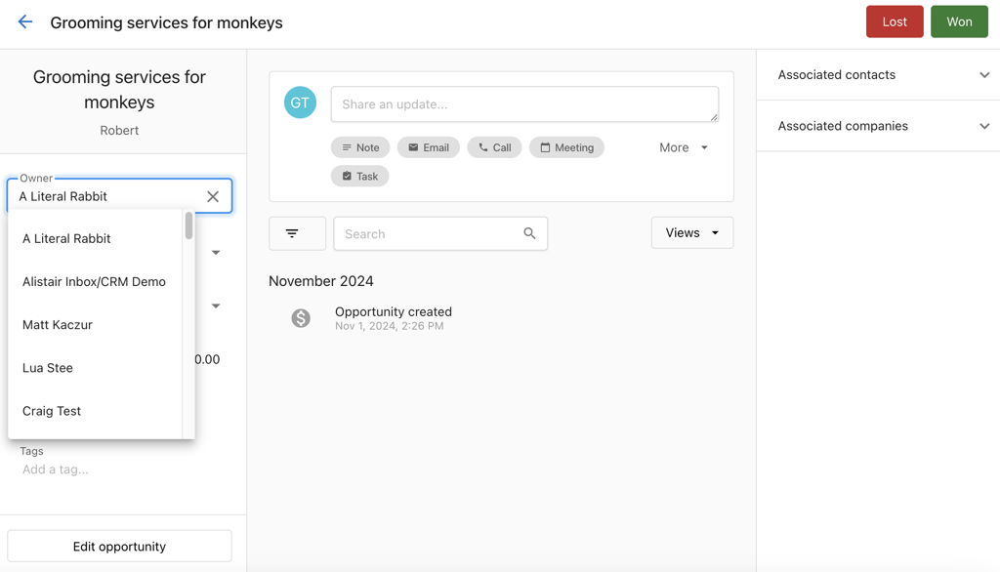

## Pipeline and list view

You can manage opportunities in two views:

**Pipeline View** – Manage opportunities visually by stage. Click `Set up a pipeline` if none exists. Drag and drop opportunities to update their stage. Use filters and search to find records.

**List View** – Click the `List` icon to switch. Configure columns, sort by fields such as expected close date, and use bulk actions.

## How to create an opportunity

### From the opportunity page

1. Navigate to `CRM` → `Opportunities`.
2. Click `Create Opportunity`.
3. Enter the opportunity details.
4. Click `Create`.

### Import opportunities (CSV)

1. In `CRM` → `Opportunities`, click `Import`.
2. Upload a CSV and map columns to opportunity fields.
3. Optionally map associations to existing contacts or companies.
4. Review choices, then finish the import.

:::note
Updating existing opportunities during import overwrites mapped fields on matching records (by ID or external ID). Export a backup first if you're unsure.
:::

## How to edit an opportunity

### From the profile page

1. Go to `CRM` → `Opportunities`.
2. Click on the opportunity.
3. Click any editable field in the left panel.
4. Make changes and click away to save.

### From the table view

1. Go to `CRM` → `Opportunities`.
2. Switch to the list view.
3. Click the action menu for the opportunity.
4. Select `Edit opportunity`.
5. Update fields and click `Save`.

## How to close an opportunity

### In pipeline view

Drag the opportunity to the `Closed Won` or `Closed Lost` column.

### From the profile page

Open the opportunity and click `Closed Won` or `Closed Lost` at the top.

### By updating the stage field

Open the opportunity and change the `Stage` field to `Closed Won` or `Closed Lost`.

:::info
When marking an opportunity as `Closed Lost`, you may be prompted to provide a reason. Key stage changes (Won, Lost, Reopened) are recorded as activity notes for better history and reporting.
:::
