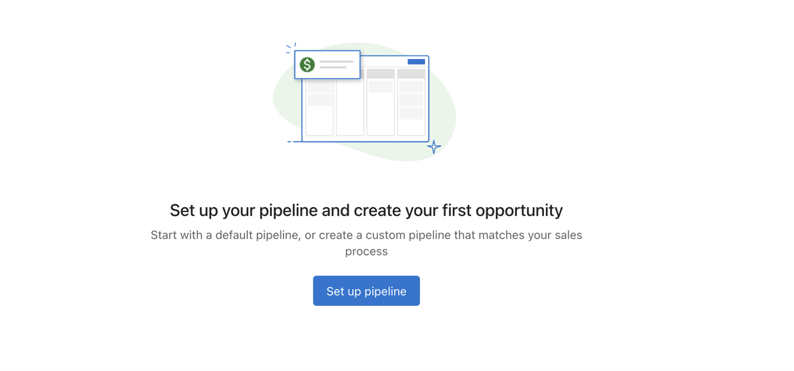
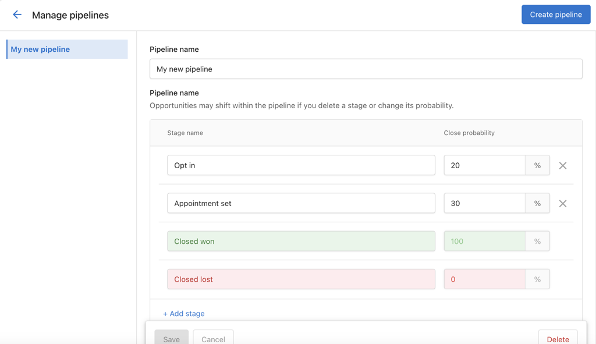
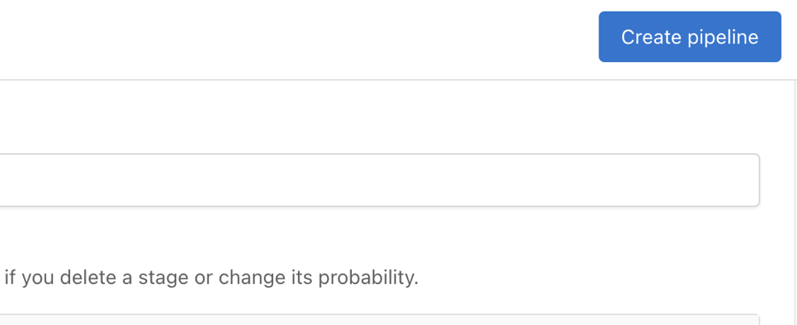
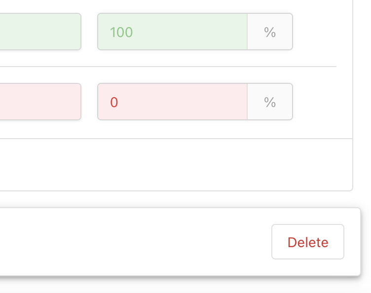

## How to set up a pipeline

1. Go to the Opportunities page.
2. Click the `Set up a pipeline` button. This creates a default pipeline.
3. Use `Add Stage` to insert new stages.
4. Use the `X` next to a stage to remove it (except for default stages).
5. Set a **Close Probability** for each stage to forecast deal success rates.

:::warning
You cannot remove `Closed Won` and `Closed Lost` stages. You also cannot set any stage to 0% or 100% Close Probability, as those are reserved for the default stages.
:::

## Example pipeline stages

Stages represent how an opportunity moves through your sales process. You can name stages to match your workflow. Common examples include:

- **Lead** – Initial contact or expression of interest
- **Qualified** – The opportunity has been qualified as a potential sale
- **Proposal** – A proposal has been presented to the potential customer
- **Negotiation** – Terms are being negotiated
- **Won** – The opportunity has resulted in a sale (or use **Closed Won**)
- **Lost** – The opportunity did not result in a sale (or use **Closed Lost**)

Moving opportunities through stages helps you track your sales process and spot bottlenecks. Set close probability per stage so the CRM can help you forecast revenue.

## How to add or remove a pipeline

### Add a new pipeline

- Click `Create Pipeline` to add a new one. There is no limit to the number of pipelines you can create.

### Remove a pipeline

- Click `Delete` next to the pipeline you want to remove.
- Ensure all opportunities are reassigned before deletion. If not, they will remain unattached.

