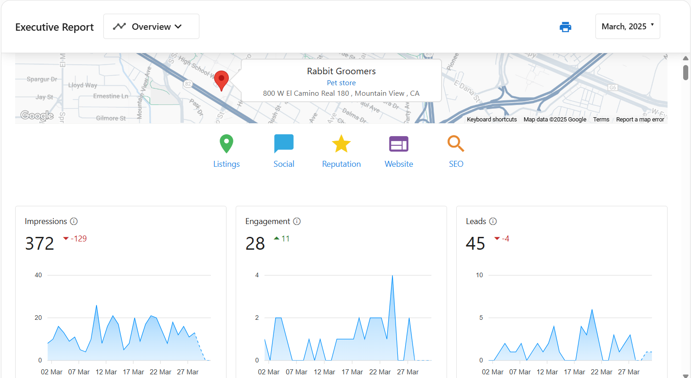
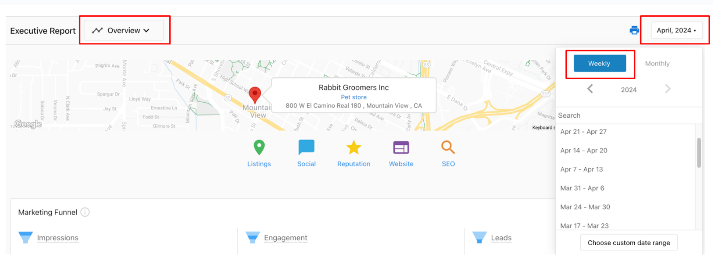
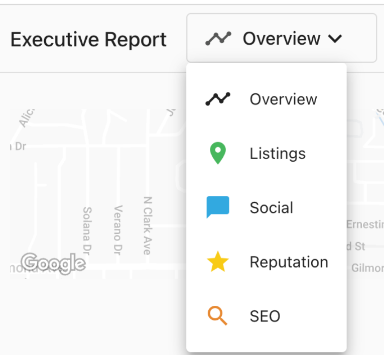

## What is the Executive Report?
The **Executive Report** gives you a clear summary of your business’s online performance across key marketing areas like reviews, SEO, social media, listings, advertising, and website traffic. The report is automatically generated and delivered on a weekly or monthly schedule and includes data from the tools connected to your Business App.

This report helps you understand your results over time and track growth without needing to gather data from multiple tools manually.

## Why is the Executive Report Important?
As a business owner, you need a clear way to understand how your online presence and marketing efforts are performing. The **Executive Report** gives you a simple, reliable summary of your most important metrics—without the need to log into multiple tools or spreadsheets.

Each report helps you:
- See how many **people saw your business** across listings, search, social, and ads (impressions)
- Understand where and how customers **engage with your content**, like social posts, reviews, or ads
- Track **leads and conversions**, such as phone calls, website visits, and clicks from campaigns

This report consolidates your data into one view, so you can make smart business decisions faster:
- Identify what’s working and what needs improvement
- Stay aware of week-over-week and month-over-month trends
- Avoid jumping between platforms to track performance

## Table of Contents
- [What is Included with Executive Report](#whats-included-with-executive-report)
- [When Is New Data Updated in the Executive Report](#when-is-new-data-updated-in-the-executive-report)
- [How to View and Navigate the Report](#how-to-view-and-navigate-the-report)
- [Frequently Asked Questions (FAQs)](#frequently-asked-questions-faqs)

## What’s Included with Executive Report
Your Executive Report includes:

- Performance data from active products in your account. These might include:
  - Reviews
  - Listings
  - Social Media
  - Website
  - SEO
  - Advertising
- Week-over-week or month-over-month comparisons 
- Long-term performance trends
- Automatic email delivery with no login required
- Mobile-friendly layout

The report includes only the sections where data has changed since your last report. If no updates were detected for a product or feature, that section may not appear.

## When Is New Data Updated in the Executive Report

Data appears in your Executive Report automatically as your connected products collect and sync performance results. Data sync time (approximate) for an authenticated Google Business Profile should populate within 5 minutes. If you recently added a product, it may take up to 48 hours for data to appear in your next report.

## How to View and Navigate the Report

To view your Executive Report:
1. Open the Business App and go to the `Executive Report` tab
2. Use the **date selector** in the top-right corner to choose:
   - Weekly view
   - Monthly view
   - Custom date range

   

3. Navigate quickly between sections using:
   - The category icons at the top of the report
   - The dropdown navigation menu

      

Your report is updated automatically and archived so you can review previous reports at any time.

### Frequently Asked Questions (FAQs)

**When will I receive my Executive Report?**  
Monthly reports are sent between the 1st–3rd of each month. Weekly reports are sent on Mondays.

**Why didn’t I receive my Executive Report this month?**  
If there were no changes to your data, or only Local SEO was active without updates, a report may not be generated.

**How soon after setup will data appear in the report?**  
Some products (like Google Business Profile) update in minutes, others may take up to 48 hours to populate.

**Is login required to view the report?**  
No. The report opens directly from email. Logging in is only required to access other features of the Business App.

**How do I view past reports?**  
Go to the `Executive Report` tab in the Business App and use the date selector to view previous reports.

**What if a section of the report is missing?**  
Sections only appear if there was updated data. If a section is missing, no new data was detected for that product during the reporting period.

**What products contribute data to the Executive Report?**  
Most active products push data to the report, including:
- Google Business Profile
- Reputation AI
- Local SEO
- Social Marketing
- Advertising Intelligence (Google Ads, Facebook Ads)
- Website Pro
- Marketgoo, Metricool, SEO tools
- QuickBooks and others

**Why isn’t Google Search Console data showing in my Executive Report?**  
Google Search Console (GSC) helps track how your website appears in Google Search results, but there are a few reasons why its data might not be appearing in your Executive Report yet:

- **Connection Timing**: Data collection begins only after GSC is successfully connected to your Business App account. If you recently connected it, allow a few days for the initial data to populate.

- **Daily Sync Schedule**: GSC data is pulled into the Executive Report once per day, typically around midnight CST. Any changes or activity may take up to 24 hours to appear in the report.

- **New Website Launch**: If your website has just gone live, there may not be enough search traffic or impressions for GSC to report yet. It’s normal for new sites to take time before data becomes available.

- **No Data in GSC**: Visit Google Search Console directly to check whether data is being collected there. If GSC itself shows no data, the Executive Report will also not display anything for that section.

If you have completed these checks and the issue persists, additional investigation may be required.

