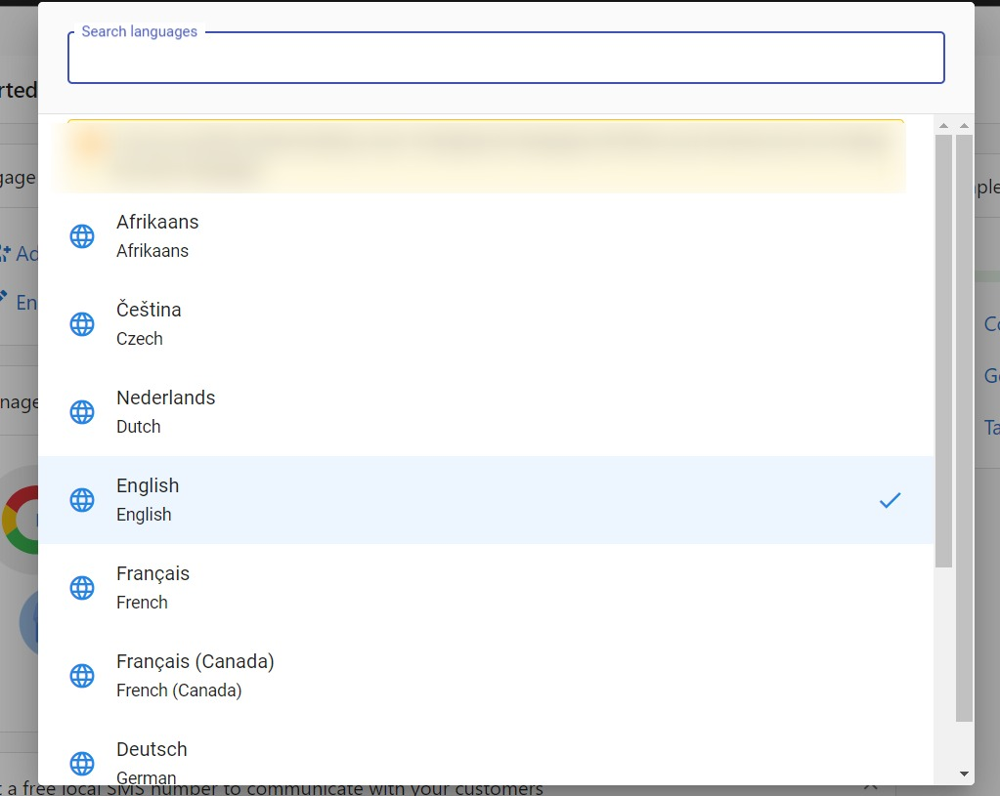

Business App is your one-stop dashboard for running your business online. Think of it as your digital command center: manage your online presence, monitor your business activity, communicate with customers, and access the products and services that help your business grow — all in one place!

  

    <iframe
      src="https://fast.wistia.net/embed/iframe/s9aqsoo0ks?web_component=true&seo=true"
      title="Business App Overview"
      allow="autoplay; fullscreen"
      allowTransparency
      frameBorder="0"
      scrolling="no"
      className="wistia_embed"
      name="wistia_embed"
      width="100%"
      height="100%"
    ></iframe>
  

---

## Key Features of Business App at a Glance

- **Manage Your Business Profile**  
  Update your business info and make sure your details appear correctly wherever customers find you online.

- **Connect & Communicate**  
  Send and receive messages with your leads and customers, and respond to reviews or inquiries through Conversations.

- **Track Your Performance**  
  See important business analytics such as website traffic, reviews, and leads either in your Executive Report or your home screen.

- **Access Your Tools & Products**  
  Quickly launch any apps or services you've activated to market your business, connect with customers, or boost productivity.

- **Multi-location Management**  
  If you manage more than one business location, view and control them all from a single login.

---

## Get Started Fast: Your Onboarding Checklist

When you first log in, you'll see a **"Complete Setup"** card on your Home screen. This is your personalized onboarding checklist to help you hit the ground running.  

Finishing these steps helps you unlock everything Business App can do for your business. You'll:
- Start seeing results in your Executive Report sooner.
- Respond faster to customer reviews and questions.
- Collect more leads and feedback.
- Discover features that save you time or help your business grow.

:::note
The set-up card will disappear when you complete each item
:::

### Setup steps may include:
- **Meeting your AI Workforce**: Put lead capture on autopilot and engage customers around the clock. Start a chat and see what an AI employee can take off your plate. Navigate to AI > AI Workforce to chat with and configure your AI Employees.
- **Connecting your Google Business Profile**: Collect and respond to Google Reviews, sync your Business Profile, and more.
- **Setting up and installing Web Chat**: Instantly engage website visitors with AI trained on your business. Install the chat widget to get leads in Conversations.
- **Connecting your business system**: Import existing customers from platforms like QuickBooks to automatically request reviews and manage relationships all in one place.
- **Registering for SMS**: Register to send SMS messages to your customers and enable text conversations.
- **Enabling push notifications** (Mobile App only): Don't miss important customer messages - manage your notifications to always be in the know.

Each step is designed to show you quick wins and real value from day one.

---

## Customize Language

Want to experience Business App in your preferred language? This guide offers a quick look at how to customize the app interface. Language customization can enhance your experience and expand accessibility.

### How to Update the Business App Language

1. Log in to Business App.
2. Click your profile name in the top-right corner, then click the current language.

   

3. Select your preferred language from the available list.

   

---

## Frequently Asked Questions

  
<strong>What happens when I finish setup?</strong>

  

    The onboarding checklist will disappear, but you can always revisit completed tasks or explore new features in your dashboard.
  

  
<strong>How do I change the Contact Us contact in bottom left corner of Business App?</strong>

  

    The contact populated in the Contact Us contact is the assigned Salesperson for the account. This can be assigned or updated by an administrator on the Account Page of the business in Partner Center from Business Details > Edit > Administration > Sales.
  

