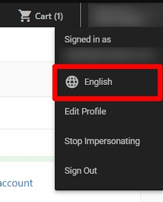
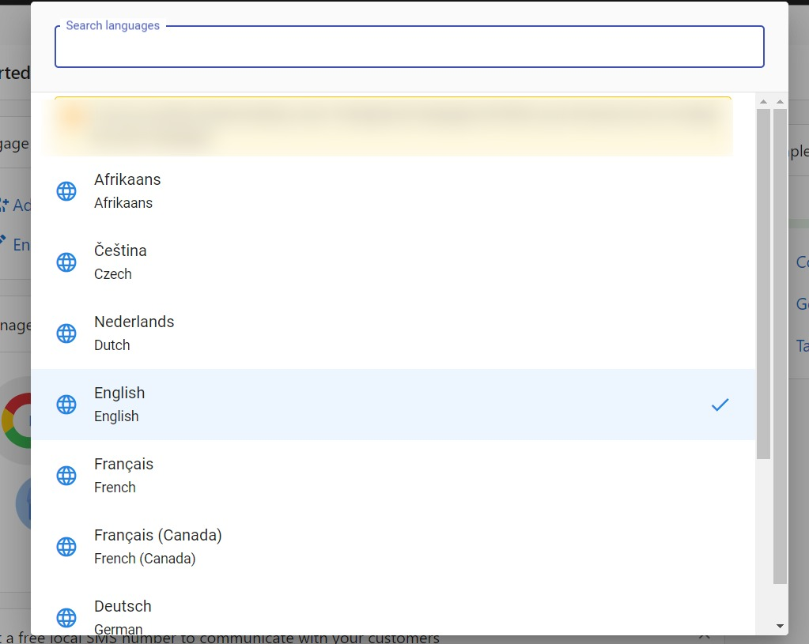

Business App is your one-stop dashboard for running your business online. This guide walks you through the most important setup steps so you can capture leads, communicate with customers, and track your performance right away.

  

    <iframe
      src="https://fast.wistia.net/embed/iframe/s9aqsoo0ks?web_component=true&seo=true"
      title="Business App Overview"
      allow="autoplay; fullscreen"
      allowTransparency
      frameBorder="0"
      scrolling="no"
      className="wistia_embed"
      name="wistia_embed"
      width="100%"
      height="100%"
    ></iframe>
  

---

## Key features of Business App at a glance

- **Manage your business profile**  
  Update your business info and make sure your details appear correctly wherever customers find you online.

- **Connect and communicate**  
  Send and receive messages with your leads and customers, and respond to reviews or inquiries through Conversations.

- **Track your performance**  
  See important business analytics such as website traffic, reviews, and leads either in your [Executive Report](./executivereport/index.md) or your [Home](./home.mdx) screen.

- **Access your tools and products**  
  Quickly launch any apps or services you've activated to market your business, connect with customers, or boost productivity.

- **Multi-location management**  
  If you manage more than one business location, view and control them all from a single login.

---

## Getting started checklist

1. [Complete your onboarding checklist](#step-1-complete-your-onboarding-checklist): Work through the setup card on your Home screen.
2. [Update your business profile](#step-2-update-your-business-profile): Ensure your business info is accurate across the app.
3. [Connect key integrations](#step-3-connect-key-integrations): Link Google Business Profile, QuickBooks, and other tools.
4. [Set up AI and web chat](#step-4-set-up-ai-and-web-chat): Put lead capture on autopilot and engage visitors 24/7.
5. [Register for SMS and customize notifications](#step-5-register-for-sms-and-customize-notifications): Enable text messaging and stay on top of alerts.
6. [Customize language](#step-6-customize-language): Use Business App in your preferred language.

---

## Step 1: Complete your onboarding checklist

When you first log in, you'll see a **"Complete Setup"** card on your [Home](./home.mdx) screen. This is your personalized onboarding checklist to help you hit the ground running.

Finishing these steps helps you unlock everything Business App can do for your business. You'll:
- Start seeing results in your [Executive Report](./executivereport/index.md) sooner.
- Respond faster to customer reviews and questions.
- Collect more leads and feedback.
- Discover features that save you time or help your business grow.

:::note
The setup card will disappear when you complete each item.
:::

The checklist may include:

- **Meeting your AI Workforce**: Put lead capture on autopilot and engage customers around the clock. Start a chat and see what an AI employee can take off your plate. Navigate to **AI** > **AI Workforce** to chat with and configure your AI Employees.
- **Connecting your Google Business Profile**: Collect and respond to Google Reviews, sync your Business Profile, and more.
- **Setting up and installing Web Chat**: Instantly engage website visitors with AI trained on your business. Install the chat widget to get leads in Conversations.
- **Connecting your business system**: Import existing customers from platforms like QuickBooks to automatically request reviews and manage relationships all in one place.
- **Registering for SMS**: Register to send SMS messages to your customers and enable text conversations.
- **Enabling push notifications** (Mobile App only): Don't miss important customer messages. Manage your notifications to always be in the know.

Each step is designed to show you quick wins and real value from day one.

[Back to checklist](#getting-started-checklist)

---

## Step 2: Update your business profile

Your [Business Profile](./administration/business_profile.mdx) is the central source for your business name, address, hours, services, and more. Keeping it complete and up to date ensures your information appears correctly in listings, reports, and lead capture tools.

### How to update your business profile

1. Go to **My Business** > **Business Profile**.
2. Use the **Primary Info**, **Hours**, and **Descriptions** tabs to update your details.
3. Click **Save** to apply changes.

:::tip
Complete your profile early. Other features in Business App use this data to power automations, AI responses, and reporting.
:::

[Back to checklist](#getting-started-checklist)

---

## Step 3: Connect key integrations

Connections bring your most important business data into one place. When you connect platforms like Google Business Profile and QuickBooks, Business App can sync location details, power your [Executive Report](./executivereport/index.md), and trigger automations.

### How to add integrations

1. Go to **Administration** > **Connections**.
2. Click the **Browse** tab.
3. Search for or scroll to the integration you need (for example, **Google Business Profile** or **QuickBooks**).
4. Click the integration tile and follow the authorization steps.

Common connections to set up early:

- **Google Business Profile**: Syncs location details and visibility metrics. Data can appear in your Executive Report within about 5 minutes. For setup details, see [Business Profile](./administration/business_profile.mdx) and [Connections](./administration/connections/index.md).
- **QuickBooks Online**: Import existing customers, automate review requests from invoiced customers, and surface financial insights. See [QuickBooks integration](./administration/integrations/quickbooks.mdx) for connection steps.

[Back to checklist](#getting-started-checklist)

---

## Step 4: Set up AI and web chat

[AI Workforce](./ai/ai-workforce/ai_workforce_overview.md) lets you automate conversations, capture leads, and answer customer questions 24/7. The [Web Chat](./conversations/web-chat/index.mdx) widget engages website visitors and sends leads directly to your Conversations inbox.

### Meet your AI Workforce

1. Go to **AI** > **AI Workforce**.
2. Start a chat with an AI Employee to see what they can do.
3. Configure the [Chat Receptionist](./ai/ai-workforce/ai-chat-receptionist/index.mdx) or [Voice Receptionist](./ai/ai-workforce/ai-voice-receptionist.md) to match your business.

### Install Web Chat on your website

1. Go to **Conversations AI** > **Conversations AI Settings**.
2. Click **Configure Web Chat** and add your business knowledge.
3. Copy the installation code and add it to your website, or use the WordPress plugin if you have a WordPress site.

:::tip
Train your AI with your website content and frequently asked questions so responses stay accurate and on-brand.
:::

[Back to checklist](#getting-started-checklist)

---

## Step 5: Register for SMS and customize notifications

If you want to send and receive text messages with customers, complete [SMS registration](./administration/sms_configuration.md) (required for US businesses). You can also adjust how you receive alerts so you never miss important activity.

### SMS registration (US businesses only)

US-based businesses must complete A2P 10DLC registration before sending SMS. Registration can take a few weeks. Canadian businesses can use SMS immediately. See [SMS setup](./conversations/sms/index.mdx) for full details.

### Notification settings

1. Go to **Settings** > **Notification Settings**.
2. Choose whether you want instant emails, daily digests, or both.
3. Expand each product section to fine-tune which events trigger notifications.

See [Notification settings](./administration/notification_settings.mdx) for a full overview.

[Back to checklist](#getting-started-checklist)

---

## Step 6: Customize language

You can use Business App in your preferred language. Language customization can enhance your experience and expand accessibility.

### How to update the Business App language

1. Log in to Business App.
2. Click your profile name in the top-right corner, then click the current language.

   

3. Select your preferred language from the available list.

   

[Back to checklist](#getting-started-checklist)

---

## Frequently asked questions

<strong>What happens when I finish the setup checklist?</strong>

The onboarding checklist will disappear once you complete each item. You can always revisit completed tasks or explore new features from your Home screen and dashboard.

<strong>How long does it take to see data in my Executive Report?</strong>

Data from Google Business Profile can appear within about 5 minutes after you connect it. Other products may take up to 48 hours to populate. See the [Executive Report overview](./executivereport/index.md) for more details.

<strong>Can I invite team members to use Business App?</strong>

Yes. From the [Home](./home.mdx) screen, select **Invite Team Member** in the top-right corner, enter the person's name and email, and click **Send Invite**.

<strong>Where do I manage my integrations after connecting them?</strong>

Go to **Administration** > **Connections** > **Manage** to see all active integrations, reconnect expired authorizations, or disconnect platforms.

<strong>Is SMS available for my business?</strong>

SMS is available for businesses located in the United States and Canada. US businesses must complete A2P 10DLC registration before sending messages. See [SMS setup](./conversations/sms/index.mdx) and [SMS registration for US businesses](./administration/sms_configuration.md) for details.

