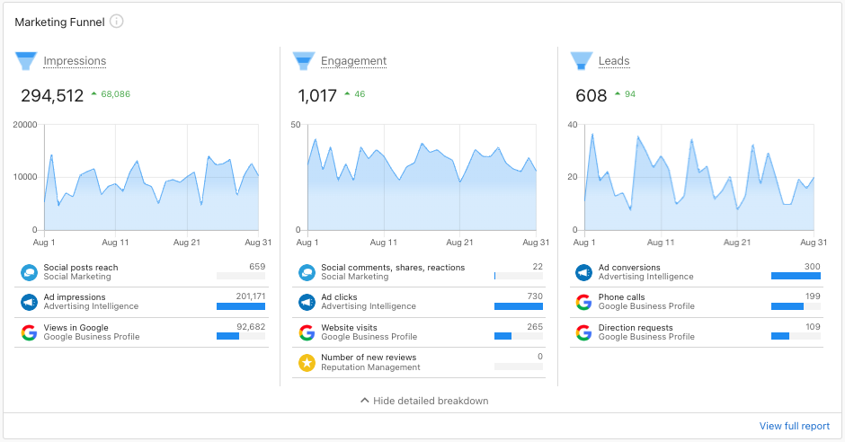
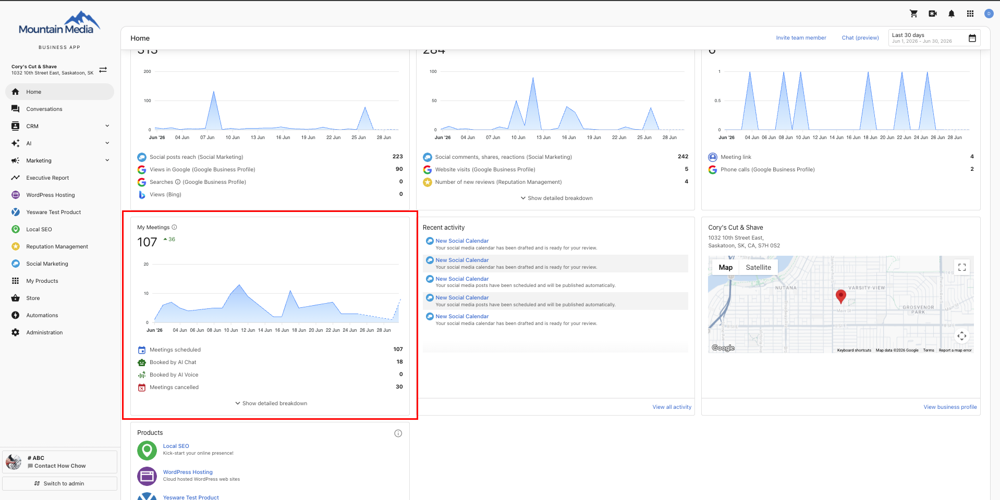

# Home Overview

The Home page is your main dashboard - the first thing you see when logging into Business App. It provides an at-a-glance view of your business performance and quick access to key features.

## What You'll See

- **Key Metrics**: Performance data organized into Impressions, Engagement, and Leads
- **Recent Activity**: Live feed of messages, calls, and customer interactions
- **Business Profile**: Quick access to your location info and profile management
- **Products & Services**: Available offerings and store integration
- **Get Started Guide**: Setup assistance if you're new to Business App

## Marketing Funnel

The Marketing Funnel displays key metrics in three easy-to-understand categories, helping you see how your marketing efforts drive business results.

### How It Works

The Marketing Funnel organizes performance data into:

- **Impressions**: Views of your online content (Google Business Profile views, social media reach)
- **Engagement**: Interactions with your business content (website visits, reviews, calls)
- **Leads**: New prospects from multiple sources (phone calls, SMS, forms, automations)

This gives you a clear view of your marketing performance without needing to dig into detailed reports.

## My Meetings Card

Below the Marketing Funnel, the **My Meetings** card shows your appointment activity so you can see whether your booking system is converting visitors into scheduled meetings — without leaving the Home page. The card appears automatically once Meeting Scheduler is active on your account.

### What the card shows

- **Total meetings scheduled** for the selected date range, with a delta badge showing the change from the prior period (green for growth, red for decline)
- **AI booking attribution** — a breakdown of bookings from AI Chat, AI Voice, or other sources
- **Calendar disconnect signal** — flags any host calendars that have been disconnected so you can reconnect them before it affects bookings
- **Detailed breakdown** — Cancelled, Rescheduled, and Total Incomplete Bookings (incomplete bookings are booking flows started via AI Chat, AI Voice, or a booking URL that were never completed). These are hidden by default — select **Show Detailed Breakdown** to expand them
- Rows with a value of 0 are hidden, so the card only shows metrics that are active for your account

### How to view it

1. Make sure **Meeting Scheduler** is active on your account. The card appears automatically on the Home page once it is — no additional setup is required.
2. Go to `CRM` > `My Meetings` > **Meeting settings** > **Calendar connections** and confirm your host calendar(s) are connected. A disconnected calendar shows as a health signal on the card until it's reconnected.
3. From the Home page, look for the My Meetings card in its own row below Impressions / Engagement / Leads. Select **Show Detailed Breakdown** to see cancellations, reschedules, and incomplete bookings.

:::note
My Meetings metrics also appear in your Executive Report, giving you the same booking numbers in your scheduled report. See [Executive Report](./executivereport/index.md).
:::

## Invite Team Member

You can invite additional team members to access your Business App account.

### How to Invite a Team Member

1. Log into **Business App**.
2. From the **Home page**, select **Invite Team Member** on the top right of the page.
3. Enter the first name, last name, and email address of the team member you want to invite.
4. Click **Send Invite**.

The invited team member will receive an email with instructions to join and access the Business App account.

## Related

- [Get Started](./getting-started-with-business-app.md) - Complete guide to Business App setup and features
