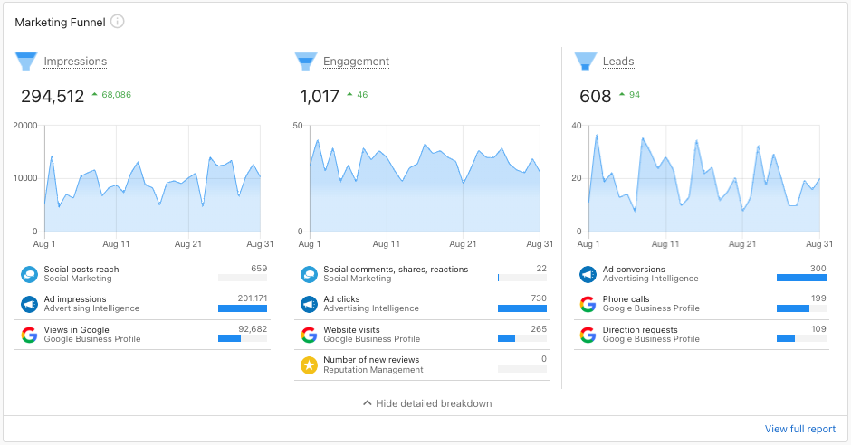
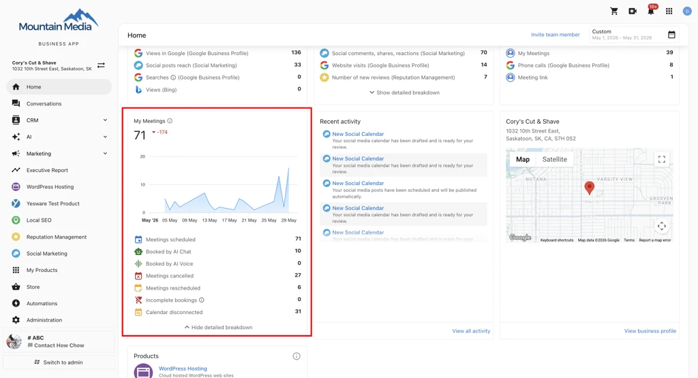

The Home page is your main dashboard - the first thing you see when logging into Business App. It provides an at-a-glance view of your business performance and quick access to key features.

## What you'll see

- **Key Metrics**: Performance data organized into Impressions, Engagement, and Leads
- **My Meetings card**: Appointment activity, AI booking performance, and calendar health (visible once Meeting Scheduler is active)
- **Recent Activity**: Live feed of messages, calls, and customer interactions
- **Business Profile**: Quick access to your location info and profile management
- **Products & Services**: Available offerings and store integration
- **Get Started Guide**: Setup assistance if you're new to Business App

## Marketing Funnel

The Marketing Funnel displays key metrics in three easy-to-understand categories, helping you see how your marketing efforts drive business results.

### How it works

The Marketing Funnel organizes performance data into:

- **Impressions**: Views of your online content (Google Business Profile views, social media reach)
- **Engagement**: Interactions with your business content (website visits, reviews, calls)
- **Leads**: New prospects from multiple sources (phone calls, SMS, forms, automations)

This gives you a clear view of your marketing performance without needing to dig into detailed reports.

## My Meetings card

Below the Marketing Funnel, the **My Meetings** card shows your appointment activity for accounts with the Meeting Scheduler product active.

The card shows:

- **Total meetings scheduled** for the selected date range, with a delta badge showing the change from the prior period.
- **AI booking attribution** — a breakdown of bookings from AI Chat, AI Voice, and other sources.
- **Calendar disconnect signal** — a count of any host calendars that have been disconnected, so you can reconnect them before it affects bookings.

Click **Show detailed breakdown** to expand Cancelled, Rescheduled, and Total Incomplete Bookings. Metric rows with a value of 0 aren't shown, so the card only surfaces signals that are active on your account.

The card appears automatically once the Meeting Scheduler product is active on your account — no additional setup is required. These metrics also appear in your [Executive Report](./executivereport/index.md).

## Invite team member

You can invite additional team members to access your Business App account.

### How to invite a team member

1. Log into `Business App`.
2. From the `Home page`, select `Invite Team Member` on the top right of the page.
3. Enter the first name, last name, and email address of the team member you want to invite.
4. Click `Send Invite`.

The invited team member will receive an email with instructions to join and access the Business App account.

## Related

- [Get Started](./getting-started/getting-started-with-business-app.md) - Complete guide to Business App setup and features
