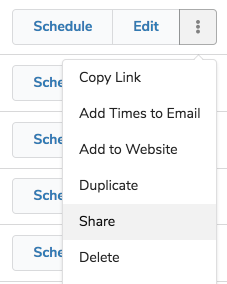
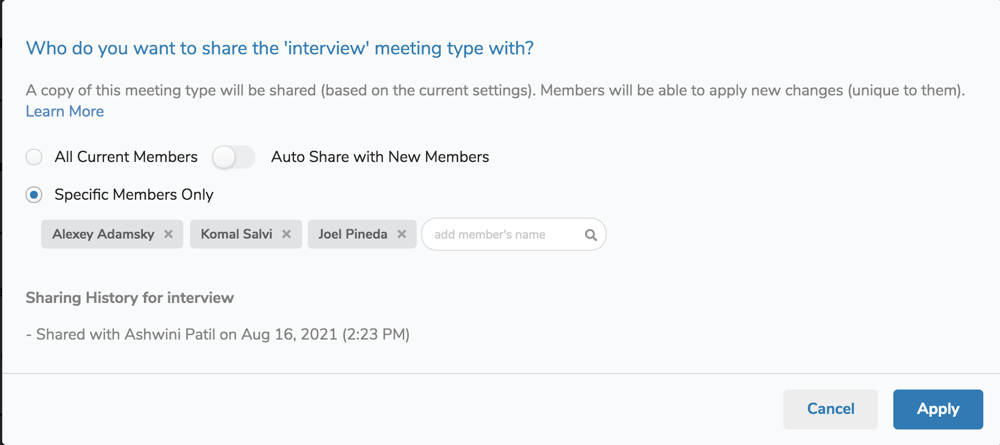
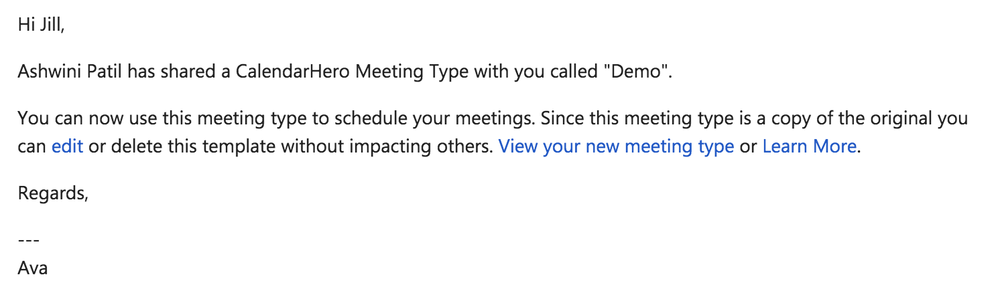

Team plan members and admins can share meeting types with other members of the same team plan for improved organizational collaboration. Team Admins can even opt to share specific meeting types with all future members, for easy scheduling automation. This helps ensure team members can get started quickly.  

What if I update a meeting type I shared? 

If updates are made after sharing, those updates will NOT apply to previously shared types. When a meeting type is shared a copy of that meeting type will appear in the member's meeting type list. Shared meeting types are copies of the original and are not linked after sharing. This ensures each member can apply new changes unique to them, without impacting other members. 

Can I only share with members of my team?  
Yes, meeting types can only be shared with members on the same paid [Team plan](https://calendarhero.com/pricing). Meeting types can NOT be shared with collaborators or users outside of your team plan.   
  
Can Admins pre-populate Meeting Types before members join?

Yes! Admins can use the "Auto-Share with New Members" setting to automatically share with any new member who joins the same team plan. The shared meeting types will automatically appear in the new members' meeting type list.

Sharing a Meeting Type

Meeting type sharing is available to all Team plan members. 

To get started: 

1. Go to your meeting type list: [https://app.calendarhero.com/settings/meeting](https://app.calendarhero.com/settings/meeting)

2. Click on the "..." menu of the meeting type you want to share.

3. Click "Share"

4. A pop-up modal will appear which allows you to select which member(s) you want to share with:

*Specific Members Only: *Both Members and Team Admins can search for specific member(s) by name to share with specific members.  

*Auto-Share with New Members:* Team Admins can turn on "Auto Share with New Members" to automatically share with any new member who joins the same team plan. 

*All Current Members:* Team Admins can select "All Current Members" to share with all members in the organization at once.

5. Click "Apply" and the meeting type will be shared with those members (the meeting type will automatically appear in their meeting type list). Each member will also receive an email notifying them.

6. Sharing History: Once a meeting type is shared, a sharing history will appear. 

