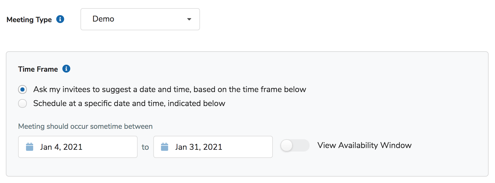
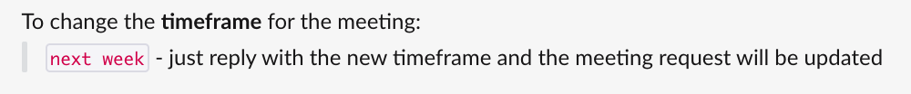

Traditionally when you schedule a meeting outside of CalendarHero there tend to be back-and-forth emails with the meeting creator and the attendees to find a time that works for everyone. The power of the CalendarHero Meeting Scheduling is that we take care of finding the best time for you (while you focus on more important things... like all that other work you need to get done!)

When you make a meeting request you're not required to specify a time frame, unless there are time restrictions when the meeting has to happen. For example, if you need to meet to make a decision *before* taking your next course of action, and there are business timelines guiding the meeting. This is actually one of the hardest things about scheduling a meeting with a bunch of internal stakeholders and external clients who are all busy. Luckily, CalendarHero is built to find the best time within your required time range.

For easy automation, time frame settings (Date Range and Availability Window) can be customized per Meeting Type. For example, you can create a meeting type with a week-long date range for scheduling candidate interviews (to ensure your candidate schedules a time *this week*), and a meeting type with a month-long window for scheduling meetings with busy sales prospects. 

Specifying a Time Frame (Web)

When you schedule a meeting using the web scheduler the  *Time Frame* section will be pre-set with the Date Range from the associated Meeting Type. If you need to update this for a specific meeting request simply use the date selector to change the date range. CalendarHero will automatically find the best time within that date range that works for all attendees. 

To view the pre-configured Availability Window toggle on "View Availability Window". You can customize the availability window further by clicking on any day and adjusting the time ranges per day. 

- Learn More about Planning Time Sensitive Meetings

- Learn more about Scheduling Meetings

Specifying a Time Frame (In Chat)

To specify a specific time range in chat (such as Slack and MSTeams) just let your assistant know what time range in natural language. For example, you can say the following:

- Meet with Sam *next week*

- Meet with Jeff and Michael *tomorrow*

- Meet with Rachel, Emily, and Joel *between October 7th - 15th*
