CalendarHero works where you work, and now offers several ways to schedule meetings and events! Read on for tips on how to schedule your first meeting using your [favorite platform](/calendarhero/setting-up-calendarhero/what-platforms-does-calendarhero-work-with).  
  
Keep in mind - CalendarHero includes an intelligent group algorithm that automatically finds the best time for all invitees even in complex group meetings. Therefore unlike some other scheduling software CalendarHero makes it easy to invite multiple internal and external stakeholders to a meeting, intelligently finds the best time to meet based on the [requirements you set](/calendarhero/scheduling-meetings/create-and-customize-a-meeting-type), and helps ensure that the meeting is booked as quickly as possible. 

> 
*Need to schedule more than 5 meetings a month?* [Upgrade to the Pro or Team plan](https://calendarhero.com/pricing)

  
Personal Scheduling Link 

- Personal Scheduling links are public URLs that you can share with anyone to easily self-book a meeting with you.

- Recommend for users who want to add a self-scheduling option to an email, SMS, or DM. Create multiple links for different meeting types to automate your meetings.

- One of the easiest ways to get started with CalendarHero: [Learn more about Personal Scheduling Links](/calendarhero/scheduling-meetings/how-to-use-a-personal-scheduling-link)

- Login to the CalendarHero web app to view and customize your scheduling links now: ([https://app.calendarhero.com/](https://app.calendarhero.com/))

The Meeting Scheduler 

- The CalendarHero web-based scheduler ([available here](https://app.calendarhero.com/tasks/new/meeting-create)) makes it super quick and easy to schedule *any* meeting when you know who you want to meet with; even those complicated ones!

- This is the most popular way to schedule group meetings and offers a traditional web interface for ultimate control.

- Recommended for users scheduling group meetings with external invitees; such as clients. 

- TIP! The Web App is also where you can customize your [powerful meeting types](/calendarhero/scheduling-meetings/create-and-customize-a-meeting-type) and [general meeting settings](https://app.calendarhero.com/settings/meeting/general). We highly recommend setting these up before you schedule.

The Group Class Scheduler

- The *Group Class* web-based scheduler makes it easy to schedule group events or online training that requires individual sign-up for a pre-selected date and time.

-  Each attendee can sign up at their convenience (and pay online if needed) via a custom scheduling page.

- Recommended for scheduling online group classes (such as group coaching or exercise classes) and webinars. 

- [Learn how to schedule a group class](/calendarhero/how-to/how-do-i-schedule-a-group-class)

Chat Assistant

- Ask your assistant in natural language to [schedule meetings](/calendarhero/how-to/how-to-schedule-a-meeting-via-chat) for you using your favorite chat platform - such as Slack or MS Teams.

- Chat scheduling takes a bit more practice for some, but is a great option for simple meeting requests or internal meeting scheduling.

- Chat users can also query their calendars, and cancel or postpone meetings right from chat.

Email Plugin (Outlook or Gmail)

- If you live inside of email and want to quickly book meetings then:

- The [Outlook email plugin](/calendarhero/how-does-calendarhero-work/how-does-the-microsoft-outlook-plugin-work) is a great add-on to use for Microsoft users

- Our [Google Gmail add-on](/calendarhero/how-does-calendarhero-work/how-to-use-the-calendarhero-gmail-add-on) (available in the [G Suite Marketplace](https://workspace.google.com/marketplace/search/CalendarHero)) is recommended for Google users

Customize Meetings Settings

Before you schedule your first meeting we recommend personalizing your meeting settings. This allows you to schedule your meetings more quickly by using pre-set preferences and/or by leveraging your assistant's artificial intelligence.  
Learn more about [General Meeting Settings](/calendarhero/how-to/how-to-customize-general-meeting-settings) or unleash the power of CalendarHero by [creating and customizing your Meeting Types](/calendarhero/scheduling-meetings/create-and-customize-a-meeting-type) for speedy scheduling!

 

Schedule a Meeting *- via Personal Scheduling Link*These instructions are for you if you want others to easily self-book a meeting with you, based on your availability. 

Go [here](/calendarhero/scheduling-meetings/how-to-use-a-personal-scheduling-link) to learn all about Personal Scheduling links - they are a great way to get started with CalendarHero

 

Schedule a Meeting *- via Web*These instructions are for you if you are scheduling meetings using the CalendarHero web scheduler. 

This is the most popular way to schedule group meetings and offers a traditional web interface for ease of use and more control.

To schedule a meeting from the Web App login to [app.calendarhero.com](https://app.calendarhero.com/) and then click the "Schedule &lt;Meeting&gt;" link on your dashboard or go directly to the web scheduler [here](https://app.calendarhero.com/tasks/new/meeting-create) (or from the left navigation menu 'Schedule.')

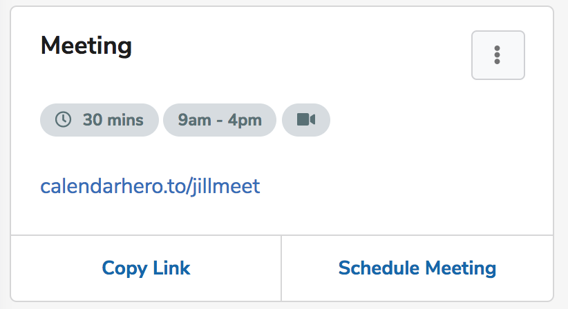

Step 1: Invitees

The web scheduler will first prompt you to select your invitees - e.g. Who should be invited to your meeting? Simply search by name or email to select from your synced contact list. The calendar invites will be sent to the email address that appears. 

*Tip! *Remember CalendarHero automatically syncs your contacts from your connected platforms, so you can quickly schedule a meeting with them. You can always connect even more [3rd party providers here](https://app.calendarhero.com/settings/accounts/add).

*Need to add a new contact?* Simply click on the 'Add New Contact' button in the dropdown. You will be prompted to enter the individual's name and email. 

*Want to add groups of contacts?* Create a 'team' from any of your contacts and reuse that team for faster scheduling. [Learn how](/calendarhero/scheduling-meetings/how-do-i-create-teamsgroups-for-meetings)

*Need to select a different email address?* If your invitee has more than 1 associated email address you can specify the default address by selecting it via the dropdown menu. The calendar invites will be sent to the email address that appears. 

*Need to mark a contact as VIP? *[Learn how to add a VIP](/calendarhero/scheduling-meetings/can-i-mark-multiple-invitees-as-vip-or-required)

Already sent out an invite and need to add an invitee? [Learn how to add or remove invitees](/calendarhero/additional-resources/adding-or-removing-meeting-invitees)

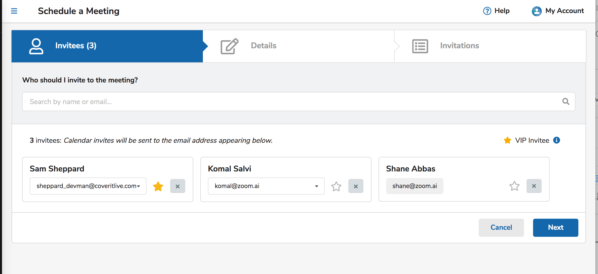

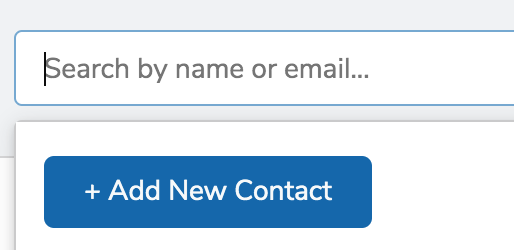

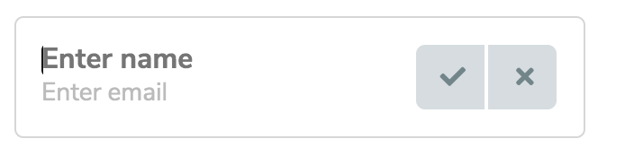

Step 2: Details  

Next, you can customize your meeting details, including the meeting title, meeting type, duration, location, and agenda. Here is a breakdown of all the Meeting Settings you can configure:

Meeting Types: Meeting types enable you to pre-configure your meeting settings, and then reuse those settings for faster meeting scheduling. While CalendarHero includes a number of [pre-configured meeting types](/calendarhero/scheduling-meetings/create-and-customize-a-meeting-type) out of the box, you can fully unleash the power of CalendarHero by [creating your own custom meeting types](https://app.calendarhero.com/settings/meeting/new). Once created you simply select the meeting type on this step and all the related settings will update accordingly. This makes it quick and easy to schedule any type of meeting!

Time Frame: Specify a time range for when the meeting should be booked. For time-sensitive meetings, you may want to limit this range. For most meetings, we recommend offering a wider time range so invitees have more options. CalendarHero will automatically find the best time within this time range that works for all attendees. [Learn More](/calendarhero/how-to/how-does-time-frame-work-when-creating-a-meeting)

Availability Window: The *Time Frame* will be pre-set with the *Availability Window* from the associated Meeting Type. To view the pre-configured settings toggle on "View Availability Window". You can customize the *Availability Window* further for a specific request by clicking on any day and adjusting the time ranges per day. [Learn More](/calendarhero/how-to/how-do-i-customize-my-availability-window)

Specific Time: CalendarHero is built to intelligently find the best time to meet, so for most meetings, you won't need to specify the exact meeting time. However, if you already know when you want to meet then instead of setting a Time Frame simply specify the time using the "Specific Date" option. [Learn More](/calendarhero/how-does-calendarhero-work/how-to-specify-a-specific-date-and-time-for-a-meeting)

Meeting Title: The Meeting title represents the subject of your meeting. Meeting Titles will appear in the meeting invite and calendar event sent to your attendees. Update the default meeting title by replacing it with your own. [Learn More](/calendarhero/scheduling-meetings/how-do-i-add-or-customize-a-meeting-title)

Duration: This is how long your meeting will last. Duration can be from 15min minimum to 8 hours maximum. The meeting Duration will appear in the meeting invite and calendar event sent to your attendees. The default for this setting comes from your associated [meeting type](/calendarhero/scheduling-meetings/create-and-customize-a-meeting-type). 

Location: The location field can be used to enter an address, a phone number, or an on-the-fly static video conferencing URL. The location will appear in the meeting invite and calendar event sent to your attendees. The default for this setting comes from your associated meeting type.

Video Conferencing: If you have enabled a video conferencing link for the associated meeting type it will automatically be added to your meeting invites, so your invitees know how to connect with you. A confirmation will appear here for reference. [Learn More](/calendarhero/what-can-calendarhero-do/how-do-i-connect-my-video-conference-software)

Agenda: Enter your Agenda to easily share information with your meeting attendees. Agenda details will be automatically added to the meeting invite and calendar event. [Learn More](/calendarhero/scheduling-meetings/can-i-add-an-agenda-to-my-meeting)

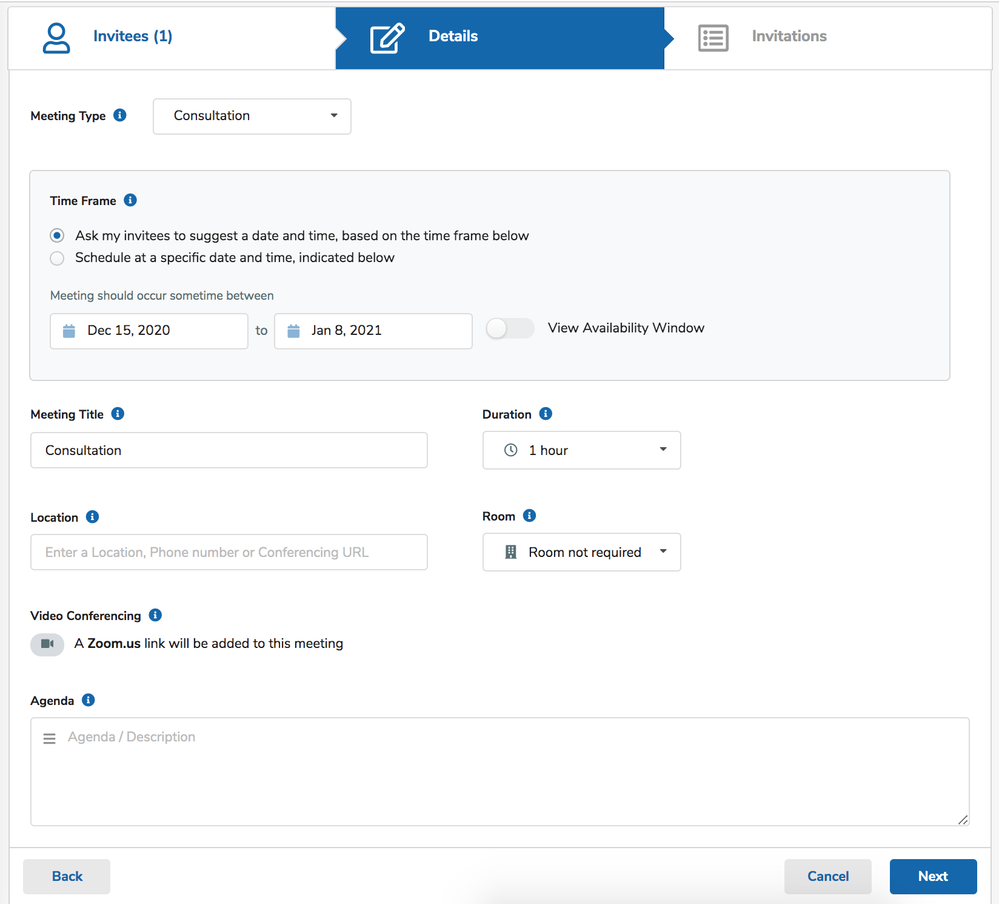

Step 3: Invitations

Before [your assistant](/calendarhero/how-to/how-to-personalize-my-assistant) sends out the meeting invitations you will be able to confirm the details.  
  
Once you are ready to send the invitations you have two choices; either have your assistant send the invite on your behalf, or easily copy a [private meeting link](/calendarhero/how-does-calendarhero-work/how-do-private-invite-links-work) and send it at your convenience; for example via email or SMS.

Send Invite: *Your* meeting assistant sends the invite on your behalf - [learn more](/calendarhero/how-does-calendarhero-work/scheduling-page-what-do-invitees-see-when-i-invite-them-to-a-meeting)

Get Invite Link: Copy a private meeting link to send directly to your invitees - [learn more about private meeting links](/calendarhero/how-does-calendarhero-work/how-do-private-invite-links-work)

Invite to External Invitees

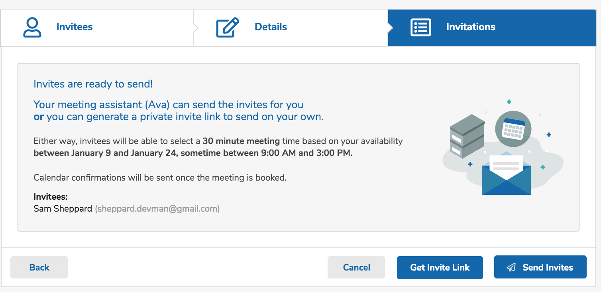

Invite for Internal Invitees 

If you are using CalendarHero with others in your organization, and you invite only them to a meeting you will be able to quickly select a mutually available time, or choose to let them decide. If you let them decide you will have a choice to either send the invites via your assistant or a private meeting link. 

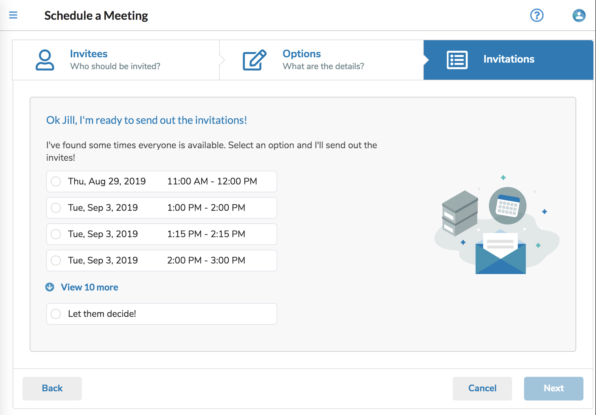

Step 4: Your Invitations have been sent!

If you opted to have your assistant send the invitations on your behalf - then you will see a confirmation and your assistant will take care of the rest. Meeting invitees will automatically receive an email from your automated assistant asking them to select a time.

*Internal Meetings: *If you and your invitee(s) are both CalendarHero users, your assistant will provide some time slots that work for everyone so that you can select a time right away. Once you select your preferred time the meeting is set and the invitees are automatically notified. 

*External Meetings:* If your meeting includes an external invitee (or you selected the "Let them Decide" option for internal invitees) then when you reply with "Yes", your assistant will inform you that it will email your invitee(s), introduce itself as your assistant, and ask them to choose a time-slot based on your availability. 

- An Overview: [Internal vs External Meetings](/calendarhero/how-does-calendarhero-work/internal-meetings-vs-external-meetings)

That's it! You are officially on your way to easier meeting scheduling via the web. 

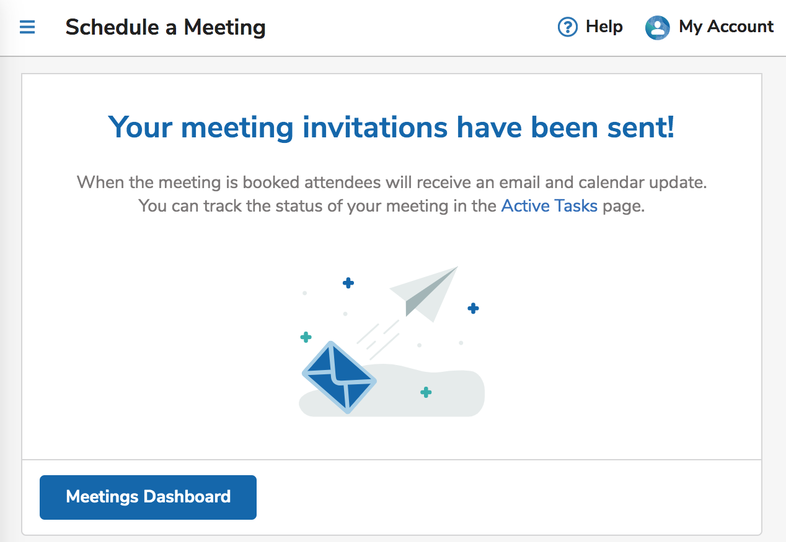

Schedule a Meeting - via  *Chat *These instructions are for you if you are scheduling meetings using a chat platform like Slack or MS Teams...

[Go here to learn how to schedule a meeting using Chat](/calendarhero/how-to/how-to-schedule-a-meeting-via-chat)

  
Schedule a Meeting -  using the  *Outlook Plugin*These instructions are for you if you are scheduling meetings using the Outlook Plugin...

Once you have [installed the Outlook Plugin](/calendarhero/how-to/how-do-you-install-the-microsoft-outlook-plugin-individual-users) it's easy to schedule a meeting by using the shortcut buttons in the "Connect" or "Actions" tabs -OR- by asking your assistant using natural language in the "Chat" tab. Learn more here: [How does the Outlook Plugin work?](/calendarhero/how-does-calendarhero-work/how-does-the-microsoft-outlook-plugin-work)

 

Schedule a Meeting - using the Gmail Add-On

The Gmail Add-On is available in the [G Suite Marketplace](https://workspace.google.com/marketplace/search/CalendarHero). It allows you to:

- Quickly insert a meeting-type scheduling link in a new or replied email

- Initiate a meeting request with the sender of an email using a specific meeting type

- Get insights on the sender of an email

Learn more here: [How to use the Meeting Assistant Gmail Add-on](/calendarhero/how-does-calendarhero-work/how-to-use-the-calendarhero-gmail-add-on)

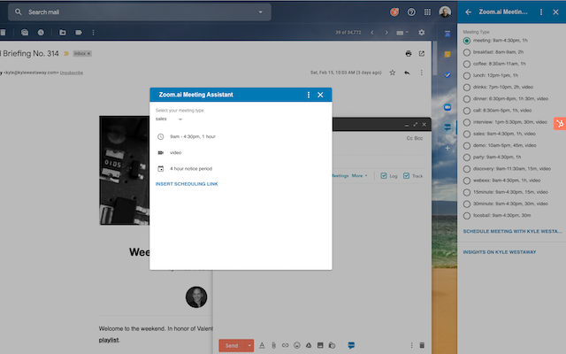

All - Meeting Progress (staying up to date)

- Rest assured no matter how you schedule your meeting - your meeting assistant will keep you updated on the status with notifications throughout the invite process. 

- You can also view and manage your active meeting requests from your [Active Tasks page](https://app.calendarhero.com/tasks/active) in the web app. [Learn how to manage your meetings from Tasks](/calendarhero/scheduling-meetings/how-to-manage-your-meetings-from-tasks)

-  You will be notified once your invitees accept/select a time.   
  

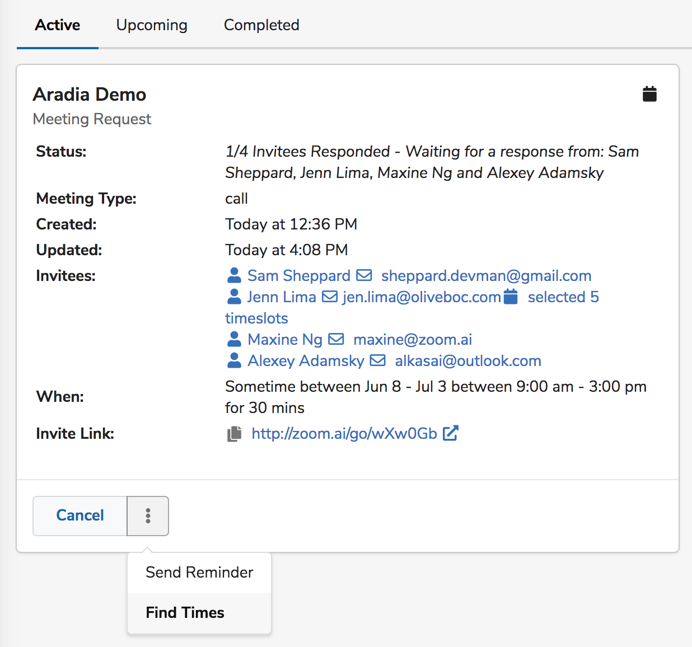

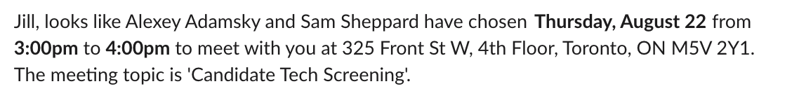
