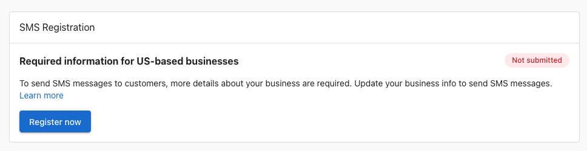

import Tabs from '@theme/Tabs';
import TabItem from '@theme/TabItem';

You can use Conversations to send and receive SMS and MMS messages with customers from a dedicated business phone number. Each business is assigned a local phone number for two-way communication based on the provided business address. SMS is available to businesses with a suppoorted edition of Conversations in Canada and the United States.

## SMS Registration and Setup

<Tabs>
  <TabItem value="us" label="United States">
### Conversations SMS Registration for US Businesses (A2P 10DLC)

To prevent spam and ensure reliable delivery, phone carriers in the United States require businesses to register their phone numbers before sending SMS messages to customers (A2P 10DLC). 
:::warning
Registration time can vary signficantly from hours to weeks depending on various external factors. You should start the registration process early if you have a deadline for when you want to start using SMS. 
:::

To register a US-based business:

1. Go to `Settings > Conversations Settings` to see the registration card
2. Click "Register now" to view the form
3. Fill out the form completely with your business information
4. Submit your EIN (Employer Identification Number)
5. Click "Submit information"

:::info
You can save your progress if you're unsure of some fields and return to complete the registration later.
:::

Your business will need an EIN number - a nine-digit number the IRS uses to identify your business for tax purposes. If you don't know your EIN, you can apply for one by submitting IRS Form SS-4 online.
  </TabItem>
  <TabItem value="ca" label="Canada">
### Conversations SMS Access for Canadian Businesses

If your business is located in Canada, you can use SMS messaging immediately without registration requirements. 
  </TabItem>
</Tabs>

## Sending SMS Messages

Once your setup is complete:

1. Open `Conversations Messages`
2. Click the `Send a Message` button
3. Enter the customer's phone number (automatically formatted to +1 (555) 555-5555)
4. Type your message and send

:::info
With Conversations Pro, you can send and receive nearly unlimited SMS and MMS messages, with some carrier limitations (e.g., up to 2,000 SMS segments per day on T-Mobile).
:::

## Getting SMS Replies

- Customer replies to your assigned Conversations phone number automatically appear in the same Conversations thread 
- 
- All SMS history is retained alongside other channels like email and web chat

## FAQs About SMS Messaging in Conversations

<strong>How come I don't see SMS in Conversations Settings?</strong>

SMS is only available to businesses located in the United States or Canada. Make sure your account address is physically located in one of those two countries; otherwise, SMS will not be available.

<strong>What's A2P 10DLC SMS registration?</strong>

US-based businesses are required to register their business before being able to send messages. Registration can take a few weeks. Once registered, users on the business account will receive a notification and can send their first message.

<strong>How long does registration take?</strong>

Once the form has been submitted, registration through third-party verification can take anywhere from one week, up to one month. A third-party agency is used by telecom carriers in the United States to verify business registration data with government databases.

<strong>How can I ensure my application is approved?</strong>

The most common reason for rejection is information that doesn't match IRS records. Make sure the business information submitted matches exactly the same information associated with your EIN.

<strong>How does a business find their EIN / Tax ID?</strong>

An EIN is a nine-digit number the IRS uses to identify a business for tax purposes. The IRS issues a CP 575 EIN Confirmation Letter to confirm your unique Employer Identification Number. If you don't know your EIN, you can apply for one by submitting IRS Form SS-4 online.

<strong>Can sole-proprietor businesses without an EIN register for SMS?</strong>

Not at this time. We are investigating supporting this in the future, for both US- and Canada-based businesses.

<strong>The business has already registered through Customer Voice. Do they need to register again?</strong>

Yes, for now. In the future, we will automatically register businesses for both products. Right now, you'll need to submit the form a second time, but your previously entered data will be saved.

<strong>My business is located in Canada, why can't I send SMS to someone in the United States?</strong>

Currently, Canadian businesses can only send SMS messages to Canadian numbers. Messages to US-based numbers are rejected by US telecom carriers because they weren't sent from an A2P-registered business.

<strong>What phone number is used to send messages?</strong>

Your business is assigned an available SMS number based on your address, using the nearest available area code. You can share this number with customers to receive text and MMS messages. Calls cannot be received at this number at this time.

<strong>How many messages can we send to customers?</strong>

With Conversations Pro, accounts can send and receive nearly unlimited one-by-one SMS messages to customers, while noting that each carrier has some limitations on messages sent and received per day.

