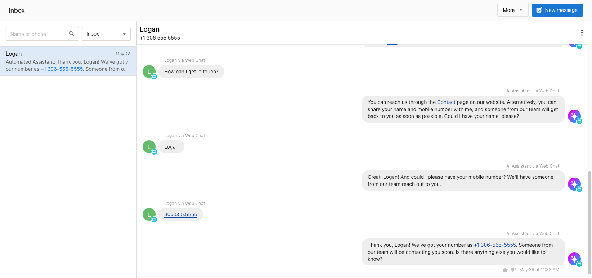

import { SettingsIcon, NotificationsIcon } from '@site/src/components/Icons';

## What is Conversations?

Conversations is your hub for managing all customer messages—email, Facebook, Instagram, and more—in a single inbox. It enables teams to view and respond to conversations collaboratively, without needing to switch between platforms. For a detailed list of supported channels and features, see the table below.

### What is Conversations AI?

Conversations AI brings the power of an AI Receptionist to your Conversations so you can capture leads, answer customer questions, and even handle phone calls automatically, 24/7.

With Conversations AI, your AI Receptionist can:

- Instantly reply to website chats, text messages (SMS), and WhatsApp
- Answer incoming phone calls for you (Premium edition), capture leads, and even book appointments
- Handle routine questions pre and post sale

To learn more about how the AI Receptionist works and how to get the most out of it, see [AI Receptionist Overview](/ai/ai-workforce/ai-receptionist).

## What you can do with Conversations

- **Increased efficiency and faster response times** for your team through a unified view of all customer conversations.
- **Improved customer satisfaction** by providing quick and consistent responses.

## Conversations Channels, Features, Editions, and Regional Availability

The table below shows all communication channels supported in Conversations, what each channel does, which edition you need, and where it’s available.

| **Channel**            | **What It Does**                                                                | **Edition** | **Availability**          |
|------------------------|---------------------------------------------------------------------------------|-------------|---------------------------|
| **Email**              | Send and receive customer emails in Conversations                                       | -         | US & Canada, Other Regions |
| **Facebook Messenger** | Manage Facebook Page conversations in Conversations                                     | -         | US & Canada, Other Regions |
| **Instagram**          | Reply to Instagram DMs from Conversations                                               | -         | US & Canada, Other Regions |
| **AI Web Chat Widget** | Capture leads via website chat, answered by AI                                  | Standard    | US & Canada, Other Regions |
| **WhatsApp**           | Manage WhatsApp messages manually and with the help of your AI Receptionist     | Standard    | US & Canada, Other Regions |
| **SMS Messaging**      | Text customers manually, using automation and with the help of your AI Receptionist | Pro      | US & Canada only          |
| **Phone Calls**        | Assign your AI Receptionist to answer and respond to calls.                     | Premium      | US & Canada only          |

## Setting Up Conversations

### Connecting Channels

Before you can send and receive messages with Conversations, you need to connect the channels you want to use. Use these setup guides for detailed, step-by-step instructions:

- [Set up Email for Conversations](./conversations-send-receive-emails.md)
- [Set up Facebook Messenger for Conversations](./conversations-setup-facebook-messenger.md)
- [Set up Instagram Messaging for Conversations](./conversations-setup-instagram.md)
- [Set up AI Web Chat for Conversations](./conversations-ai-web-chat-overview.md)
- [Set up WhatsApp for Conversations](./conversations-whatsapp-overview.md)
- [Set up SMS for Conversations](./conversations-send-receive-sms.md)
- [Set up phone calls for Conversations](/ai/ai-workforce/ai-voice-receptionist)

:::tip
You don't have to do everything at once! Start with the channels you use most and add more when you're ready. All of your available connections will be listed under `Administration > Conversations settings`.
:::

### Customize Notifications

You can customize your notification settings so you receive alerts for new messages and leads in Conversations.

- Click on <NotificationsIcon /> `Notifications` in the top-right followed by <SettingsIcon /> `Settings`
- Scroll down to the `Conversations` section and choose which notifications you want to receive. We recommend both new messages and new leads!
- Click `Save`
 
### Invite Your Team

You can invite your team so everyone can view, respond to, and manage messages in Conversations. Inviting a team member adds them to your Business App account and gives them access to Conversations. 

To add team members so they can answer messages and help manage leads:

- Click on your profile icon in the top-right of the navigation
- Click `Invite Member` 
- Enter your teammate's email address and choose their role and permissions
- Send the invitation

When a teammate sends a message using Conversations you will see their profile picture next to the message.

## FAQs About Conversations

Can Conversations integrate with other CRMs or messaging systems?

Conversations does not directly integrate with external CRMs or messaging platforms. However, you can bring data from outside systems into your CRM, and use automations to send Conversations conversation data to other systems using integrations like Zapier or through custom workflows.

How can I automate tasks in Conversations?

Business App Automations let you create custom workflows using triggers (like a `Message Received`) and actions (such as `Send Email` or `Send SMS`). This helps you automate responses and actions based on specific rules and criteria.

You can also assign an AI Receptionist to automatically respond on certain channels for you. See [AI Workforce Overview](/ai/ai-workforce/ai_workforce_overview) for more details.

If we install the web chat on our website, will it be only AI answering customers or will real agents talk to customers?

The web chat is 100% AI-managed. If enough contact details are collected by the AI Receptionist, you will be able to send a message to them on Conversations using the appropriate channel.  

For more details, see [AI Web Chat Overview](./conversations-ai-web-chat-overview.md).

How am I assigned a phone number?

When activating Conversations, you will be automatically assigned a phone number. First, the app will attempt to get a local number based on the business profile address. If no local numbers are available, a number from a neighbouring area in your country will be assigned. 

To see your assigned SMS phone number, navigate to `Settings > Conversations Settings > Your SMS number`. 

Does Conversations SMS use up Reputation Management Premium SMS add-on credits?

No. Those credits are separate.

Can Canadian businesses use Conversations to send SMS messages to recipients in the US?

No, it's not possible to send SMS messages to US numbers without A2P registration (A2P registration is not supported in Canada).

Can I block spam message in Conversations?

Not at this time. Spammers can send messages to any number, and unfortunately spam messages have been sent to users of Conversations. 

