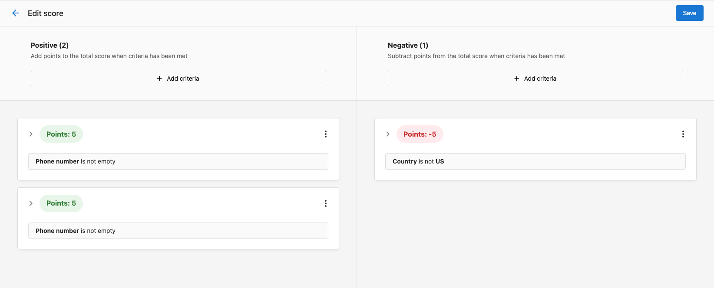

Use Companies to manage the organizations you sell to and serve. Keep company data accurate, track engagement, and associate contacts, opportunities, tasks, and lists.

## Why use Companies?

- Central reference for organization data and relationships
- Track engagement across emails, tasks, and meetings
- Associate contacts and opportunities to see full context
- Enrich with custom fields and segment for targeting

## What’s Included with Companies?

- **Companies table and profile** for searching, filtering, and editing records
- **Default fields** (name, website, address, lifecycle, UTM, source, social URLs, etc.) and support for custom fields
- **Engagement fields** (last activity, campaign interactions, last contact)
- **Associations** to contacts, opportunities, and tasks
- **Activity logging** for notes, emails, calls, meetings, and tasks
- **Find Accounts** to discover and add local businesses in bulk

## How to Use Companies

### View and manage companies

1. Go to `CRM` > `Companies`.
2. Search, sort, and filter the table to find the right records.
3. Click a company to open the profile and edit details, review engagement, and manage associations.

### Log activity on a company

1. Open a company profile.
2. In the activity area, choose the activity type: note, email, call, meeting, task, or more.
3. Add details, outcomes, and follow-up tasks as needed.

### Associate contacts and opportunities

1. From a company profile, associate related contacts and opportunities.
2. Use associations to get full context when communicating and forecasting.

### Discover companies with Find Accounts

1. Go to `CRM` > `Companies` and click `Find Accounts`.
2. Search by business type and location, select new businesses, and click `Create companies`.
3. Open `View companies` to work your new list.

### Optional: Lead Scoring

If enabled, configure scoring criteria in `Administration` > `Score` and use the score to prioritize outreach in the company table.

:::tip
Start with a simple score combining profile fit and engagement. Iterate after you review early results.
:::

## Frequently Asked Questions (FAQs)

What default fields are available for companies?

Company records include identifiers, name, website, address, contact details, lifecycle stage, UTM/source, social URLs, engagement dates, owner, parent company, and more. You can also create custom fields.

Can I log activities automatically?

Yes. Platform actions like company creation, salesperson changes, and opportunity wins/losses are logged automatically. You can also enable email auto-capture and use automations for additional activity logging.

Can I bulk add companies from local search?

Yes. Use `Find Accounts` to search for local businesses and add them in bulk without duplicates.

