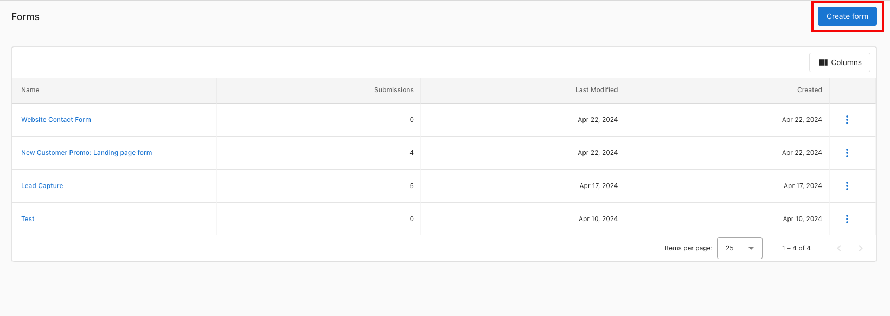
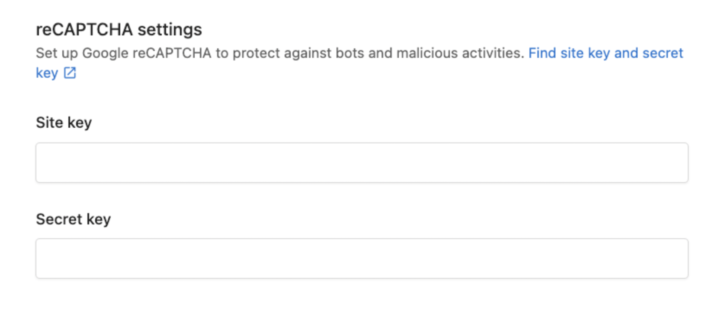

title: Forms
sidebar_position: 8
---
Use Forms to capture leads from your website directly into the CRM. Embed a form on any page, create the contact automatically, start a conversation in Conversations, and trigger automations for instant follow-up.

## Why use Forms?

- Convert website visitors into contacts automatically
- Reduce manual data entry with mapped fields and defaults
- Trigger automations (auto-reply, nurture campaigns, routing)
- Improve data quality with reCAPTCHA and UTM capture

## What’s included

- **Form Builder** with configurable fields and defaults
- **Design** controls for container, fonts, and button
- **reCAPTCHA** integration
- **Embed code** for easy installation on any site

## How to Use Form Builder

### Step 1: Navigate to CRM > Forms.

Add the key fields you’d like to capture. Keep forms short—conversion rates drop as fields increase.

There are a few different settings you can have on each form field:

**For all field types:**
 - You can set a default value, which will be submitted when the user submits an empty field.
 - You can mark the field as required, and the user can’t submit the form without filling in the required field.
 - You can make the field hidden, so users won’t see the field and can’t edit it when they fill out the form.
 - You can also populate the specific form field dynamically, which will take the query parameter from the URL to fill in the field.
     - For example, if you have a form that’s put on this link: https://www.example.com/form?campaign=spring-promotion
     - If you put “campaign” on this setting, it will pre-fill the form field with “spring-promotion” when the user submits the form.

**For the string field:** you can switch it to an open text field, drop-down, or radio button options.

:::tip
Short forms convert better. Consider deferring lower-priority questions to a follow-up email or meeting.
:::

### Step 2: Customize the styling to match your website.

You may want to set the form width to 100%, and then manage the width using your page builder. In the “Design” tab, style the container, font, and button.

### Step 3: Set up reCAPTCHA in the form to prevent Spam.

In the form builder, under Settings, use the reCAPTCHA section. After generating the site key and secret key, setup completes automatically (this can take a few minutes).

### Step 4: Copy the embed code for the form, and place it on your website landing page or contact page.

If using WordPress (e.g., Divi), add a “Code” block and paste the embed code.

### Step 5: Test your form, to confirm that a contact is captured in the CRM.

## Frequently Asked Questions (FAQs)

My form isn’t always capturing UTM fields, why might that be?
 
  
For the form to capture UTM, they must be still present in the browser address bar. If a user clicks away from your landing page, to visit a second page on your website, and you don’t have a UTM preservation tool active, the UTM can be lost and won’t be captured if they fill out a form. One tactic to prevent this is removing all links from your landing page, to ensure leads fill out the form on the landing page and nowhere else.

