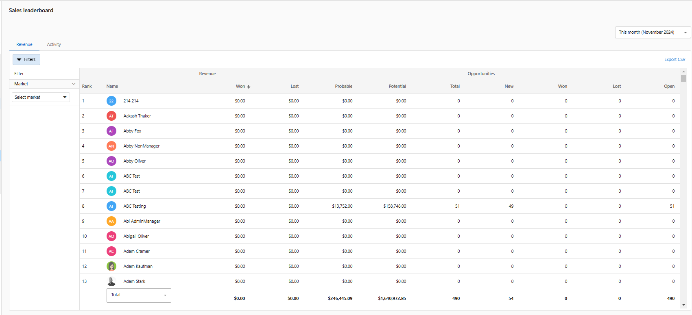

Use the Leaderboard to see top-performing salespeople and teams. Filter, compare time ranges, and identify coaching opportunities.

## Why use the Leaderboard?

- Recognize high performers and motivate your team
- Spot trends and areas for improvement
- Compare performance across time ranges

## What’s included

- **Rankings** by selected metrics
- **Filters** by team or timeframe
- **Drill-through** to underlying records

## How to use the Leaderboard

1. Go to `CRM` > `Leaderboard`.
2. Select the metric and time range.
3. Filter by team or salesperson as needed.

## Frequently Asked Questions (FAQs)

Which metrics are available?

Common metrics include opportunities won, revenue, and activity volume. Availability may vary by configuration.

