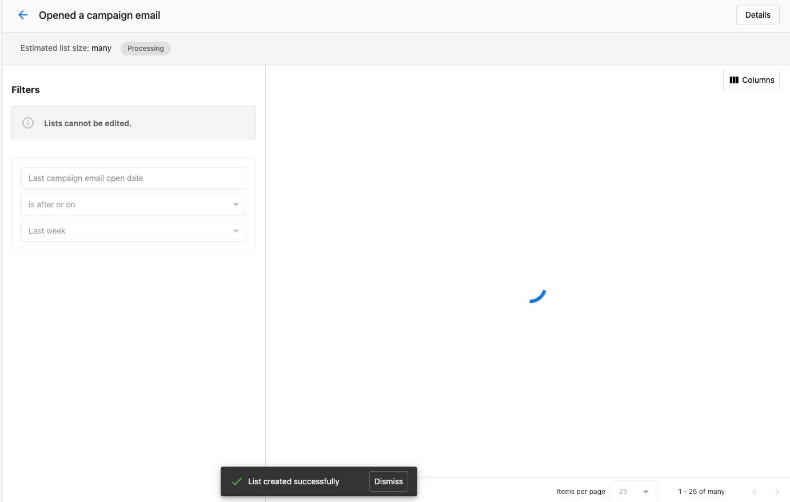
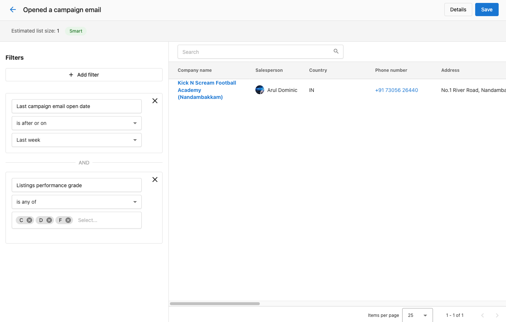
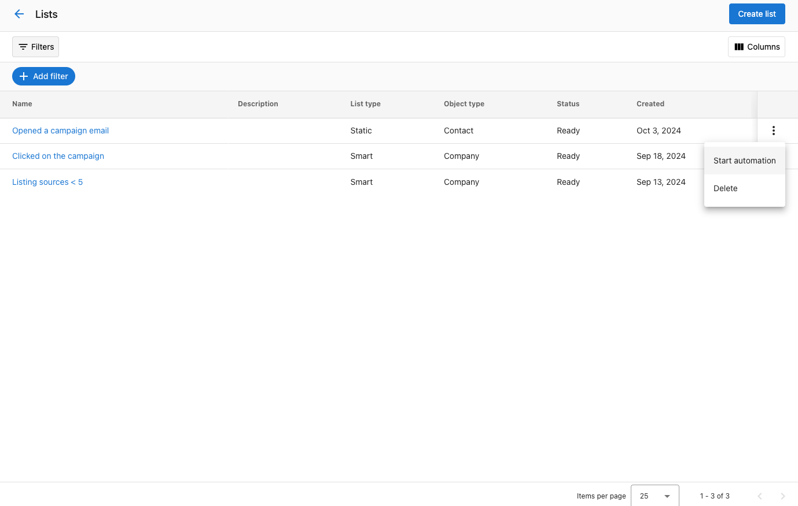
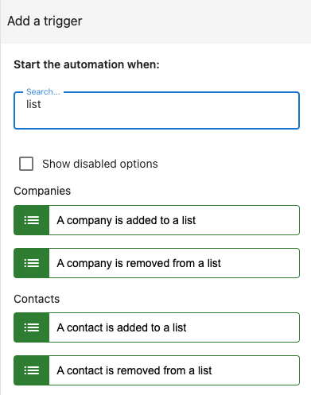
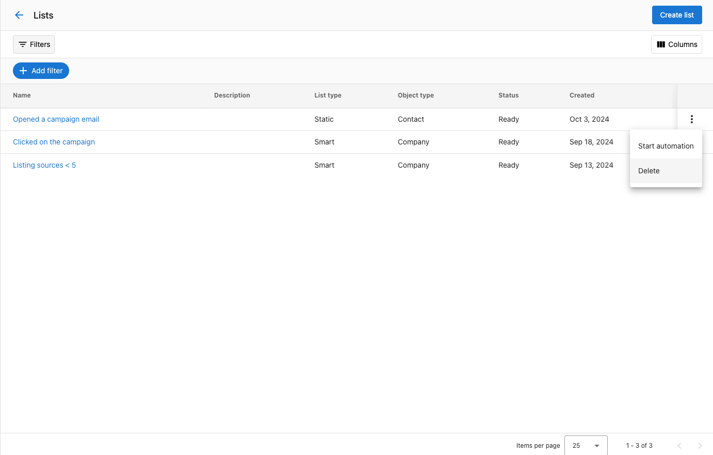

Use Lists to organize contacts and companies into meaningful segments for outreach, automation, and reporting. There are two types:

- **Static Lists**: You add or remove members manually—ideal for fixed groups such as event attendees.
- **Smart Lists**: You define rules, and the list updates automatically as data changes (attributes and behaviors).

## Why use Lists?

Lists make it easy to target the right audience, kick off automations, and keep teams aligned on who to engage.

- Centralize segmentation for contacts and companies
- Reduce manual work with automatically updating smart lists
- Trigger automations when membership changes

## What’s Included with Lists?

- **Static Lists** for manual curation
- **Smart Lists** for rule-based segmentation
- **Start Automation** actions from a list
- **Membership Triggers** to automate when contacts/companies are added or removed

## How to Use Lists

### Create a List

1. Go to `CRM` > `Lists`.
2. Click `Create`, then choose `Static` or `Smart`.

### Create a Static List

1. Specify filters to select initial members and click `Save`.
2. Add or remove members any time from the `Contacts` or `Companies` tables.

:::tip
Keep static lists small and intentional—use them for one-time actions or short-term targeting.
:::

### Create a Smart List

1. Define rules (for example, “Companies with a contact who opened a marketing email in the last 2 weeks” or “Companies with listing grade C/D/F”).
2. Click `Save`. Membership updates automatically as data changes.

### Start an Automation from a List

1. Go to `CRM` > `Lists` and locate your list.
2. Open the action menu (three dots) and select `Start Automation`.
3. Choose an automation for contacts or companies (based on the list type) and run it.

:::info
Automations run immediately for the list’s current members. Use membership triggers to handle future additions or removals.
:::

### Automate When Membership Changes

Available triggers:

- When a contact is added to a list
- When a contact is removed from a list
- When a company is added to a list
- When a company is removed from a list

Use these to send follow-ups, notify sales, or update CRM stages automatically.

### Delete a List

1. Go to `CRM` > `Lists`, find the list.
2. Open the action menu (three dots) and select `Delete`.
3. Confirm deletion.

## Frequently Asked Questions (FAQs)

Can I share lists with my team?

Yes. Lists are shared so your team works from the same up-to-date data.

What’s the difference between static and smart lists?

Static lists are manually managed. Smart lists update automatically based on rules you define.

Is there a limit to the number of lists?

There is no enforced limit. Create as many lists as needed to support your workflows.

