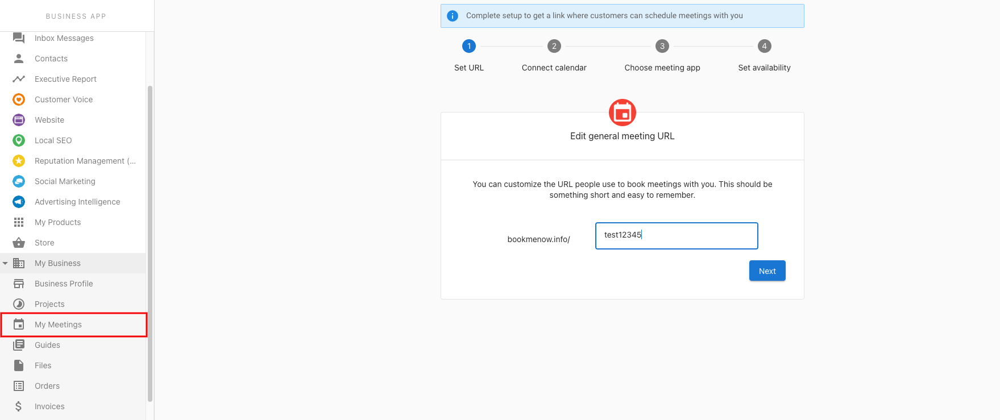
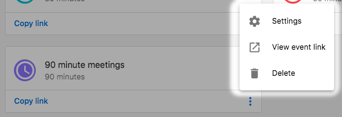
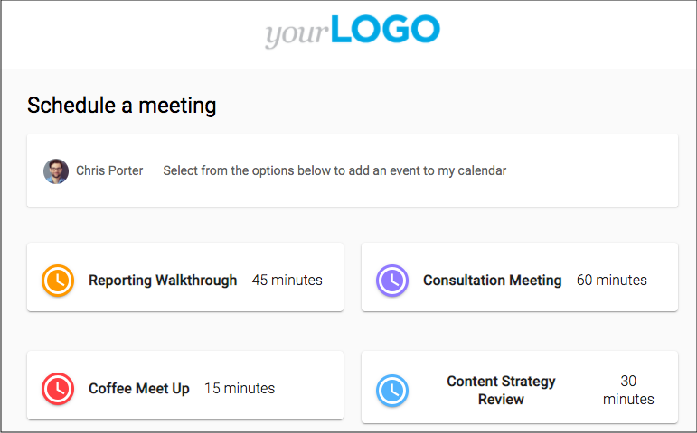

Use My Meetings to share booking links, manage availability, and track upcoming meetings.

## Why use My Meetings?

- Make it easy for prospects and customers to book time with you
- Reduce back-and-forth and no-shows with automated confirmations
- Keep meetings connected to contacts, companies, and opportunities

## What’s included

- **Personal and team booking links**
- **Availability settings** and buffers
- **Calendar connections**

## How to use My Meetings

1. Go to `CRM` > `My Meetings`.
2. Connect your calendar and configure availability.
3. Create personal or team booking links and share them.

## Frequently Asked Questions (FAQs)

Can I set different durations for meeting types?

Yes. Configure durations when creating booking links.

