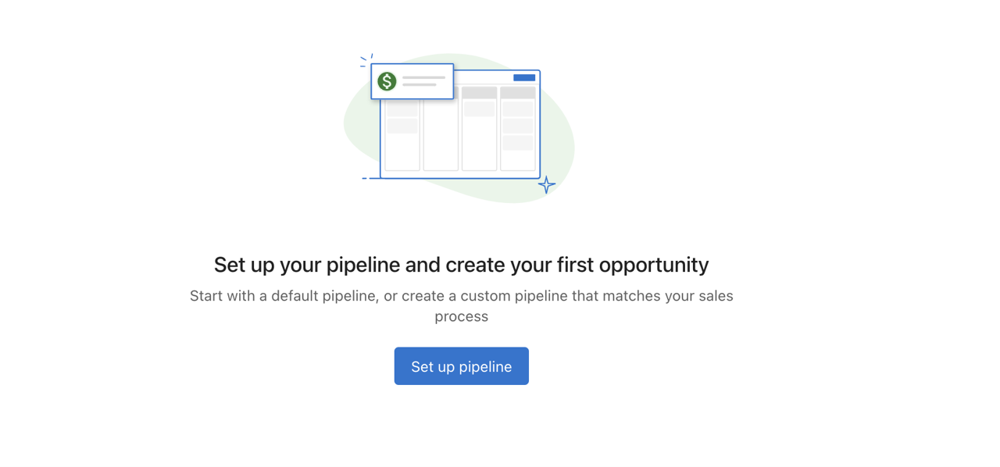

## What is Opportunities?

Opportunities help you track potential revenue throughout your sales process. You can link opportunities to CRM records, including contacts and companies, to keep information organized and up to date.

## Why is Opportunities important?

Managing opportunities lets you visualize, organize, and act on deals across different pipeline stages. It helps you monitor progress, forecast revenue, and ensure timely follow-ups with associated contacts or companies.

## What’s Included with Opportunities?

- **Pipeline View** to manage opportunities by stage
- **List View** with sortable and filterable data
- **Opportunity Profile Page** with a detailed timeline and linked CRM records
- **Manual and Automated Creation** of opportunities
- **Editable Fields** in both profile and table views
- **Flexible Closing Options** for won or lost deals

## How to Access Opportunities
1. Go to `CRM` → `Opportunities`.
2. You’ll land on the Pipeline View.

## How to Set Up and Use Opportunities

### Pipeline View
You can manage opportunities visually by stage:

- Click `Set up a pipeline` if no pipeline exists.
- Drag and drop opportunities to update their stage.
- Use filters and search to find specific records.

### List View
To switch to the list view, click the `List` icon:

- Configure columns to personalize visible data.
- Sort by fields such as expected close date.
- Use bulk actions to update multiple records.

## How to Create an Opportunity

### From the Opportunity Page

1. Navigate to `CRM` → `Opportunities`.
2. Click `Create Opportunity`.
3. Enter the opportunity details.
4. Click `Create`.

### Import opportunities (CSV)
1. In `CRM` → `Opportunities`, click `Import`.
2. Upload a CSV and map columns to opportunity fields.
3. Optionally map associations to existing contacts or companies.
4. Review choices, then finish the import.

::::note
Updating existing opportunities during import overwrites mapped fields on matching records (by ID or external ID). Export a backup first if you’re unsure.
::::

## How to Upload Files to an Opportunity

1. Open an opportunity record.
2. Go to the `Files` section.
3. Click `Add a file` to upload documents, images, or other files.
4. View AI-generated summaries of uploaded content for better organization.

Learn more about [file uploads](./file-upload) and supported file types.

## How to Edit an Opportunity

### From the Profile Page

1. Go to `CRM` → `Opportunities`.
2. Click on the opportunity.
3. Click any editable field in the left panel.
4. Make changes and click away to save.

### From the Table View

1. Go to `CRM` → `Opportunities`.
2. Switch to the list view.
3. Click the action menu for the opportunity.
4. Select `Edit opportunity`.
5. Update fields and click `Save`.

## How to Close an Opportunity

### In Pipeline View

- Drag the opportunity to the `Closed Won` or `Closed Lost` column.

### From the Profile Page

- Open the opportunity.
- Click `Closed Won` or `Closed Lost` at the top.

### By Updating the Stage Field

- Open the opportunity.
- Change the `Stage` field to `Closed Won` or `Closed Lost`.

::::info
When marking an opportunity as `Closed Lost`, you may be prompted to provide a reason. Key stage changes (Won, Lost, Reopened) are recorded as activity notes for better history and reporting.
::::

## How to Set Up a Pipeline

1. Go to the Opportunities page.
2. Click the `Set up a pipeline` button. This creates a default pipeline.
3. Use `Add Stage` to insert new stages.
4. Use the `X` next to a stage to remove it (except for default stages).
5. Set a Close Probability for each stage to forecast deal success rates.

:::warning
You cannot remove `Closed Won` and `Closed Lost` stages. You also cannot set any stage to 0% or 100% Close Probability, as those are reserved for the default stages.
:::

## How to Add or Remove a Pipeline

### Add a New Pipeline

- Click `Create Pipeline` to add a new one.
- There is no limit to the number of pipelines you can create.

### Remove a Pipeline

- Click `Delete` next to the pipeline you want to remove.
- Ensure all opportunities are reassigned before deletion. If not, they will remain unattached.

## How to Create Opportunities Automatically

You can create an opportunity when a lead is captured from webchat.

### Example: Create an Opportunity and Follow Up from Webchat

**Requirements**: Conversation AI must be active.

Automation behavior:
- Triggered when a lead is captured through webchat
- Webchat summary is sent to AI
- AI identifies the requested service and creates an opportunity
- A follow-up SMS message is sent to the contact
- A sales task is created for further follow-up

### Steps to Set It Up:
1. Go to `Automation`.
2. Click `Create automation`.
3. Search for the template **Create an opportunity and follow up when a lead is captured by Webchat**.
4. In the `Create opportunity` step, choose the appropriate pipeline.
5. Review and customize the steps to match your workflow.

## How to Automate Actions Based on Opportunity Stages

You can start nurturing campaigns or send communications when an opportunity reaches a specific stage.

### Example: Trigger a Campaign When an Opportunity Moves to a Nurturing Stage

**Requirements**: Campaign Pro with SMS credits must be active.

Automation behavior:
- Triggered when an opportunity enters a specified nurturing stage
- Finds the contact associated with the opportunity
- Starts a predefined campaign

### Steps to Set It Up:
1. Go to `Automation`.
2. Click `Create automation`.
3. Search for the template **Start a campaign when opportunity move to a specific stage**.
4. In the `When an opportunity is created or modified` step, set the pipeline and stage conditions.
5. In the `Start a campaign for contact` step, select the desired campaign.
6. Review and adjust the automation as needed.

## How to Move Opportunities to Specific Stages Automatically

You can move an opportunity to a specific stage when a defined trigger occurs, such as booking a meeting.

### Example: Move Opportunity to “Appointment Set” When a Meeting Is Booked

Automation behavior:
- Triggered when a meeting activity is created or modified
- If the meeting status is `Scheduled`, the opportunity is moved to the “Appointment set” stage

### Steps to Set It Up:
1. Go to `Automation`.
2. Click `Create automation`.
3. Search for the template **Move the opportunity to a specific stage when a meeting is booked**.
4. In the `Update opportunity` step, set the correct pipeline and target stage.
5. Customize the steps as needed for your process.

## Frequently Asked Questions (FAQs)

What is the currency for the opportunity amounts?

The currency follows your Business App's configured currency settings.

Can I import opportunities with CSV? What fields are supported?

Yes. Go to `CRM` → `Opportunities` → `Import` and upload a CSV. You can map columns to standard fields (name, amount, stage, expected close date, owner, etc.) and to your custom fields. You can also map associations to existing contacts or companies.

Will importing update existing opportunities?

If you choose to update matches, rows that match by ID or external ID will overwrite the mapped fields on those records. Export a backup first if you’re unsure.

Which automation actions are available for opportunities?

You can create tasks, notes, and logged calls tied directly to an opportunity, update fields, and move an opportunity to a specific stage as part of an automation.

How do I create a pipeline for my opportunities?

Go to `CRM` → `Opportunities`, then click `Set up a pipeline` and follow the prompts.

Can I automate the creation of opportunities?

Yes. You can use the automation builder to trigger opportunity creation when specific conditions are met.

How do I close an opportunity?

You can close an opportunity via the pipeline view, profile page, or by updating the stage field to `Closed Won` or `Closed Lost`.

Can I associate an opportunity with more than one contact or company?

Yes. Opportunities can be linked to multiple contacts and companies. Logged activities appear on all linked records.

How do I edit an opportunity?

Edit from the profile page by clicking the field, or from the table view using the action menu.

Can I filter opportunities by stage?

Yes. Both pipeline and list views support filters for opportunity stage and other fields.

How do I customize the columns in the list view?

Use the column configuration options in the list view to choose which fields to display.

Are activities synced across linked records?

Yes. Activities logged on an opportunity are also shown on linked contacts and companies.

Can I bulk update opportunities?

Yes. Use the bulk action tools in the list view to update multiple records at once.

