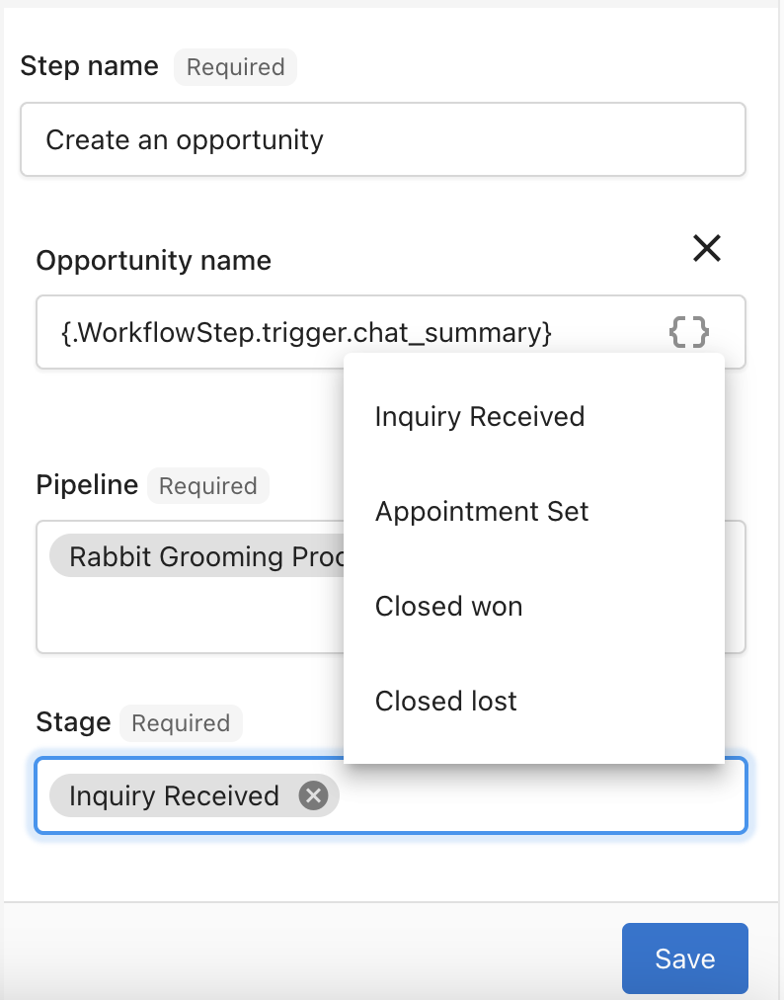

Use Opportunities to track deals from the first contact through to a won outcome. View your work in either a table or a board, apply filters and sorting, and customize pipelines and stages to match your process.

## Why are Opportunities important?

Managing Opportunities gives you a clear view of all current deals and their progress.
It helps you:

- Monitor sales activity
- Organize and prioritize deals
- Identify bottlenecks in your process
- Forecast revenue more accurately

## What’s Included with Opportunities?

- **Table View** for data-focused management
- **Board View** for drag-and-drop visual workflow
- **Filters and Sorting** to refine results
- **Pipeline and Stage Management** for customization
- **CSV Export** for offline analysis

## How to Use Opportunities

### Table View

1. Go to `CRM` > `Opportunities` > `Table`.
2. Search opportunities, sort columns, and apply filters.
3. Export displayed rows to CSV if needed.

:::tip
Save filtered views to quickly revisit common segments (e.g., this quarter’s deals by team).
:::

### Board View

1. Go to `CRM` > `Opportunities` > `Board`.
2. Drag and drop opportunities between stages.
3. Select an opportunity to open its details.

:::note
Drag-and-drop updates the stage immediately. Use filters to focus on a pipeline, team, or product line.
:::

## Apply Filters

1. Select `+ Add Filter` from the Opportunities view.
2. Choose one or more filter criteria, such as:
   - Account
   - Type
   - Salesperson or Team
   - Status
   - Packages or Products
   - Tags
   - Expected or Actual Close Date
   - Created Date
   - Assigned Date

:::info
You can combine multiple filters to narrow your results further.
:::

## Sort Opportunities

You can sort by:

- Potential Revenue
- Expected or Actual Close Date
- Last Connected Date
- Last Sales Activity
- Opportunity Name
- Created Date
- Assigned Date
- Qualification

## Manage Pipelines and Stages

Default stages are **Lead**, **Contact**, **Qualified**, and **Proposal**, each with an associated forecast percentage.
You can create custom pipelines and define your own stages and percentages.

1. Go to `CRM` > `Opportunities` > `Board`.
2. Open the pipeline dropdown and select `Manage Pipelines`.
3. Create a new pipeline:
   - Enter a pipeline name.
   - Add stages.
   - Set default percentages for each stage.
4. Save your changes.

## Frequently Asked Questions (FAQs)

Can I switch between table and board views?

Yes. You can switch views from the `Opportunities` section at any time.

Can I export data from Opportunities?

Yes. In Table View, you can export the displayed rows to a CSV file.

Are there default stages?

Yes. The default stages are Lead, Contact, Qualified, and Proposal, each with a preset forecast percentage.

Can I create multiple pipelines?

Yes. You can create and manage multiple pipelines from the `Manage Pipelines` menu.

How do I update forecast percentages?

Edit the stage details when managing your pipelines, then save your changes.

Can I sort opportunities by revenue?

Yes. Sorting by potential revenue is available in both Table and Board views.

Can I filter by salesperson or team?

Yes. Use the filter menu to select specific salespeople or teams.

Will filters apply across all views?

Filters apply to the current view (Table or Board) you are working in.

