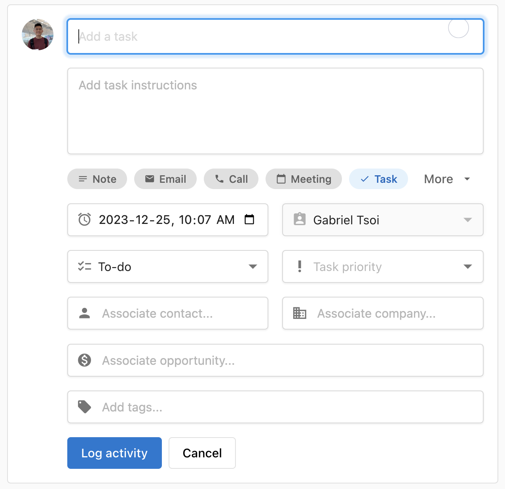
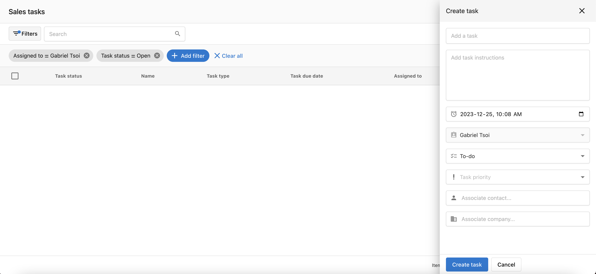
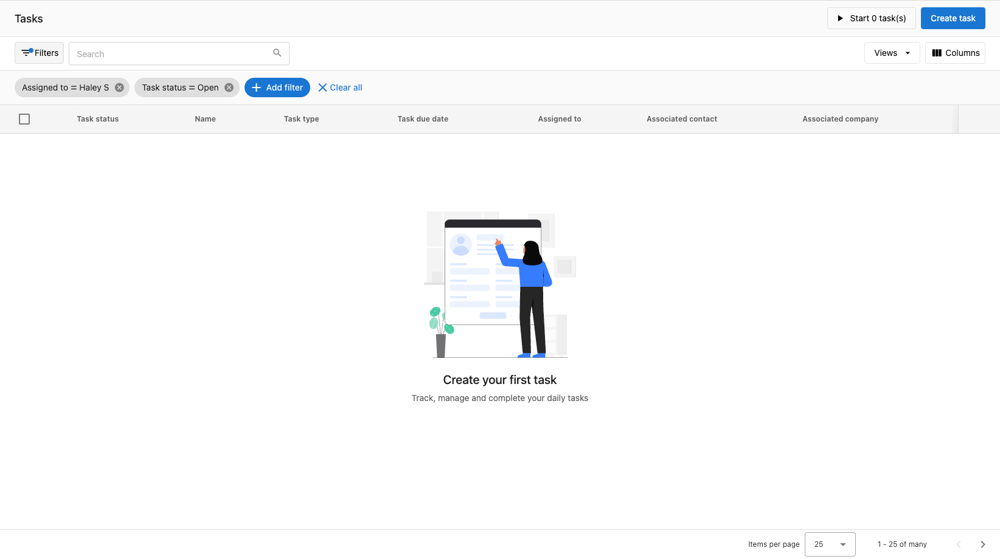
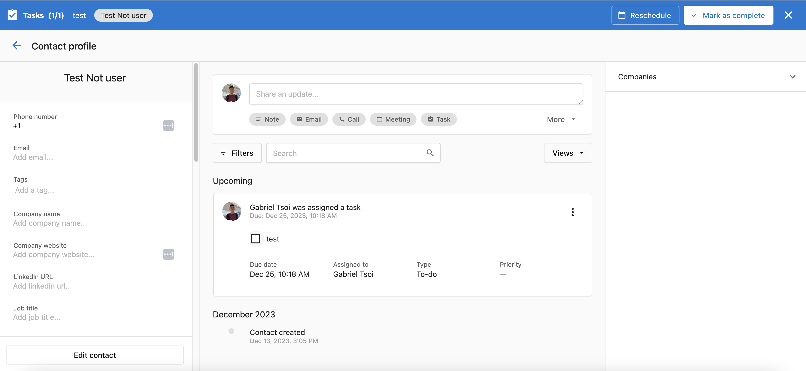
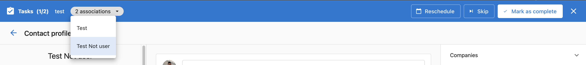

Tasks help you plan and track the actions required to move deals forward—calls, emails, follow-ups, and more.

## Why use Tasks?

- Keep sales activities organized and on schedule
- Prioritize daily work across contacts, companies, and opportunities
- Improve visibility and handoffs across the team

## What’s Included with Tasks?

- **Create from CRM records** (Contacts, Companies, Opportunities)
- **Task table** for pipeline-wide task management
- **Fields** for name, instructions, due date/time, type, priority, associations, and tags
- **Views and filters** to focus on the most important work
- **Task Queue** to complete tasks consecutively

## How to Use Tasks

### Create from a Contact or Company

1. Go to `CRM` > `Contacts` (or `Companies`).
2. Click the record name to open the profile.
3. In the activity area, select `Tasks`, fill in details, and save.

### Create from the Task Table

1. Go to `CRM` > `Tasks`.
2. Click `Create task` and enter details:
   - Name, instructions
   - Due date and time
   - Type: To-do, Email, Call, Message, Connection, LinkedIn
   - Priority: Low, Medium, or High
   - Associations: Opportunity, Contact, Company
   - Tags
3. Click `Create`.

:::tip
Use tags and priority to organize your daily queue, then save a view for today’s focus tasks.
:::

### View and Filter Tasks

1. Go to `CRM` > `Tasks`.
2. Click `Add filter` to filter tasks and save common filters as `Views`.

:::note
Views are personal by default. Name them clearly so you can reuse them.
:::

### Edit, Complete, or Delete Tasks

Within a CRM record’s activity timeline:

- Complete: check the task checkbox, or use `Mark as complete` if shown.
- Edit: open the task menu (kebab), choose `Edit activity`, make changes, and save.

From the task table:

- View: click the task name.
- Edit: kebab menu > `Edit task`, update fields, and save.
- Delete: kebab menu > `Delete task`, and confirm.
- Complete: change status in the `Task status` column.

### Work Faster with Task Queue

1. Go to `CRM` > `Tasks` and apply filters or open a saved view.
2. Click `Start [x] tasks` to work through them consecutively.
3. For each task, choose: `Mark as complete`, `Reschedule`, or `Skip`. Use the association dropdown to jump between linked records. Exit the queue any time and resume from the table.

:::info
The task queue works best with a narrowly filtered set of tasks (same type or segment) to reduce context switching.
:::

## Frequently Asked Questions (FAQs)

Can I associate a task with multiple records?

Yes. You can associate tasks with contacts, companies, and opportunities.

Can I save my filtered views?

Yes. Save common filters as `Views` to access them quickly.

What task types are available?

To-do, Email, Call, Message, Connection, and LinkedIn.

Can I change due dates and priorities later?

Yes. Edit any task to adjust due date/time, priority, and other fields.

