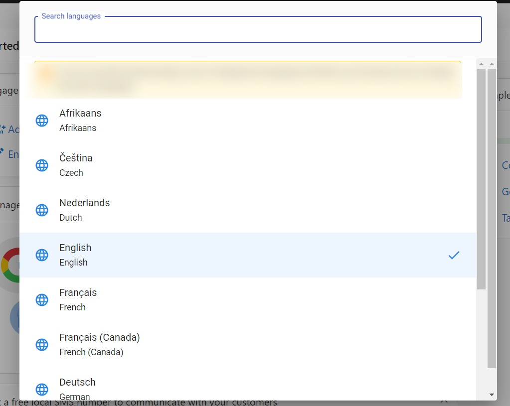

## Introduction

Welcome to *Business App*! This brief stub will soon guide new users through the essential setup steps and key concepts they need to know before diving in.

> **Note**
> This page is a placeholder created on **July 9 2025**. Detailed instructions and screenshots will be added in a future update.

## Customize Language

Want to experience Business App in your preferred language? This guide offers a quick look at how to customize the app interface. Language customization can enhance your experience and expand accessibility.

### How to Update the Business App Language

1. Log in to Business App.
2. Click your profile name in the top-right corner, then click the current language.

   

3. Select your preferred language from the available list.

   
