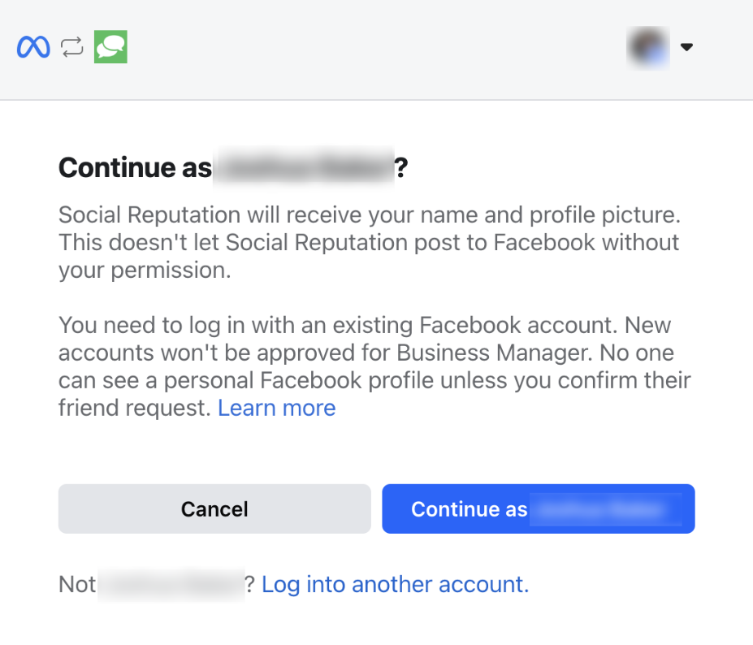
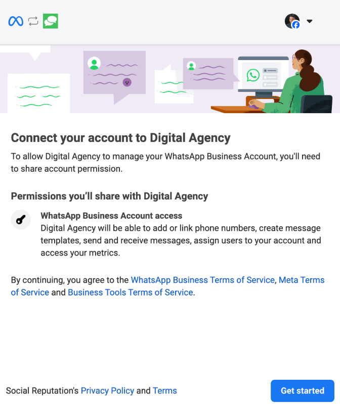

## What is the Whatsapp Integration?

WhatsApp integration in Inbox enables international customer communication by connecting your WhatsApp Business account directly to your team’s shared Inbox. This allows you to send messages to new leads and existing customers using WhatsApp, while managing all customer interactions from one centralized location.

If enabled, businesses can use approved message templates to start conversations, and respond to inbound messages through the WhatsApp channel. This integration supports lead generation, faster follow-ups, and more convenient engagement—especially for customers outside the U.S. and Canada. 

WhatsApp messaging is available in Inbox, for any accounts with either Inbox Pro or AI-Assisted Web Chat products active on their account, internationally.

## Why is Whatsapp Important?

For many international markets, WhatsApp is the preferred method of communication. Without this integration, businesses may miss out on leads who prefer to message over WhatsApp instead of SMS or email. Connecting a WhatsApp Business account ensures that customers can reach you where they’re most active, while enabling your team to respond using the same shared Inbox they use for all other channels.

## Table of Contents

- [What’s Included](#whats-included)
- [How to Set It Up](#how-to-set-it-up)
- [How to Use It](#how-to-use-it)
- [Optional Features or Upgrades](#optional-features-or-upgrades)
- [Frequently Asked Questions (FAQs)](#frequently-asked-questions-faqs)
- [Screenshots](#screenshots)

## What’s Included

With Inbox Pro or AI-Assisted Web Chat, these features are included:

- Direct integration with Inbox (send and receive WhatsApp messages directly from Inbox)
- WhatsApp message templates
- Includes 250 outbound conversations per month (1,000 once verified)
- Unlimited incoming messages

## How to Set It Up

Follow these steps to connect your WhatsApp Business account to Inbox:

1. Go to `Administration > Inbox Settings`.
2. Locate the `WhatsApp Business Messages` card and click `Sign in with Facebook`.

3. A modal will appear prompting you to sign in to your Facebook account.
4. Allow Social Reputation to connect by clicking `Continue as [Your Name]`.

5. Connect your business account to the platform called `Digital Agency` by clicking `Get Started`.

6. Select an existing WhatsApp Business account or create a new one:
   - If creating a new account, fill out all required business information.
   - **IMPORTANT NOTE: Add your main business phone number. You may use your assigned Inbox number if you're in a supported SMS region (U.S./Canada)**.
7. Temporarily enable call forwarding to receive the verification call:
   - Go to `Inbox Settings > Your SMS/Phone Number > Settings`
   - Set `Forward the call` temporarily
8. Return back to the WhatsApp setup screen:
   - Enter the Inbox number
   - Choose phone call verification method
   - You will receive a call with a code to verify ownership
9. After verifying, return the call forwarding setting to its original state.
10. Confirm permissions and complete the setup. 

A green ‘connected’ badge will appear when verified.

## How to Use It

- Once connected, you can send outbound WhatsApp messages using approved message templates.
- If your account is new and has no templates, the system will auto-submit one for approval.
- Additional templates can be created and submitted via the [Meta Business Help Center](https://business.facebook.com/latest/whatsapp_manager/message_templates).
- Custom replies are only allowed within 24 hours of a customer’s inbound message.

## Optional Features or Upgrades

- **Verified WhatsApp Business Accounts**  
  Verified businesses gain access to:
  - Increased messaging limits (from 250 to 1,000 daily business-initiated conversations)
  - Business name display in customer chats
  - Higher trust and visibility in the WhatsApp environment

  To verify your business, visit the [WhatsApp Manager](https://business.facebook.com/latest/whatsapp_manager).

- **Conversation Expansion Beyond Free Limits**  
  After the first 250 or 1,000 (if verified) conversations per month, WhatsApp’s standard conversation pricing applies. **These charges are billed directly through Meta and require a valid payment method in your Meta Business account**.

### Frequently Asked Questions (FAQs)

**Can a client connect an existing WhatsApp business account to Inbox, and still use the mobile app?**  
Not currently. WhatsApp is working on a feature called “WhatsApp Coexistence,” which is in closed beta. If a business has a WhatsApp for business account on their phone already, they can register a new (second) account for using with Inbox. In the future, we hope to support ‘coexistence’ as well.

**Why can’t I write an outgoing message?**  
Only approved templated messages can be sent as outbound cold messages. Once a customer initiates contact, you can reply with custom messages within a 24-hour window.

**Why did my message fail to send?**  
Your message template may not be approved. Check template status in the [WhatsApp Manager](https://business.facebook.com/latest/whatsapp_manager/message_templates).

**What will WhatsApp messaging cost me?**  
You can send 250 (or 1,000 once verified) outbound conversations per month at no charge. Beyond that, Meta’s conversation pricing applies. A valid payment method must be added to your Meta account.

