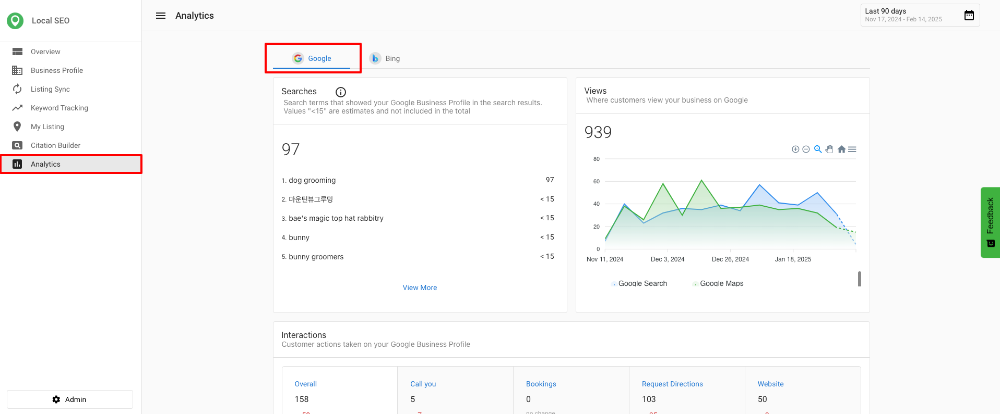
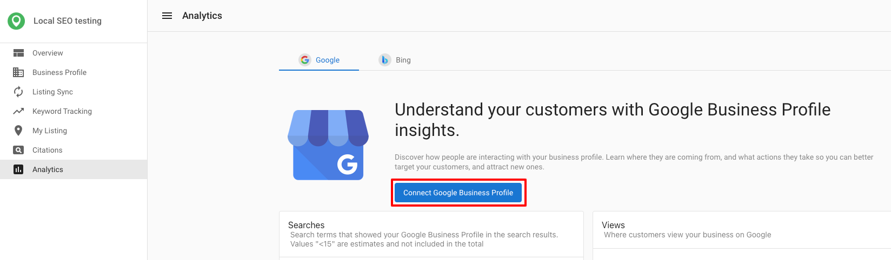
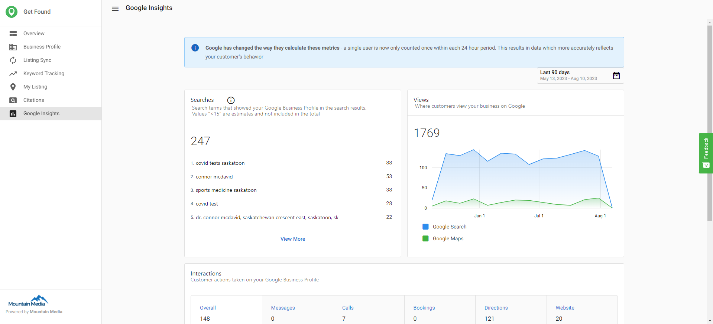

In this section, you'll learn about the analytics capabilities available in Local SEO. Use these insights to measure performance, track customer interactions, and optimize your local search strategies.

## What is analytics in Local SEO?

Analytics in Local SEO provide valuable insights into how your business is performing on Google. By tracking key metrics, you can better understand customer interactions, refine your digital marketing strategies, and optimize your local search presence.

## Google business profile insights in Local SEO

Google Business Profile Insights provide a detailed overview of how customers find and interact with your business on Google. These metrics help you assess your online visibility and customer engagement.

### Key Google metrics available in Local SEO

- **Search Terms** – Displays the queries people use to find a business. (Available in Local SEO and Executive Report.)
- **Search Total** – Shows the total number of searches where the business appeared. (Available in Local SEO, Executive Report, Multi-Location, and Multi-Location Executive Report.)
- **Customer Interaction [Bookings]** – Tracks completed customer bookings. (Available in Local SEO, Executive Report, Multi-Location, and Multi-Location Executive Report.)

:::note
Google updates the Searches metric at the beginning of each month, and it may take up to five days to reflect new data.
:::

### Accessing Google business profile analytics in Local SEO

1. Go to `Local SEO` > `Analytics` > `Google`.
2. Click `Connect Google Business Profile`. If you do not have an account, click `Create a Google Business Profile account` to sign up.

After you select an account, the system checks whether the Google Business Profile's business name and address match your Business Profile. If either doesn't match, a warning appears so you can confirm you're connecting the correct listing before continuing. The warning only checks business name and address — a mismatched phone number or website does not trigger it.

After connecting, you can view metrics such as searches, where customers view your business, and common customer actions.

## Why these insights matter

- **Better Decision Making** – Helps businesses understand which search platforms are driving traffic.
- **Improved Engagement Strategies** – Aligns customer interactions with business goals.
- **More Control Over Listings** – Ensures that businesses can monitor and adjust their presence on Google.

## Frequently asked questions (FAQs)

What is the difference between Search Terms and Search Total?

Search Terms shows the actual queries people used to find your business, while Search Total shows the overall number of times your business appeared in search results.

Why do I need to connect my Google Business Profile to view analytics?

Connecting your profile allows Local SEO to pull data directly from Google’s API, ensuring you see accurate insights about how customers are finding and interacting with your business.

