# Keyword Tracking

Manage how you track and report on keywords. This section provides a single overview of settings, usage, tips, and troubleshooting.

## What is Keyword Tracking?

Keyword Tracking helps you monitor how a business ranks for specific search terms over time. You can add keywords, view positions in a grid, analyze trends, and manage which keywords appear in reports.

## Why is Keyword Tracking important?

- Understand ranking performance for target keywords.
- Identify changes in visibility over time.
- Focus efforts on terms with the most impact.

## What’s included with Keyword Tracking?

- **Add Keywords**: Enter terms to track.
- **Keyword Grid**: View positions, best position, average rank, change, search volume, competition, and last updated date.
- **Settings**: Adjust or remove keywords using the action menu.
- **Trend Tab**: Analyze performance over time.
- **Access Controls**: Disable editing of keywords for Business App-only users.
- **SMART Keyword Suggestions**: Discover additional keyword ideas using a website as the seed.
- **Executive Report keywords**: Choose which keywords to include in reports and sync to sources that accept this data.

## How to use Keyword Tracking

### Access Keyword Tracking
1. Open the Local SEO product.
2. Select `Keyword Tracking` from the left-hand menu.

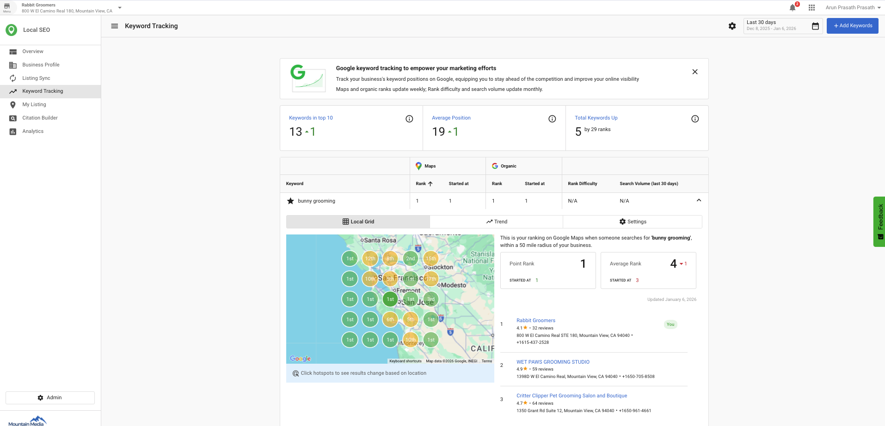

### Add keywords to track
1. Click `Add Keywords`.
2. Enter keywords (one per line).
3. Click `Add` to begin tracking.

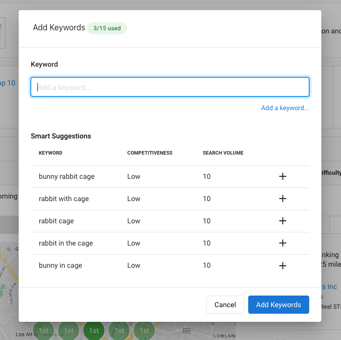

### View keyword data in the grid
The grid displays:

- `Position`: Current search position for the keyword
- `Best Position`: Highest position achieved
- `Average Rank`: Average of all the grid points
- `Change`: Difference since the last update
- `Local Monthly Search Volume`: Approximate local monthly searches
- `Competition`: Competition level (Low, Medium, High)
- `Last Updated`: Date of the last update

### Adjust keyword settings
1. Click the gear icon ⚙ in the `Action` column for a keyword.
2. Select the desired action from the dropdown to adjust settings or remove the keyword.

### Adjust map radius and units
1. Click the gear icon ⚙ in the `Action` column for any keyword.
2. Under **Map Units**, select **Miles** or **Kilometers**.
3. Under **Map Radius**, choose a distance from the dropdown: 1.25, 2.5, 5, 10, 30, or 50 miles.
4. Click **Apply**.

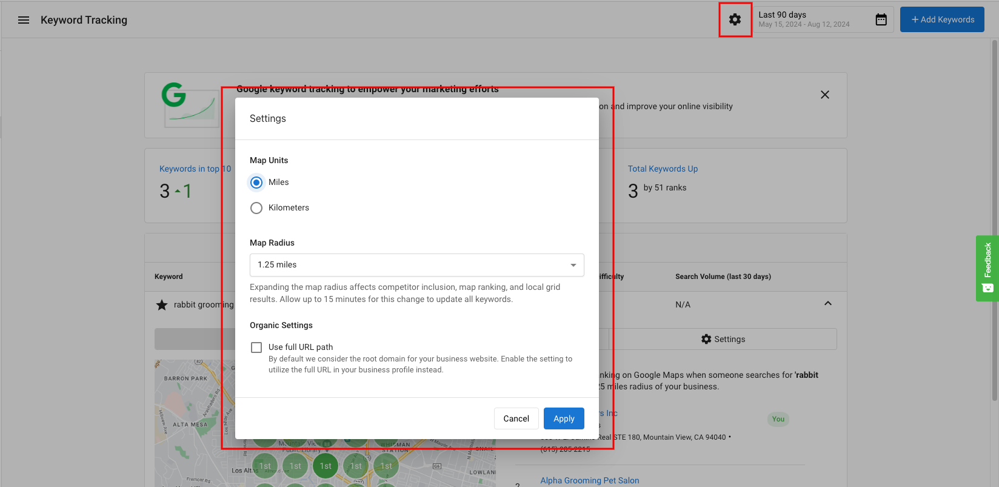

:::info
Expanding the map radius affects competitor inclusion, average rank, map ranking, and local grid results. Allow up to 15 minutes for the change to update all keywords.
:::

### Analyze keyword trends
1. Click the `Trend` tab at the top of the page.
2. Select a date range.
3. Hover over data points to view details for specific dates.

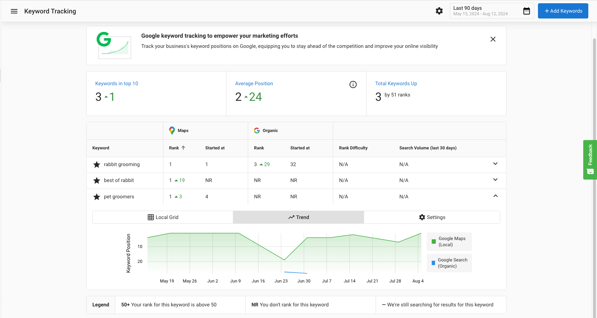

## Manage access to editing keywords and radius settings

You can disable editing of keywords for Business App-only users.

:::info
By default, editing is enabled for Business App users.
:::

To disable editing:
1. Open the Local SEO Admin Dashboard.
2. Go to `Product Settings`.
3. Toggle off `Allow SMBs to edit keywords`.

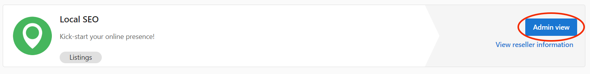

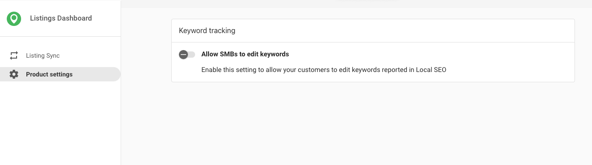

## SMART keyword suggestions

You can track SEO ranking on up to 15 keywords. Suggested keywords help you choose the terms that matter most.

How it works:

- Uses a business website as a seed to surface relevant alternatives.
- Considers competitiveness and search volume to highlight additional keywords to explore.
- Find suggestions at `Local SEO` > `Keyword Tracking` > `Add Keyword`.

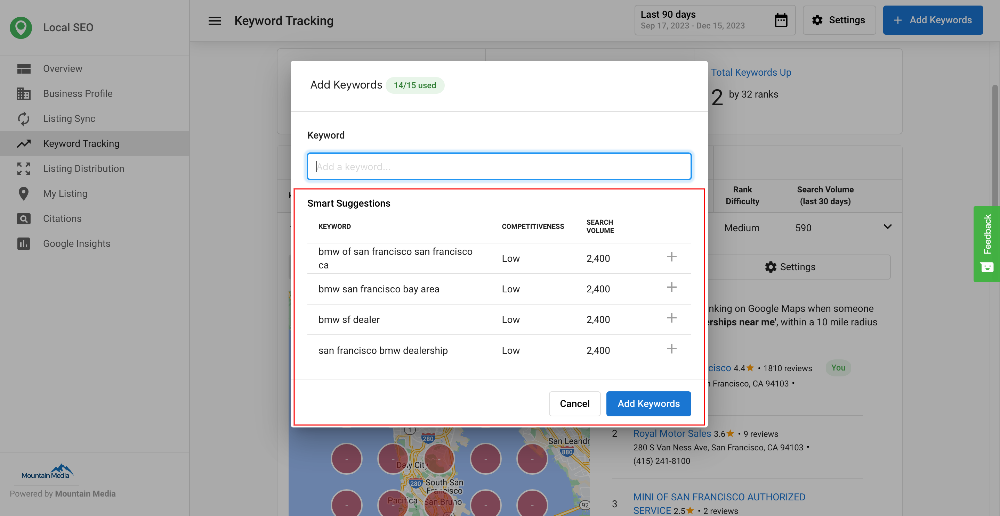

## SEO keywords in the executive report

You can select keywords to be synced (to sources that accept this data) and choose which ones to include in the Executive Report. This helps you monitor more keywords while reporting only on selected terms.

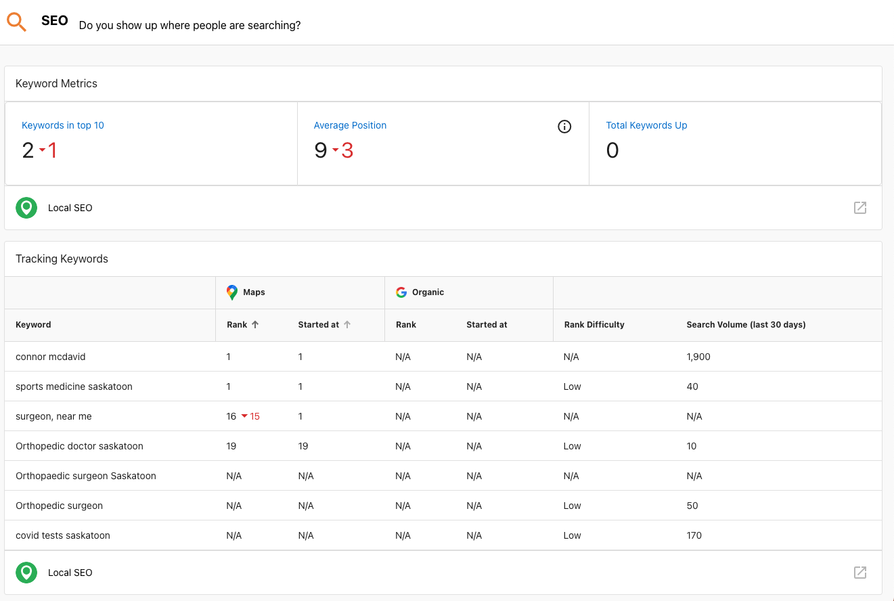

Examples and settings:

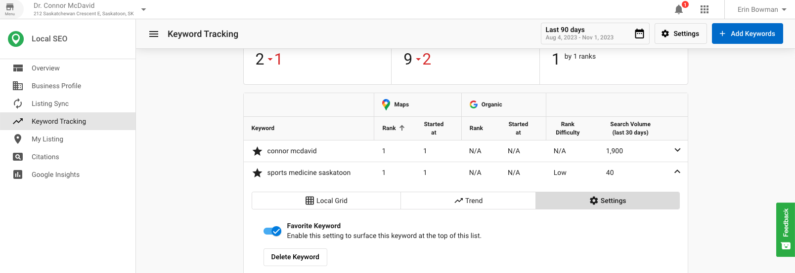

You can set the default for new keywords to be favorited or not.

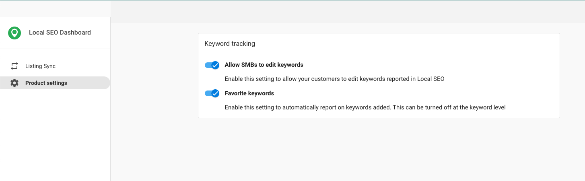

## How organic keyword ranking works

The platform determines your organic rank by searching for the tracked keyword from the business's location and looking for the business's website URL in the search results. This means:

- A **website URL must be set** in the Business Profile for organic rankings to populate.
- The URL must match exactly what Google indexes for the business. If the URL in the platform differs from the URL Google associates with the business (for example, `www.example.com` vs. `example.com`), organic rankings will not populate.

## Keyword update frequency

- **Local SEO Pro (weekly)**: Keyword data is refreshed every Saturday.
- **Local SEO (monthly)**: Keyword data is refreshed once per month.

If you check rankings mid-cycle, the data reflects the most recent update, not real-time rankings.

## Understanding "NR" (Not Ranked)

"NR" means the keyword did not rank within the top 100 search results at the time of the last data update. It is not an error — it means the business was not found in the top 100 results for that keyword.

**Common reasons a keyword shows NR:**
- The business does not rank in the top 100 for that search term in the tracked location.
- For organic rankings specifically: the website URL in the platform does not match the URL Google indexes for the business. Verify the URL in Business Profile matches exactly.
- Competition, algorithm changes, or website content changes can also cause a previously ranked keyword to drop to NR.

If a keyword consistently shows NR across multiple update cycles and the website URL is confirmed correct, contact support.

## Understanding the local grid

The local grid shows your ranking at 25 points around the business location. Reading the results:

- **No dot**: No search results existed for that grid location — this does not mean a ranking issue, it means Google returned no local results there.
- **Red dot**: Search results existed for that location, but the business was not in the top 20.

Google Maps results show a maximum of 20 listings per search. If the business does not rank in the top 20 for an area, it appears as a red dot on the grid.

## Brand searches

Brand search data in keyword tracking comes from **Google Analytics**. Brand searches track how often people search specifically for your business name. This data is only available when Google Analytics is connected to the account.

## Showing keywords in multi-location view

To make a keyword visible in the multi-location keyword tracking view, mark it as a **Favorite**. Keywords that are not marked as Favorites will not appear in the multi-location summary.

To mark a keyword as a Favorite: click the gear icon ⚙ in the Action column for the keyword and select the Favorite option.

## Why are there no results in the Local SEO grid?

If the business is a Service Area Business (SAB), the issue might arise from a misalignment between targeted keywords and the address listed in the business profile.

How the map works:

- The listed business address is the center point for the map area used in Local Grid searches.
- If targeted keywords correspond to a region far from the listed address, no rankings will appear in the grid.

Workarounds:

1. Align keywords with the business address by focusing on the area surrounding the listed address.
2. Change the business address to a location closer to the targeted region. Important: This is not recommended and may impact listing accuracy.

### Additional context about keyword mapping
For Google Maps results, the system retrieves a maximum of 20 listings per search. If a business does not rank within the top 20 for an area, it appears as a blank red entry on the map. Organic search results do not use a radius setting. To get more detail, adjust the zoom level to focus on a smaller area.

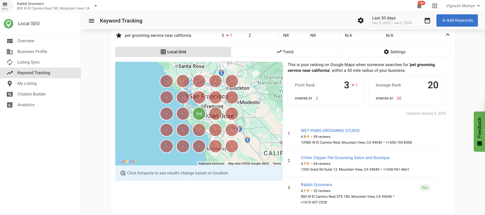

## Frequently asked questions (FAQs)

How do I access Keyword Tracking?

Open the Local SEO product and select `Keyword Tracking` from the left-hand menu.

How do I add keywords?

Click `Add Keywords`, enter terms (one per line), and select `Add`.

What data does the keyword grid show?

It shows `Position`, `Best Position`, `Average Rank`, `Change`, `Local Monthly Search Volume`, `Competition`, and `Last Updated`.

What is an average rank?

Average Rank reflects how a keyword performs across all tracked grid points on the map, not just the center location.

How is the average rank calculated?

Average Rank is calculated by averaging the rankings across all 25 grid points, assigning a rank of 21 to any point where the business does not rank.

How do I change or remove a keyword?

Use the gear icon in the `Action` column to adjust settings or remove the keyword.

How do I view trends?

Open the `Trend` tab, choose a date range, and hover over data points.

Can I limit who can edit keywords?

Yes. You can disable editing of keywords for Business App-only users via `Product Settings`.

What are SMART Keyword Suggestions?

Suggestions use a website to propose related keywords and show competitiveness and search volume to evaluate them.

How many keywords can be tracked?

You can track up to 15 keywords. You can add more tracked keywords by activating the Local SEO add-on Additional Keywords. Each activation of this add-on will add an additional 15 tracked keywords to your limit.

Where do I find keyword suggestions?

Go to `Local SEO` > `Keyword Tracking` > `Add Keyword`.

How do I include keywords in the Executive Report?

Select which keywords to include in the report and sync to sources that accept this data.

Why does the Local Grid show no results?

The targeted keywords may not align with the area around the listed address, especially for service area businesses.

How can I improve Local Grid results?

Align keywords with the business address. Changing the address may help but is not recommended due to potential listing accuracy issues.

Can I change the radius of the local SEO grid?

Click the gear icon ⚙ in the `Action` column for any keyword to open Settings. Under **Map Radius**, choose from 1.25, 2.5, 5, 10, 30, or 50 miles (or the equivalent in kilometers). You can also switch between **Miles** and **Kilometers** under **Map Units**. The default is 1.25 miles. Allow up to 15 minutes for the change to update all keywords.

What does "NR" mean in keyword tracking?

NR stands for "Not Ranked." It means the business did not appear within the top 100 organic search results for that keyword at the time of the last data update. It is not a bug — it indicates the business was not found in top results for that search term.

Why is my organic rank showing NR when I know I rank on Google?

The most common cause is a website URL mismatch. The platform searches for the exact URL set in your Business Profile in Google's results. If the URL there differs slightly from what Google indexes for your site (for example, with or without `www`), the rank will show as NR. Verify the website URL in Business Profile matches exactly what appears in Google search results for your business.

How often are keyword rankings updated?

Local SEO Pro updates keyword rankings weekly, every Saturday. Local SEO (standard) updates monthly. Rankings are not real-time — if you check between update cycles, the data reflects the most recent update.

How do I show a keyword in the multi-location view?

Mark the keyword as a Favorite. Only Favorite keywords appear in the multi-location keyword tracking summary. Click the gear icon ⚙ in the Action column for the keyword to access this option.

What are brand searches and where does that data come from?

Brand searches track how often people search specifically for your business name. This data comes from Google Analytics and is only available when Google Analytics is connected to the account.

