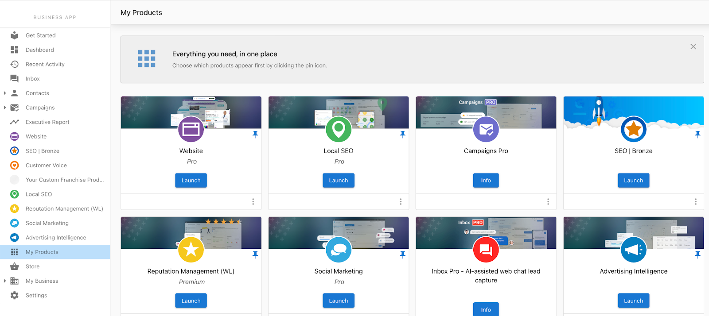
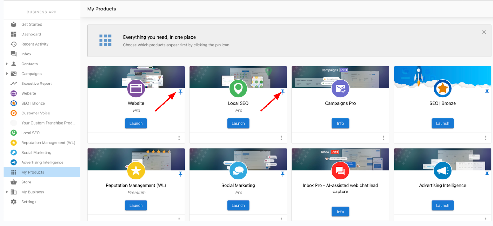

# Overview

The My Products page offers a comprehensive list of all of your businesses products for easy accessibility through Business App. From this page, you will see all of the active products on your account, and can easily pin your most used products to the side panel.

## How does My Products page work?

1. Log into Business App and click on My Products.

## How can I organize the products on the side panel of Business App?

By clicking on the My Products page and clicking on the pin icon in the top right of each product, you can choose which products will appear on the Business App side panel, for yourself. Each user can set these independently. 

 