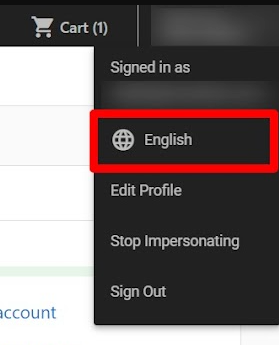
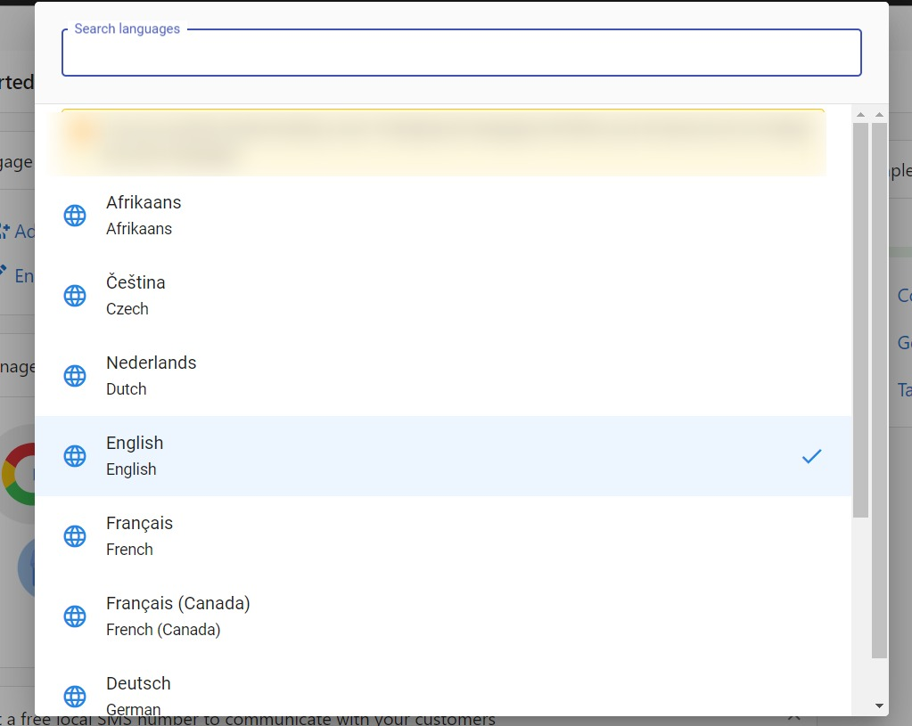

Want to experience Business App in your preferred language? This guide offers a quick look at how to customize the app's interface. Language customization can enhance your experience and expand accessibility.

How to Update the Business App Language
1. Log in to Business App
2. Click on your profile name in the top right corner, then click on the current language.

3. Select your preferred language from the available list.

 