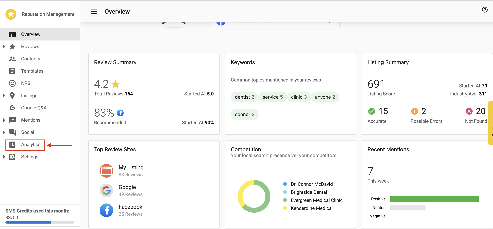
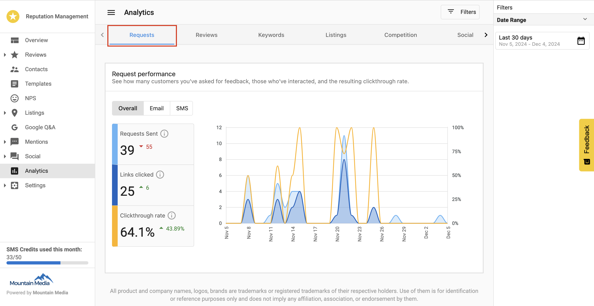
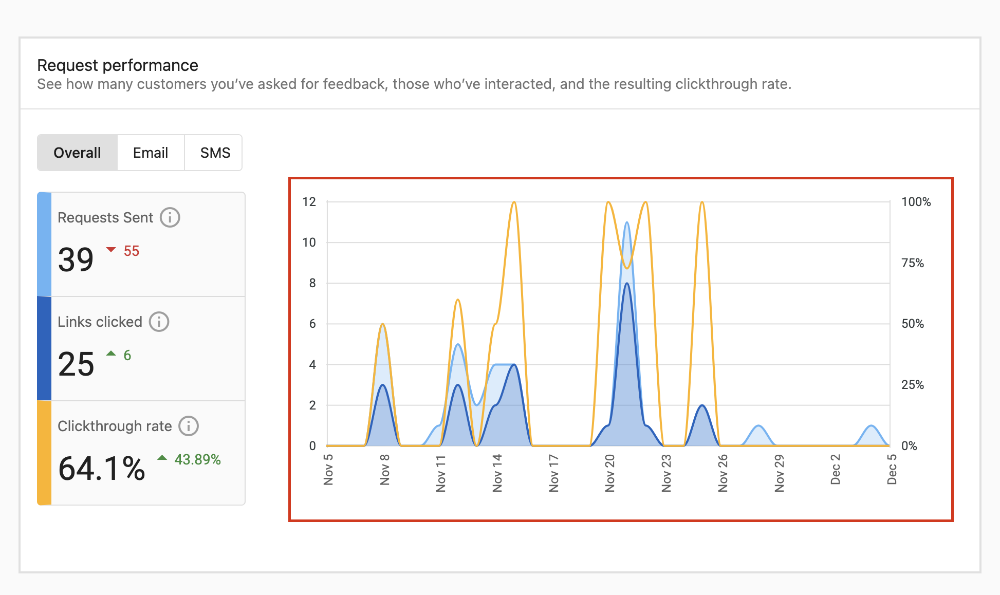
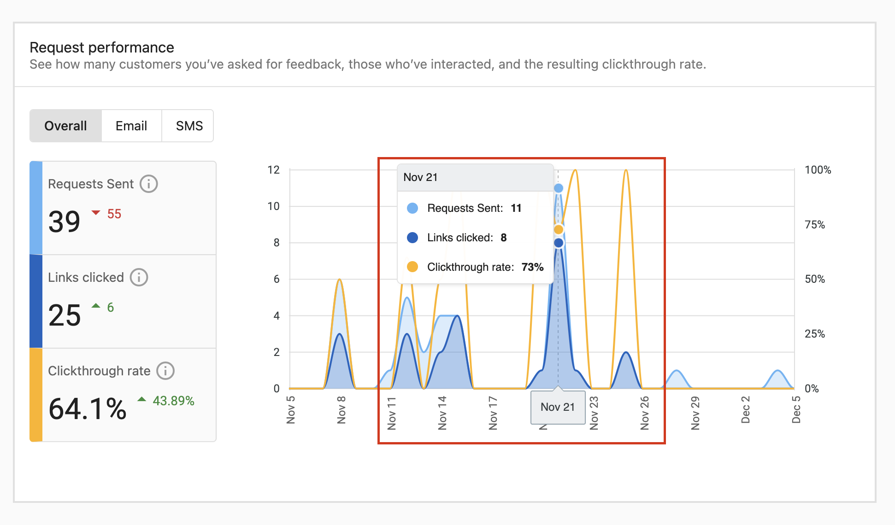
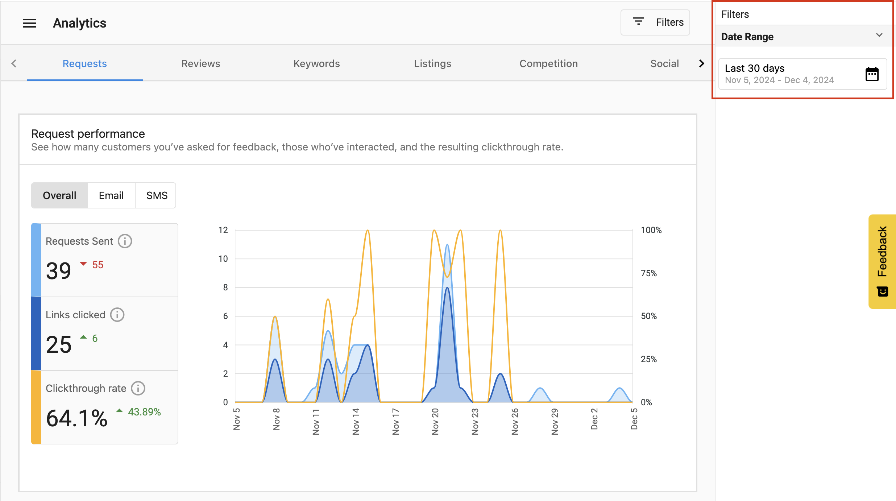

# Request Performance Metrics (Single Location)

The **Request Performance Metrics** provide insights into the quantity of customer review requests sent, and the resulting customer reviews for a single location. This helps businesses understand the effectiveness of their review requests and track the distribution of their reviews across different platforms.

## Accessing Request Performance Metrics

To view the Request Performance Metrics for a single location:

1. Navigate to the **Business Center**
2. Select a business
3. Go to **Reputation Management**
4. Click on the **Analytics** tab

## Using the Request Performance Metrics

The Request Performance section displays:

### Performance Graph

The graph provides visual insights showing:

- **Requests Sent**: The total number of review requests sent to customers
- **Reviews Received**: The total number of reviews received after sending requests

### Interactive Features

- **Mouse over data points**: View detailed information for specific dates

- **Date Range Selection**: Customize the time period for the data displayed

## Analyzing Performance

These metrics help you:

1. Track the success rate of review requests
2. Identify trends in customer responses
3. Optimize your review request strategy
4. Measure the ROI of your review generation efforts

## Best Practices

- Monitor the ratio of requests sent to reviews received
- Look for patterns in days/times when customers are most responsive
- Adjust your request strategy based on performance data
- Use insights to identify opportunities for improvement

## Frequently asked questions (FAQs)

What information does the Performance Graph show?

The graph visualizes the trend of **Requests Sent** versus **Reviews Received** over your selected time period, helping you see the direct impact of your outreach efforts.

Can I change the date range for the metrics?

Yes. Use the date range selector in the top right corner to filter data for specific periods, such as the last 30 days, last quarter, or a custom range.

How do I calculate the success rate of my requests?

Compare the number of **Reviews Received** to **Requests Sent**. A higher ratio indicates a more effective request strategy and higher customer engagement.

