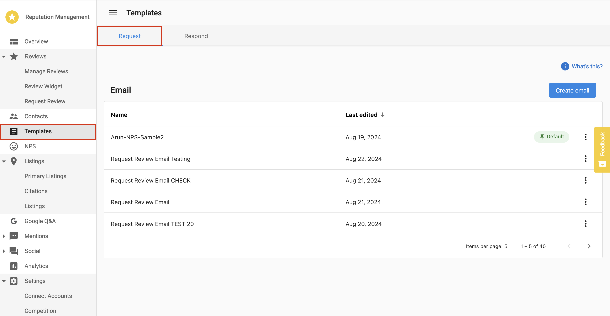

The **Net Promoter Score (NPS)** feature in Reputation AI Premium allows you to send customer satisfaction surveys before requesting public reviews. This workflow helps identify unhappy customers early, enabling businesses to address concerns before prompting reviews on platforms like Google Business Profile or Facebook.

Using NPS surveys improves feedback accuracy and increases the likelihood of receiving positive public reviews. It also supports internal service improvement by highlighting satisfaction trends.

## Why use NPS?

Sending direct review requests to all customers may result in negative public feedback, especially from dissatisfied clients. NPS surveys offer a buffer—letting you gather private feedback first. By identifying and responding to detractors privately, you reduce the risk of negative public reviews and strengthen your overall online reputation.

## What's included

- Email and SMS NPS survey capabilities
- Configurable NPS templates using a drag-and-drop email builder
- Automatic redirect options for promoters to leave public reviews
- NPS score tracking and feedback history
- Filterable feedback view by promoter, passive, or detractor

## Get started

1. Go to `Templates` in the side menu of Reputation AI Premium.
2. Select the `Request` tab.
3. Click `Create Email` to open the email builder.
4. Add the NPS block to your template.
5. Enable the option to redirect customers with scores above 7 to a public review site.
6. Send NPS surveys via `Review Requests`.

## How to Create an NPS Template

1. Go to `Templates` in the side menu of Reputation AI Premium.
2. Select the `Request` tab.
3. Click `Create Email` to open the email builder.
4. Click `Add New Block` and insert the NPS block.
5. Choose your preferred display option:
   - **Button Option**: One-click feedback buttons inside the email.
   - **Inline Option**: Number scale (0–10) directly embedded in the email.
6. Enable the option to redirect customers with scores above 7 to a public review site (e.g., Google).
7. Click `Save` once all configurations are complete.

:::info
The SMS version of the NPS message is currently not customizable. It sends the default:  
"[Business Name]: We'd love to hear about your recent experience with us. Leave us a review here."
SMS template customization will be available in a future update.
:::

## How to View NPS Feedback

1. Go to `NPS` in the side menu of Reputation AI Premium.
2. Review the average score within a selected date range.
3. See the percentage of:
   - **Promoters** (9–10)
   - **Passives** (7–8)
   - **Detractors** (0–6)

You can also view individual feedback responses, including the score, written comments, and contact details.

## NPS Calculation and Trends

**NPS Formula:**

NPS = % Promoters - % Detractors

- **Promoters** are likely to recommend your business.
- **Detractors** are not likely to recommend your business.
- **Passives** are neutral and not included in the calculation.

The `Trends` section shows NPS score changes over time, helping you track improvements or issues in customer satisfaction.

## Frequently Asked Questions (FAQs)

Can I redirect only satisfied customers to leave a public review?

Yes. You can enable a setting that redirects customers with scores above 7 to a review site such as Google.

Can I customize the SMS message?

Not currently. The SMS message is hardcoded. SMS template customization is planned for a future release.

Can I use both email and SMS for NPS surveys?

Yes. You can select both delivery methods when sending a review request.

Where can I view customer feedback from NPS surveys?

Go to the `NPS` tab to see scores, written responses, and contact info.

Can I use AI to respond to NPS feedback?

No. NPS is designed for private feedback collection and does not include AI-generated responses.

What do the NPS categories mean?

- **Promoters (9–10)**: Highly satisfied, likely to recommend.
- **Passives (7–8)**: Satisfied, but not enthusiastic.
- **Detractors (0–6)**: Dissatisfied, may share negative feedback.

Is the NPS email customizable?

Yes. Use the email builder to fully design your message and choose between Button or Inline score options.

Does NPS impact public reviews automatically?

Only if configured to redirect promoters. Otherwise, feedback remains private.

Can I use an NPS survey link without sending it to a contact (for example, at point of purchase)?

No. NPS surveys must be sent to a contact via Email or SMS. NPS is designed to collect feedback from identifiable contacts so responses can be properly submitted and displayed in the Reputation Dashboard. Using a direct URL without a contact is not supported and may cause errors.

