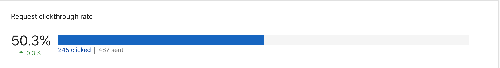
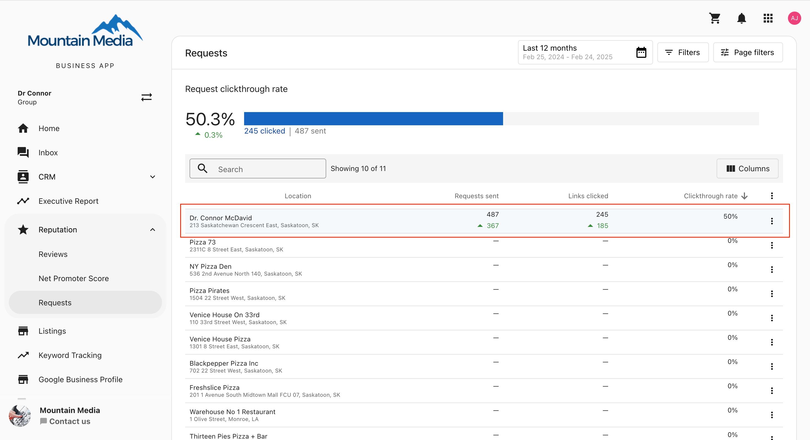
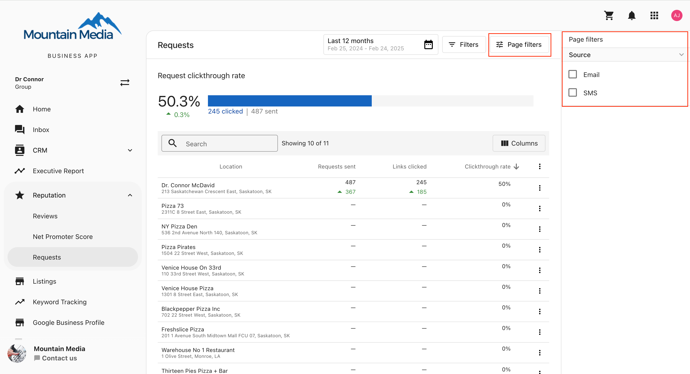

Tracking review request performance metrics is crucial for understanding and improving the request process within the multi-location section of Business App.

## Accessing Request Performance Metrics

To access Request Performance metrics for multi-location businesses:

1. Select `Reputation AI` from the sidebar
2. Click the `Requests` tab in the top navigation bar

## Understanding the Metrics

The `Requests` tab displays an overview of request performance metrics for all locations within the business:

### Key metrics explained

- **Requests Sent**: The total number of review requests sent
- **Email Open Rate**: The percentage of sent emails that were opened
- **Feedback Rate**: The percentage of requests that resulted in feedback (either from the review site or from your feedback form)
- **Reviews Collected**: The number of reviews collected as a result of your requests
- **No of surveys**: The number of surveys sent to customers. Integration and automation requests count per job or transaction — a contact with 3 jobs in the selected period counts as 3 surveys. Manual requests with no linked transaction each count as 1 survey.
- **Conversion Rate**: The percentage of surveyed transactions that received an NPS or review response, calculated as (surveyed transactions with a response ÷ total surveyed transactions) × 100.

Channel and Request Type filters don't apply to **No of surveys** or **Conversion Rate**. Both metrics respect the date range, location, and team filters you select, and are consistent between the single-location and multi-location Requests reports.

## Viewing metrics by location

Below the overview, you can see metrics broken down by individual locations:

This view allows you to compare performance across different locations and identify which locations may need additional attention or support.

## Filtering options

The filter options in the top right corner allow you to customize the date range and filter by specific locations:

You can:
- Set a specific date range for the data
- Filter by location name
- Sort the data by various metrics

## Using these metrics

These metrics can help you:

- Identify which locations are most effective at generating reviews
- Spot trends in review request performance over time
- Compare the performance of different locations to identify best practices
- Identify locations that may need additional training or support with their review request process

## Best practices

1. **Regular Monitoring**: Check these metrics regularly to track progress and identify issues early
2. **Compare Locations**: Use the location breakdown to identify top performers and share their strategies with other locations
3. **Test Different Approaches**: Try different request methods or messaging and track the impact on your metrics
4. **Set Goals**: Establish performance targets for each location based on these metrics

## Frequently asked questions (FAQs)

What key metrics are tracked for multi-location businesses?

The primary metrics are **Requests Sent**, **Email Open Rate**, **Feedback Rate** (responses to internal or external requests), and **Reviews Collected**.

Can I see performance for a specific location?

Yes. The Location Metrics table breaks down performance by individual location. You can also use the filter options to view data for a specific location or group.

How is the Feedback Rate calculated?

Feedback Rate is the percentage of requests that resulted in any form of feedback—either a direct review on a platform or a response to an internal feedback form.

What is the difference between specific location metrics and the overview?

The overview provides an aggregate view of all locations to gauge overall health. The specific location metrics allow you to pinpoint high or low performers to tailor your support and strategy.

What counts toward No of surveys?

Integration and automation requests count per job or transaction, so a contact with 3 jobs in the selected period counts as 3 surveys. Each manual request with no linked transaction counts as 1 survey.

Do the Channel and Request Type filters affect No of surveys or Conversion Rate?

No. Those filters don't apply to **No of surveys** or **Conversion Rate**. Both metrics still respect the date range, location, and team filters you select.

